# 人間関係（092時点）

カズマを中心にした関係の全体図。矢印の向きは「誰が誰をどう思っているか」。

## 相関図

```mermaid
graph TD
  K[カズマ]
  subgraph 手持ち
    G[ガッシュ<br>不動のエース]
    R[ルサルカ<br>エースアシストα]
    M[マックイーン<br>二枚看板]
    L[ライナー<br>エースキラーβ]
    F[ガブリアス<br>トップバッター]
    I[イカルガ<br>アヴェンジャー]
    Mo[モモ<br>エンチャンター]
    Y[ヤマト<br>チェイサー]
  end
  subgraph ハクタイ
    A[アカネ／マーズ]
    Z[ゼットン]
    Rin[渋谷凜]
    Ry[ライザ]
    Dad[地下おじさん]
    Shop((探検堂))
  end
  subgraph テンガン山
    Me[メリュジーヌ]
    Ki[キーラ<br>氷狼女帝]
  end
  subgraph キッサキ
    Sa[キジマ・シア<br>キッサキジム]
  end
  subgraph ナギサ
    Ev[レヴィ]
    Os[三雲修]
  end
  Ka[天羽奏]
  subgraph ソノオ杯
    Br[ブリジット]
    Sh[食蜂操祈]
  end
  Ya[山岡]
  subgraph ヨスガ
    Ma[メアリ]
  end
  subgraph コトブキ
    Ho[ホーネット<br>チャンピオン]
    Ge[碇ゲンドウ<br>ナナカマド博士]
    Ke[ケイネス<br>スクール校長]
    En[エネル<br>ナギサジム]
  end
  Ar[アルセウス]
  E[エール・モフス]

  Ar -->|"転生させた（コモン扱い）"| K
  K -->|"邪神と呼んで恨む"| Ar
  A -->|"拾った・強く意識（98/100）・賭けに負け、家を出て行かれた"| K
  K -->|"恩人・元雇い主。3日以内にまた来る"| A
  Z -->|"胃袋をつかまれた・週1〜2で家事を頼む"| K
  Rin -->|"相談役・面倒を見る・デート（笑）"| K
  Ry -->|"商売の恩人・ブリーダー・一蓮托生・意識している様子"| K
  Shop -->|"スポンサー・住み込み先"| K
  Dad ---|"店長"| Shop
  Ry ---|"看板娘"| Shop
  Me -->|"気に入った・1年以内に戦いに来い"| K
  E -->|"執着・ダンジョンアタックと熟達指令のコーチ・練習試合で負けて公式戦でリベンジ"| K
  Sa -->|"遭難者として助けた・たんけんセットに興味・好感度高め・ジム挑戦を待つ"| K
  Da[ダージリン<br>茶房グロリアーナ]
  Bk[爆豪勝己<br>雄英ダイナマイツ]
  Da -->|"統率型のライバル・ハクタイ杯決勝で負けた"| K
  Ju[ジュピター<br>ギンガ団三将星筆頭]
  Ad[アダム<br>ギンガ団社長]
  Tk[一条武丸<br>人力ハードラック]
  Ju -->|"意気投合・連絡先交換・統率型の先輩として助言"| K
  Ju ---|"同僚（ウチのバカ）"| A
  Ad -->|"気に入って本部に呼んだ"| K
  Tk -->|"同期・スポンサーの最終面接で競った・練習試合（087）"| K
  R -->|"一目惚れ・デートでキスして告白（091）"| K
  K -->|"告白されて放心・2つ目の『絆』（愛の絆）"| R
  Sp[先輩<br>随牧スペリオール]
  Sp -->|"後輩・ノモセ杯の決勝で0-3で勝った"| K
  Nao[禪院直哉<br>呪相カースメーカー]
  Nao -->|"ライバル・挑戦状・トバリ杯初戦で再戦（102）"| K
  Da ---|"観客席で隣・挑戦状を届けた"| Nao
  Bk -->|"ハクタイ杯初戦で負けた"| K
  Sa ---|"知り合い（凛ちゃん）"| Rin
  Ki -.->|"推測: 西の麓に放ったタマゴの子？"| Y
  Ki ---|"顔なじみ"| Me
  Ma -->|"相談役・コンテストに誘う"| K
  R -->|"泥棒猫"| Ma
  Rin -->|"手持ちを移籍させた"| Mo
  R -->|"同じ淫乱ピンク…（般若）"| Mo
  Ka -->|"統率型の先輩・固有のヒント"| K
  Br -->|"デビュー戦で負けた・次はリベンジ"| K
  Sh -->|"地味くん・ソノオ杯決勝で勝った"| K
  Ya -->|"おっかけ記者（になるかも）"| K
  R -->|"戦艦級と警戒"| Br
  En ---|"師匠と門下生"| Ev
  Ev -->|"練習試合で負けた・リベンジを誓う"| K
  Os -->|"練習試合で負けた"| K
  M -->|"3回吹き飛ばして捕獲"| Y
  Ry -->|"育成担当（半ギレ）"| Y
  Ho -->|"ガバイトに惹かれて連れ出した"| K
  Ge ---|"上司と助手"| E
  Ke -->|"たんけんセット導入を検討・練習試合"| K
  En -->|"ガッシュ種に食いつき練習試合を持ちかけた"| K
  Ge -->|"たんけんセットを100万円で購入"| Shop
  R -->|"ダーリン（本気）"| K
  G -->|"信頼（バギーポジションとは思っている）"| K
  A ---|"親友"| Rin
  A ---|"険悪（カズマをめぐって）"| R
  A ---|"エース"| Z
  F -->|"姐さん"| R
  F -->|"アニキ"| L
```

## カズマに向けられた気持ち
| 人物 | 気持ち | 変化 | 出典 |
| --- | --- | --- | --- |
| [アカネ](trainers/akane-mars.md) | 強く意識している（意識度98/100）。素直になれない | 拾った興味本位 → パンツ騒動で意識 → 「守って」を期待 → 旅立ち後は「帰ってこい」「添い寝してやる」 → 賭けに負け、スポンサー候補を教える → 家を出て行かれて「カズマのバカァ！」 → ソノオ杯を観戦し、初敗北に「ビンタしてでも引きずってってやる」 | 001, 008, 019, 036, 038, 061 |
| [ルサルカ](pokemon/rusalka.md) | 一目惚れで本気（「ダーリン」、正妻気取り）。カズマもデートでルサルカを強く意識した（意識度99）。「右腕」と「左腕」の片方を目指す | 最初は生命エネルギー目当て → 毎朝寝込みを襲う → メアリいわく「アシスト（ヒロインルート）」寄り → デートでペアのアクセサリーを付け合い、キスして告白 → カズマの2つ目の『絆』（『愛の絆』）を得て一気に強くなる | 004, 005, 022, 025, 090, 091, 098, 101 |
| [ライザ](trainers/ryza.md) | 意識し始めている。仕事上は一蓮托生 | 商売の相談相手 → じてんしゃのサドルで悶える → 様子がおかしい（凜談） → 探検堂のブリーダーとして一緒に育成 → 住み込みのカズマを「クズ野郎」呼ばわりしつつ、納品に一緒に来てほしがる | 009, 016, 019, 025, 036, 037, 038, 042 |
| [メリュジーヌ](pokemon/melusine.md) | 「割とタイプ」。勝ったら恋人にしてあげる | 気配への興味 → 気に入る → 素通りされてイラッとした | 007, 020 |
| [メアリ](trainers/mary.md) | コンテスト仲間になれそうな相手として好意的。「応援してるわよ」 | 夕食に誘う → 連絡先を渡す → ヨスガに招いてコンテストに付き合い、『固有』やチーム名を教える | 025, 028, 040, 041 |
| [天羽奏](trainers/others.md) | 気さく。「デートしてやってもいい」。統率型の先輩として面倒を見る（「運男」） | 連絡先を渡す → 探検堂に遊びに来て『固有』のヒントをくれ、昼食を奢る | 028, 043 |
| [エール・モフス](trainers/ail.md) | 友達になりたい。執着が強い。今はライバル | ジム戦を見て興味 → 押しかけて助っ人に → 連絡先交換 → 夜中に鬼電して打ち上げ、『熟達指令』を教える → 練習試合で負けて「公式戦でリベンジ」、『必中追尾』のコツを手紙で送る | 032, 033, 036, 050, 051, 068, 072 |
| [ゼットン](pokemon/zetton.md) | 家にいてほしい | 部屋を片付けてから一貫して味方 → 家を出るカズマについて行こうとし、週1〜2の家事を頼み込む | 001, 005, 019, 038 |
| [渋谷凜](trainers/shibuya-rin.md) | 面倒を見ている。見直しつつある。デートに誘われてかなり意識した | 「厨二病のバカ」 → 「思ってたよりスゴイ奴？」 → バッジ3つに「まだ驚いてる」 → 汚部屋の掃除を頼み、デート（笑）へ（割り勘） | 003, 025, 036, 043, 044 |
| 地下おじさん | 運命の人材 | 店に迎えたい → スポンサー登録して即採用 → 地下大洞窟の調査から帰還 | 016, 036, 094 |
| ホーネット（チャンピオン） | 好意的。珍しいガバイトの持ち主として興味 | ガバイトに惹かれて連れ出す → カズマに得があってほっとする | 038, 039 |
| エネル | ライバル心（「でんき」最強を示したい）とガッシュ種への好意 | 練習試合を持ちかける | 039 |
| 碇ゲンドウ、ケイネス | お得意様 | たんけんセットを購入・導入検討 | 039 |
| [モモ](pokemon/momo.md) | 移籍先の監督として好意的。あざとくからかう | カズマのチームに興味を持つ → 移籍 | 043, 044 |
| [レヴィ](trainers/levi.md) | 「強いね、おにーちゃん」。リベンジを誓う | 練習試合で負ける | 046 |
| [三雲修](trainers/osamu.md) | 統率型の恐ろしさを認める | 練習試合で負ける | 048, 049 |
| [ダージリン](trainers/darjeeling.md) | 同期のライバル。統率型同士。からかわれて土下座 | 3vs3で負ける → 開会式の日に店に来られる → ハクタイ杯の決勝でリベンジを狙うが、また負ける → 直哉の挑戦状を届け、『PT』作りを見てくれる | 030, 051, 074, 078, 096 |
| [禪院直哉](trainers/naoya.md) | ライバル。「どっちがモテるか」で張り合う仲。リベンジを狙う | ジム巡りのころにバトルで負ける → 野営で仲良くなる → プロになり「逃げたら格下」の挑戦状を送る → 大会前に店で会う → トバリ杯の初戦で再戦中 | 021, 022, 093, 096, 099, 102 |
| [先輩](trainers/senpai.md) | 「後輩」と呼ばれる。いい人だが噛ませ犬オーラ | 初めてのトレーナー戦で勝つ → ノモセ杯の決勝で0-3で負ける（C上位の壁） | 010, 013, 092 |
| [ジュピター](trainers/jupiter.md) | 同じ統率型の先輩。相談相手 | 祝勝会の店で会って連絡先交換 → ギンガ団本部に呼ばれ、助言をもらう | 080, 082 |
| 一条武丸 | 同期。強面で怖い | スポンサーの最終面接で並ぶ（武丸が採用） → サイクリングロードで再会、練習試合の約束 | 081 |
| エネル | ガブリアスへの殺意（「本気で殺しに行く」） | ― | 049 |
| [ブリジット](trainers/bridget.md) | 明るく友好的。「おにーさん」 | 喫茶店で相席 → デビュー戦で負ける | 054, 057 |
| [食蜂操祈](trainers/shokuhou.md) | 余裕の上から目線（「地味くん」）。対戦を楽しみにしている | 同じソノオ杯で優勝候補として待ち受ける → 決勝で勝ち、プロ初の黒星をつける | 054, 061 |
| 山岡 | 面白いトレーナーとして興味 | おっかけになるかも | 053 |
| ハンサム | 口止めしたい相手 | きのみを渡して消える | 044 |
| ハクタイジムのポケモン | 何体かがカズマを気にしている（統率の片鱗） | ― | 022, 025 |

## カズマが持つ約束・借り
| 相手 | 内容 | 期限 | 出典 |
| --- | --- | --- | --- |
| アカネ | 一ヶ月の賭け（バッジ3つ＋スポンサー）。負けたらずっと家政夫 → **条件を両方達成（カズマの勝ち）** | 旅立ちから1ヶ月 | 008, 036 |
| アカネ | 旅費を出世払いで借りている | ― | 008 |
| アカネ | 3日以内にまた来る | 038から3日 | 038 |
| ゼットン | 週1〜2でアカネの家の世話（ゼットンの頼み。引き受けたかは不明） | ― | 038 |
| ハンサム | 国際警察のことを他言しない（口止め料にきのみをもらった） | ― | 044 |
| メリュジーヌ | テンガン山で戦う | 007から1年 | 007 |
| メアリ | またヨスガに来たら、街を案内してもらいコンテストの話を聞く | ― | 028 |
| ダージリン、食蜂操祈 | プロの舞台での再戦 → 食蜂にはソノオ杯決勝で負け（061）、ダージリンにはハクタイ杯決勝で勝ち（078） | ― | 031, 061, 078 |
| 一条武丸 | 《人力ハードラック》と練習試合 → 088でカズマの勝ち | ― | 081, 088 |
| ルサルカ | 練習試合のあとにデート → 091で実施（ペアのアクセサリー、キス、告白） | ― | 086, 091 |
| シア | いつかキッサキジムに挑戦する（「イケたらイク」） | ― | 086 |
| 禪院直哉 | 挑戦状（「逃げたら格下」）を受け、同じ大会にエントリーして対決する → トバリ杯の初戦で対戦中 | トバリ杯 | 093, 096, 101 |
| エール | スポンサーが決まったら打ち上げ（エールの奢り） → 050で実施 | ― | 036, 050 |
| 探検堂 | スポンサー契約。プロで勝って店を潤す | ― | 036, 037 |
| ライザ | 「わざマシン：エナジーボール」を借りている（「貸しただけだからね？」） | ― | 042 |
| エネル、ケイネス | ナギサシティで練習試合 → レヴィと三雲修に勝利 | ― | 039, 046, 048 |
| エール | どちらかが抽選に落ちたら、もう片方の応援に行く（エールの提案） | 第一節 | 051 |
| エール | 地下大洞窟で練習試合 → **カズマの勝ち**。ただし情報を渡す前に帰られた（のちにタツマキの手紙でコツが届く） | ― | 062, 068, 069, 072 |
| エール | 今度は公式戦でリベンジ（エールの宣言） | ― | 068 |
| ガッシュ、ルサルカ、マックイーン | 『専用』の3つの枠を与える → ガッシュは付与済み（072）。マックイーンは第一節のうちに | ― | 064, 070, 072 |

## そのほかの関係
- **アカネと凜**: 親友で同類。どちらも汚部屋。（出典: 002, 003, 006）
- **アカネとジュピター**: 同じ三将星のライバル。（出典: 000, 001）
- **メアリとマルフォイ**: マルフォイが一方的に好意を寄せ、いつも断られている。（出典: 026, 028）
- **直哉と玉藻の前**: 元主人と侍女で、トレーナーと『エース』。『愛の絆』を結んでから、玉藻はツンデレどころかデレデレ。（出典: 021, 022, 099）
- **直哉とマンハッタンカフェ**: スカウトが実り、カフェは《呪相カースメーカー》の『キラー』。直哉のことは相変わらず呆れている。（出典: 022, 100, 101）
- **玉藻とジゼル**: 同じチームで言い合いばかり（「女装野郎」「タマモっち」）。（出典: 101）
- **イングリッドとカタクリ**: 「相棒」。カタクリはイングリッドを「イン姉」と呼ぶ。（出典: 101）
- **ガッシュとルサルカ**: 旅立ちからの2人で、カズマの2つの『絆』。カズマの「右腕」と「左腕」を目指す。（出典: 101）
- **ダージリンとウラヤマ**: 姪と叔父。（出典: 028）
- **ダージリンと直哉**: ノモセ杯の観客席で偶然隣になり、言い合う。どちらもカズマへのリベンジ狙い。ダージリンは直哉の挑戦状を面白がって届けた。（出典: 093, 096）
- **黒鉄一輝とホムラ**: トレーナーと『エース』（『天賦の才』）。ホムラは一輝がなかなか『絆』を結んでくれないと不満。すぐヒートアップするホムラに一輝は手を焼く。（出典: 095）
- **ホムラとライナー**: 偶然会い、「お友達から」と言われた。（出典: 095）
- **ホシノ、さみだれと地下おじさん**: 地下大洞窟の調査仲間。（出典: 094）
- **食蜂操祈とスピアー**: 「唯一無二」の相棒。（出典: 029）
- **エールとラハール・キュゥべえ・タツマキ**: トレーナーと手持ち。『エース』はラハール。タツマキはツッコミ役。（出典: 009, 032, 050）
- **エールと碇ゲンドウ（ナナカマド博士）**: 助手と上司。ゲンドウいわく、エールは「ボッチ」。（出典: 039）
- **ホーネットとエネル**: 顔を合わせると言い合う。エネルはホーネットを「女子力ゼロ勢」と呼ぶ。（出典: 039）
- **エネルと煉獄**: ライバル（エネル談）。（出典: 039）
- **メアリと凜**: カズマの近況を伝え合う仲。（出典: 040）
- **凜とティファニア**: トレーナーと手持ち。ティファニアは「エルフ」種の『金冠サイズ』。（出典: 043, 071）
- **シアと凜**: 知り合い（シアは「凛ちゃん」と呼ぶ）。シアは凜の汚部屋も見ている。（出典: 072, 084）
- **ゴールドシップとマックイーン**: 野生時代の友人。ゴールドシップはマックイーンがいなくなってさみしくて、《人力ハードラック》に入った。（出典: 087）
- **キーラとメリュジーヌ**: テンガン山の顔なじみ。互いに「西の麓」への視線をからかい合う。（出典: 071）
- **キーラとヤマト（推測）**: キーラは昔「西の麓」へ自分のタマゴを放った。フェンリル種のヤマトがその子かもしれない。（出典: 052, 071）
- **修とティアナ**: トレーナーと『エース』。スクールで意気投合した。（出典: 045）
- **ブリジットとウラヤマ**: 教会と孤児院を援助する「足長おじさん」。（出典: 054）
- **食蜂操祈とロータス、スピアー**: トレーナーと『二枚看板』、『エース』。ロータスはスピアーから『エース』の座を奪おうとして連敗中。（出典: 054）
- **ウラヤマと探検堂**: ソノオ杯で地下おじさんと隣の席になった縁で、たんけんセットを大量に買い、知人に紹介すると約束。（出典: 065）
- **ホーネットとアダム（アカギ）**: 今と先代のチャンピオン。ギンガ団はチャンピオンの座の奪還を狙っている。（出典: 044）
