# 人間関係（408時点）

カズマを中心にした関係の全体図。矢印の向きは「誰が誰をどう思っているか」。

## 相関図

```mermaid
graph TD
  K[カズマ]
  subgraph 手持ち
    G[ガッシュ<br>不動のエース]
    R[ルサルカ<br>エースアシストα]
    M[マックイーン<br>二枚看板]
    L[ライナー<br>エースキラーβ]
    F[ガブリアス<br>トップバッター]
    I[イカルガ<br>アヴェンジャー]
    Mo[モモ<br>エンチャンター]
    Y[ヤマト<br>チェイサー]
    Ro[ロトム<br>タイトエンド]
    Bz[ベルゼブモン<br>スカウター]
    Hi[リザードン<br>すっぴん・メガシンカ（元ヒトカゲ）]
  end
  subgraph ハクタイ
    A[アカネ／マーズ]
    Z[ゼットン]
    Rin[渋谷凛]
    Ry[ライザ]
    Dad[地下おじさん]
    Shop((探検堂))
    Os[オシュトル<br>前タワータイクーン]
  end
  subgraph テンガン山
    Me[メリュジーヌ]
    Ki[キーラ<br>氷狼女帝]
  end
  subgraph キッサキ
    Sa[キジマ・シア<br>キッサキジム]
  end
  subgraph ナギサ
    Ev[レヴィ]
    Osm[三雲修]
  end
  Ka[天羽奏]
  subgraph ソノオ杯
    Br[ブリジット]
    Sh[食蜂操祈]
  end
  Ya[山岡]
  subgraph ヨスガ
    Ma[メアリ]
  end
  subgraph コトブキ
    Ho[ホーネット<br>チャンピオン]
    Ge[碇ゲンドウ<br>ナナカマド博士]
    Ke[ケイネス<br>スクール校長]
    En[エネル<br>ナギサジム]
  end
  Ar[アルセウス]
  E[エール・モフス]

  Ar -->|"転生させた（コモン扱い）"| K
  K -->|"邪神と呼んで恨む"| Ar
  A -->|"拾った・強く意識（98/100）・賭けに負け、家を出て行かれた"| K
  K -->|"恩人・元雇い主。3日以内にまた来る"| A
  Z -->|"昔助けた・胃袋をつかまれた・週1〜2で家事を頼む・好感度はかなり高い・ヒトカゲ捕獲に付き合う（279）・ガッシュが巡り会ったのがお前でよかった（373）"| K
  Rin -->|"相談役・面倒を見る・デート（笑）・「友達」（160）・悪い虫から守護る（166）"| K
  Rin -.->|"泥棒猫の香り・ライザに見張らせる（166）"| Tk2[出雲天花]
  R -.->|"最近様子のおかしいしぶりんを警戒（166）"| Rin
  Ry -->|"商売の恩人・ブリーダー・一蓮托生・意識している様子"| K
  Shop -->|"スポンサー・住み込み先"| K
  Dad ---|"店長"| Shop
  Os ---|"スタッフ（202）"| Shop
  Os -->|"『ベテラン』として選手入り（372）・直哉戦で初陣（379）・ヨスガ杯で公式戦初登場（399）・決勝で3体抜き（403）"| K
  K -->|"路地裏で拾った（198）"| Os
  Ry ---|"看板娘"| Shop
  Me -->|"気に入った・1年以内に戦いに来い"| K
  Ho ---|"従姉妹・377で距離が縮まる"| Sh
  E -->|"執着・ダンジョンアタックと熟達指令のコーチ・練習試合と中規模大会で負けた・同期のライバル"| K
  Sa -->|"遭難者として助けた・たんけんセットに興味・お気に入り・5つ目のジムで負けた（224）"| K
  Da[ダージリン<br>茶房グロリアーナ]
  Bk[爆豪勝己<br>雄英ダイナマイツ]
  Da -->|"統率型のライバル・ハクタイ杯決勝で負けた・同じくB昇格（158）・第三節前の練習試合で負けた（385）・これまでの相手で最高峰"| K
  Ju[ジュピター<br>ギンガ団三将星筆頭]
  Ad[アダム<br>ギンガ団社長]
  Tk[一条武丸<br>人力ハードラック]
  Ju -->|"意気投合・連絡先交換・統率型の先輩として助言"| K
  Ju ---|"同僚（ウチのバカ）"| A
  Ad -->|"気に入って本部に呼んだ"| K
  Tk -->|"同期・スポンサーの最終面接で競った・練習試合（087）"| K
  R -->|"一目惚れ・デートでキスして告白（091）"| K
  K -->|"告白されて放心・2つ目の『絆』（愛の絆）"| R
  Sp[先輩<br>随牧スペリオール]
  Sp -->|"後輩・ノモセ杯の決勝で0-3で勝った・マサゴ杯でまた負けた"| K
  Nao[禪院直哉<br>呪相カースメーカー]
  Nao -->|"ライバル・挑戦状・トバリ杯初戦でまた負けた（104）・同じくB昇格（158）・第三節前の練習試合で負けた（381）・人間性だけは認めへん（386）"| K
  Yu[ゆら<br>直哉のSP候補]
  Yu -->|"実家から見張りに来た・SP候補"| Nao
  Sam[朝比奈さみだれ<br>四天王]
  Lz[ルイズ<br>宮殿トリステイン]
  Lz -->|"フロンティアの練習試合で0-4で負けた（170）"| K
  Zg[ジーク<br>双龍ファフニール]
  Zg -->|"責任転嫁されて練習試合に（172）、0-4で負けた（177）"| K
  Fyu[黛冬優子<br>ルーレットゴッデス]
  Fyu -->|"ルーレット好きで歓迎。施設にハマる適性を感じる（173）"| K
  Mnj[万丈目サンダー<br>発電所サンダーズ]
  Mnj -->|"操祈のダーリンの座を賭けて決闘を申し込む（182）"| K
  Tei[トウカイテイオー]
  Tei ---|"ユニバースに加入（168）"| E
  Tei -->|"ライバル宣言（171）"| M
  A -->|"Aランク大会の決勝で勝った（159）"| Sam
  Ik[黒鉄一輝<br>黒鉄キャバルリィ]
  Ik -->|"トバリ杯で負けた・強いな、キミは"| K
  Sat[サターン<br>ギンガ団三将星]
  Sat -.->|"マーズの噂で観戦・面白いトレーナー"| K
  Da ---|"観客席で隣・挑戦状を届けた"| Nao
  Bk -->|"ハクタイ杯初戦で負けた"| K
  Sa ---|"知り合い（凛ちゃん）"| Rin
  Ki -->|"母（西の麓にタマゴを放った）"| Y
  Ki ---|"育て役（ロリオカン）"| Me
  Ma -->|"相談役・コンテストに誘う・ヨスガ杯とエキシビションに誘う（370）"| K
  R -->|"泥棒猫"| Ma
  Rin -->|"手持ちを移籍させた"| Mo
  R -->|"同じ淫乱ピンク…（般若）"| Mo
  Ka -->|"統率型の先輩・固有のヒント・ハクタイ杯2日目に負けて「優勝して来いよな」（353）"| K
  Br -->|"デビュー戦で負けた・次はリベンジ・ウタのチャリティソングのお礼と激励（355）"| K
  Sh -->|"地味くん・ソノオ杯決勝で勝った"| K
  Ya -->|"おっかけ記者（になるかも）"| K
  R -->|"戦艦級と警戒"| Br
  En ---|"師匠と門下生"| Ev
  Ev -->|"練習試合で負けた・リベンジを誓う"| K
  Osm -->|"練習試合で負けた"| K
  M -->|"3回吹き飛ばして捕獲"| Y
  Ry -->|"育成担当（半ギレ）"| Y
  Ho -->|"ガバイトに惹かれて連れ出した・家の掃除をしてもらい好感度40、ただ操祈との距離は心配（377）"| K
  Ge ---|"上司と助手"| E
  Ke -->|"たんけんセット導入を検討・練習試合"| K
  En -->|"ガッシュ種に食いつき練習試合を持ちかけた・ナギサジム戦で「1-0」で負けて「この神が認めてやる！！！だから勝ち進め」（490）"| K
  Ge -->|"たんけんセットを100万円で購入"| Shop
  R -->|"ダーリン（本気）"| K
  G -->|"信頼（バギーポジションとは思っている）"| K
  A ---|"親友"| Rin
  A ---|"険悪（カズマをめぐって）"| R
  A ---|"エース"| Z
  F -->|"姐さん"| R
  F -->|"アニキ"| L
  Tk2 -->|"テレビでムサシとコジロウのコンビ（「コジロウくん」）・ライブに「何なら私と一緒に行く？」（248）"| K
  Hk[岸波白野<br>ミラクル団会長]
  Hk -->|"推し・舞台裏動画のご褒美に撫でられて小動物化、トバリ・デパートへ（249）・探検堂に就職するつもり（376）・生配信の司会（387）"| K
  Sk[左門<br>召喚サモナーズ]
  El[エレン・ベーカー<br>電波局ニューホライゾン]
  Sk -->|"ななつぼしを奢られる（234）・テレビの練習試合で負けた（243）"| K
  El -->|"教育番組に悪役として呼んだ・練習試合で負けた（247）"| K
  Ut[ウタ<br>シンオウの歌姫]
  Ut -->|"番組で暴れたカズマたちを止めた・お詫びにライブのペアチケット（248）"| K
  Ut ---|"マブダチ（178）"| Ma
  K -.->|"ウタのライブに誘う予定（248）"| Ma
  Ay[羽咲綾乃<br>百貨店スマッシュ]
  Ay -->|"白野を「デート」に連れ出されて敵認定・クロガネ杯の初戦で負けた（260）"| K
  Hk ---|"刎頸の友（あやのん）"| Ay
  Zn[星噛絶奈<br>多々良クラッシャーズ]
  Zn -->|"「ジャリボーイ」・クロガネ杯の5戦目で負けた（268）"| K
  Jt[ジータ<br>百代ファンタジーズ]
  Jt -->|"同じハクタイの「統率」型・クロガネ杯の決勝で勝った（269）・ガチャ談義でケンカ、ポンコツ凛に一緒に突っ込んで友情っぽいもの（272）・ハクタイ杯大規模大会の決勝で負けた（365）・「今日の借りは、必ず返す」（365.1）・未公開の『エンペラー』ネネカでマウント（484）"| K
  K -->|"課金兵・今大会で一番負けたくない相手（341, 350）・クロガネ杯の雪辱を果たした（365）・「またやろうぜ」（365.1）"| Jt
  Rin ---|"同期で友達・6つ目のバッジを取られた（272）"| Jt
  Pw[パワー<br>召喚サモナーズ]
  M ---|"顔を合わせれば口喧嘩（234）"| Pw
  Bz -->|"特訓で『共鳴』などを引き出した（249）"| Ro
  Ro ---|"アホほど相性がいい交代の相棒（249）"| Mo
  subgraph カントー
    Shi[白石蔵ノ介<br>トキワジム・グリーン]
    Tn[天子<br>白石の元門下生]
    Mf[桐須真冬<br>四天王・カンナ]
  end
  Shi -->|"手持ちを「B」中位級と見抜く・トキワジムに泊めた・天子との練習試合を提案（275）・ヒトカゲの育成相談に乗り、邪道な育成法も手帳に載せる・「キミのこと好きになれそうやで？」（281）"| K
  Shi ---|"元師匠と元門下生（『天賦の才』のニドキングを譲った）"| Tn
  Tn -->|"練習試合の約束（275）"| K
  Mf -->|"若いスバメ候補（74点）・ともしび温泉に招待（277, 278）"| K
  K -->|"フリーザーに抱きつきに行く・マーズやしぶりんと同じ匂い（58点）"| Mf
  Mf -.->|"生き別れの姉妹のようなシンパシー（279）"| A
  A -->|"カントー出張に誘う（273）・ともしび温泉まで追いかける（278, 279）"| K
  Ut -->|"Togetherを作る（271）・天賦のヒトカゲを「お前が、持ってろ！」（280）"| K
  K -->|"ウタへのお土産のつもりで捕まえた・11体目（279, 280）・そだてやに預けた（332）"| Hi
  Hi -->|"リザードンに進化してスズカと激励に来た（355）"| K
  Tk2 -->|"カントーに自腹でついて来る（274）・ヒトカゲのことで「おはなし」（280）"| K
  subgraph ハクタイ杯大規模大会
    Td[東堂葵<br>真砂ブギウギ]
    Ir[イレイナ<br>波止場ウィッチクラフト]
    Kt[鏑木・T・虎徹<br>夜帳ワイルドヒーローズ]
  end
  Td -->|"ブラザー・初日1戦目で負けた「負けたぜ、ブラザー」（344）・焼き肉で連絡先交換（368）"| K
  Ir -->|"「こいつら人間性最低ですよ」・初日2戦目で負けた（346, 347）・焼き肉で連絡先交換（368）"| K
  Kt -->|"「情熱も冷静さも併せ持ってる」（341）・最終日の初戦で負けた（361）"| K
  Gym[ハクタイジムの門下生]
  Rin ---|"師匠と門下生"| Gym
  Gym -->|"突然変異の珍獣・バトルの時だけはカッコイイかも（モテ度63）・直哉との練習試合をジムでと決めた（350）"| K
  Nao -->|"ナンパして返り討ち（350）"| Gym
  Ut -->|"カズマ由来の故郷の歌をチャリティソングに（355）・決勝の勝者コール（365）"| K
  M -->|"『絆』レベル5・「一緒に獲りに行きましょう、てっぺんを」（356）"| K
  K -->|"このチームの『アシスト』・俺の左腕（339）"| R
  R -.->|"たるんどる、と喝を入れて日帰りに送り出す（388）"| Tk2
  Tk2 -->|"キミのSPの座は誰にも渡さない・心の中では好き（391）"| K
  Ash[アシュロン<br>先代のテンガンのヌシ]
  Ash -->|"ヤマトの居場所に「ありがとうな」・王の素質を持つ傑物かも（373）"| K
  K -->|"メリュジーヌを『エンペラー』にすると宣言（373）"| Ash
  Ash ---|"先代と今代の『テンガンのヌシ』"| Me
  Kn[栗花落カナヲ<br>ハクタイジムの門下生]
  Rin ---|"師範と門下生"| Kn
  Kn -.->|"一目惚れされたと勘違い（365.2, 369）"| K
  Lk[リュカ<br>山小屋グランバニア]
  Lk -->|"友好度5・リベンジのビジョンが見えるまで出禁（371）"| K
  Cl[クロロ<br>むしの四天王]
  Cl -->|"同じ「統率」型として注目・少し同類の匂い（389）"| K
  Ju -.->|"カズマの話をちょくちょくする（389）"| Cl
  Ken[上杉謙信<br>オシュトルの元エースキラー]
  Ken ---|"元『エースキラー』（390）"| Os
  Ken ---|"『ベテラン』として加入（390）"| Sp
  Ken -->|"根っこは其方に似たトレーナーの元についた（390）"| K
  subgraph ヨスガ杯中規模大会
    Vh[ヴィルヘルム<br>鮮血カズィクルベイ]
    Uni[ユニ<br>探求バブミーズ]
    Cld[クラウド<br>神羅ソルジャーズ]
  end
  Mal[マルフォイ<br>ヨスガジムの門下生]
  Vh -->|"これは俺とテメェの決闘だ・初戦で負けた（393〜395）"| K
  Uni -->|"2戦目で負けた（397〜399）"| K
  Ce[セシリア<br>水麗ブルーティアーズ]
  Uni ---|"知り合い・データの受け渡し（410）"| Ce
  Ce -->|"オシュトルのサインと記念写真を条件に練習試合を受ける（410）・大規模戦の覇者の力、感じさせてもらいますわ（413）・練習試合で3体残しで負けた（414〜415）"| K
  Os -->|"ファン対応・サインとツーショット（416）"| Ce
  Tyk[島津豊久<br>血風ドリフターズ]
  Tyk -->|"レスリングの借りを返す・練習試合で2体残しで負けた・強かチームじゃ（417〜421）"| K
  Tyk ---|"ブリーダー番組で共演・後日練習試合の約束（417, 422）"| E
  Fyu ---|"同系統の運の『固有』・ガリガリくんを奢る・内緒で応援（423）"| K
  Cld -->|"全勝同士の決勝で負けた・エースを「しらはどり」で返り討ちにされ動揺・良い経験になった、礼を言う（401〜403）"| K
  K -->|"悔しいでしょうねぇ（煽り）（403）"| Cld
  Mal -->|"ヨスガスタジアムで出迎えるが名前を思い出してもらえない（392）"| K
  Ma -->|"すでに今大会でも最強・メガシンカに元タワータイクーンはやり過ぎ（393, 399）・エキシビションで「演りましょうか」（403）・負けて「こんなに強くなってたのね」（408）"| K
  K -->|"半年以上経ってここまで来た・戦ろうぜ（403）・エキシビションで勝った（408）"| Ma
  En -.->|"酔ってオシュトルの愚痴を聞かせた（407）"| Ma
```

## カズマに向けられた気持ち
| 人物 | 気持ち | 変化 | 出典 |
| --- | --- | --- | --- |
| [アカネ](trainers/akane-mars.md) | 強く意識している（意識度98/100）。素直になれない | 拾った興味本位 → パンツ騒動で意識 → 「守って」を期待 → 旅立ち後は「帰ってこい」「添い寝してやる」 → 賭けに負け、スポンサー候補を教える → 家を出て行かれて「カズマのバカァ！」 → ソノオ杯を観戦し、初敗北に「ビンタしてでも引きずってってやる」 → 中規模大会の決勝前に「上で待ってる、勝って来なよ」「カズマが勝つって信じてる。だから勝って、それから――」（続きは言わなかった） → 優勝を見届け、「無粋じゃん」と直接は言わずに心の中で「おめでとっ、カズマ♪」 → Aランク大会で優勝して「Aで待っている」。「帰ってきて」と駄々をこねる（159） → 凛の暴走に「ヤンデレかよ」。カズマを自分のチームのSPにしたい（166） → 「帰ってきてほしいよ、やっぱり」。頬にキスして“目印”をつけ、「“私はアンタを連れ戻す”」と宣戦布告。第四節の「A」で“勝った方が負けた方になんでもひとつ命令できる”勝負を提案（187） → シルフへの出張にカズマを誘い（「迷惑、かな…？」）、手持ち10体ごとカントーへ連れて行く。天花とライザもついて来て当初のプランは崩れた（271〜274） → 「今日も泊まり」の連絡と四天王との写真に「タイム」3回でキレ、ともしび温泉まで追いかけて「変な気の使い方をしてんじゃねぇよ」（278, 279） → PVのマッチアップ相手で確定（304）。凛とカズマを''管理''する''タッグ結成''（310） → テンガン山のPV撮影でカズマに「次はシンオウリーグで待ってるから」（337） → アシュロンに「好いてしまったものだな？」と言われ「ホントだよ、マジでなんなんだろうねコイツ」。雌雄を決するのは第四節のポケモンリーグと心に決める（373） → 479でギンガハクタイビルに来たカズマに「私は今からでも雇い直す準備があるぞ？」「ぶっちゃけまだちょくちょく「飼い殺しにしておけば………」と思う夜はある」。部屋の掃除をさせることになりガッツポーズ | 001, 008, 019, 036, 038, 061, 145, 148, 159, 166, 187, 271, 273, 274, 278, 279, 304, 310, 337, 373, 479 |
| [ルサルカ](pokemon/rusalka.md) | 一目惚れで本気（初対面のストライク度1D100:94。生命エネルギーの美味さ80。「ダーリン」、正妻気取り）。カズマもデートでルサルカを強く意識した（意識度99）。「右腕」と「左腕」の片方を目指す | 最初は生命エネルギー目当て → 毎朝寝込みを襲う → メアリいわく「アシスト（ヒロインルート）」寄り → デートでペアのアクセサリーを付け合い、キスして告白 → カズマの2つ目の『絆』（『愛の絆』）を得て一気に強くなる → 昼寝中のカズマに"マーキング"。『愛の絆』が嬉しかった、『アシスト』は誰にも渡さない（166） → カズマもルサルカを意識していると認めた（180）。ガッシュと並ぶ「左腕」（181） → マーズに対抗して天花と《ビッグ・ボンバーズ》。制服遊園地デートで2回目のキスと改めての告白（「“アンタの一番”は私じゃなくても、“私の一番”はアンタだけ」）。カズマの弱音を受け止めた。「しばらく抱き枕」でカズマの布団に（188〜190） → 366で「こいつを逃がすなんて、''私自身の魂が許さない''」と自覚し、ガッシュと「''一緒になろう''？シンオウチャンピオンに」 | 004, 005, 022, 025, 090, 091, 098, 101, 166, 180, 181, 188, 189, 190, 366 |
| [ガッシュ](pokemon/gash.md) | 最初の手持ちで「右腕」。とんでもないトレーナーの手持ちになったと何度も思いつつ信頼している | 366で「''チャンピオンとなったカズマの『エース』として、隣に立ちたい''」と気づき、ルサルカと「''一緒になろう''？シンオウチャンピオンに」 | 366 |
| [ライザ](trainers/ryza.md) | 意識し始めている。仕事上は一蓮托生。Bランク以降もBDを続けると決めた（今年いっぱいはただ働き）。ルサルカとの『愛の絆』に思うところがある | 商売の相談相手 → じてんしゃのサドルで悶える → 様子がおかしい（凛談） → 探検堂のブリーダーとして一緒に育成 → 住み込みのカズマを「クズ野郎」呼ばわりしつつ、納品に一緒に来てほしがる → サイクリングロードで二人乗り。「チュートリアルキャラでゲームクリアまで」と言われて続投を決める → 優勝で「育成」の不安を口にし、「育成：A+」に成長 → 操祈に「“こんなヤツを気にするのは私だけだろ”って思ってたら、気づいたらこうなってた」。操祈を恋愛方面の協力者に（188） → オシュトルの妻・博霊先代に鍛えられ、積極性を出すと決める（204） | 009, 016, 019, 025, 036, 037, 038, 042, 109, 110, 148, 151, 188, 204 |
| [メリュジーヌ](pokemon/melusine.md) | 「割とタイプ」。勝ったら恋人にしてあげる | 気配への興味 → 気に入る → 素通りされてイラッとした → 336のPV撮影で「俺が勝ったらお前をもらう」と宣戦布告され、負ければキミの翼になると約束（カズマは13体目の仲間、『エンペラー』として予約） → クシャルダオラに手紙を持たせ、カズマの返事で文通に（クシャルダオラが定期便。455） | 007, 020, 336, 455 |
| クシャルダオラ（[その他のポケモン](pokemon/others.md)） | メリュジーヌのパシリの古龍（Lv140）。“ごすのお気に入り”とは仲良くしておいた方が得、と妙にフレンドリー。三下適正で妙な親和性 | 000でアカネのゼットンに倒される → 455で手紙を運んできて酔ったヤマトに撃墜される → カズマの返事で文通になり、ハクタイの街の東で落ち合う''ハクタイ-テンガン山の定期便''に | 000, 006, 455 |
| [メアリ](trainers/mary.md) | コンテスト仲間になれそうな相手として好意的。「応援してるわよ」。326からは週4回のファッション情報で、カズマの身につけるものをじわじわ自分の好みに書き換えにかかっている（補足: ユーザーより） | 初対面の好感度87（023のダイス。カズマへの値（補足: ユーザーより）） → 夕食に誘う → 連絡先を渡す → ヨスガに招いてコンテストに付き合い、『固有』やチーム名を教える → カズマがもらったウタのライブ（ヨスガのコンテスト会場）のペアチケットで、誘う相手にダイスで決まる（249時点ではまだ誘われていない）（248, 249） → ジャージ姿を見て週4回ファッション情報を送ることに（326） → 第三節の初戦をヨスガ杯にしないかと誘い、優勝チームと戦うエキシビションマッチの相手に（370） → 観戦して「''すでに今大会でも最強に位置する''でしょうね」（393）、オシュトルの登場に「やり過ぎでしょカズマ…………？」（399） → 優勝したカズマの挑戦に「あら、情熱的………ホントにここまで来るような存在になったのね、カズマ？」「ええ、演りましょうかカズマ………このヨスガの舞台で、盛大にね？」（403） → エキシビションで「今日という日を、楽しみにしていたわっ」（405）、「わくわくさせてくれるわよね、ホントあなたって……ねぇ、カズマ？」（406）と戦い、負けて「貴方の勝ちよ、カズマ……こんなに強くなってたのね、貴方って人は」（408） → 興行の大成功に礼を言い、心の中では''相手をその気にさせるのが上手い''と思いつつ「あまり声を大きくしては言えないけど、応援してるわよ？カズマ」（409） | 023, 025, 028, 040, 041, 248, 249, 326, 370, 393, 399, 403, 405, 406, 408, 409 |
| [天羽奏](trainers/others-b.md) | 気さく。「デートしてやってもいい」。統率型の先輩として面倒を見る（「運男」） | 連絡先を渡す → 探検堂に遊びに来て『固有』のヒントをくれ、昼食を奢る → ハクタイ杯の2日目に「格上とぶつかるくらいの気持ちで」挑んで負け、「優勝して来いよな、カズマぁ」（353） | 028, 043, 352, 353 |
| [エール・モフス](trainers/ail.md) | 友達になりたい。執着が強い。今はライバル。No.2ルーキーの座を争う | ジム戦を見て興味 → 押しかけて助っ人に → 連絡先交換 → 夜中に鬼電して打ち上げ、『熟達指令』を教える → 練習試合で負けて「公式戦でリベンジ」、『必中追尾』のコツを手紙で送る → 先にバッジ4つと第二『固有』を得て、カズマに奢らせる（中規模大会が公式戦初対決になりそう） → 中規模大会の全勝対決でまた負ける（「また負けちったよぉ」） → フロンティアの案内役に誘われ、ワンコールで「案内は任せろ！！」（162） → ソノオ杯小規模大会のエール優勝祝いで、同期4人でカズマに奢らせる（322） → ハクタイ杯大規模大会を同期と観戦して応援。PVでは先輩と2人でクローズアップされる（341〜365.1） → かまって来訪し、操祈の第二『固有』の情報を手土産に。プロデューサーの電話に割り込み、カズマの推薦でブリーダー番組に出ることに（412） → 番組で共演（417） → 呼ばれてヤマトの進化の兆しを見立てる（「ヤマトタケルノミコト」）。カズマと相性が良いかも（422） → 481の地下探索で「グラシデアのはな」をカズマに譲り、「またこういうのやるんなら誘ってよねカズマっ！！」 | 032, 033, 036, 050, 051, 068, 072, 114, 144, 162, 322, 341, 358, 364, 365.1, 412, 417, 422, 481 |
| [ゼットン](pokemon/zetton.md) | 家にいてほしい。好感度は「かなり高いぞ？」。昔カズマを助けたことがあり、ガッシュと組んだ時もその場にいた。知り合って半年ほどで、トレーナーに黙ってカズマについて来る仲 | 部屋を片付けてから一貫して味方 → 家を出るカズマについて行こうとし、週1〜2の家事を頼み込む → 「ウチのSPにならないか」（159） → カズマの単独コミュの相手としてヒトカゲの捕獲に付き合う。「助けたことはあってもそれ以降は世話になってるのはむしろこっちだしな」。プロの上の人たちからの評価とファン層を教え、『天賦』のヒトカゲに最初に気づく（279） → ガッシュとは以前から知り合いで、今だからこそ礼を言う（304） → 「ガッシュが巡り会ったのがお前でよかった、つくづくそう思うよ」、それでもSPの誘いは続ける（373） | 001, 005, 019, 038, 159, 279, 304, 373 |
| [渋谷凛](trainers/shibuya-rin.md) | 面倒を見ている。見直しつつある。デートに誘われてかなり意識した。160で「"友達"」と自分で整理した（今までより「イイヤツ」に感じる）。166では「私が守護らねばならぬ」と天花やルサルカに見張りをつけ始めた（本人は「普通の友達」のつもり） | 「厨二病のバカ」 → 「思ってたよりスゴイ奴？」 → バッジ3つに「まだ驚いてる」 → 汚部屋の掃除を頼み、デート（笑）へ（割り勘） → 寝不足で過剰反応、膝枕で熟睡して「友達」（160） → 天花を泥棒猫と警戒し、見張りをつける（166） → モモに「変な虫」の逐一報告を頼み、カズマのジャージの上をほしがる（180） → ジャージの追加発注。モモに「“友達”で収まる領域を超えてる」と言われ、「じゃあ“それ以上”ならええねんな？」と“友達”以上へ。同棲、8つめのジムでの運命のバトルなどを考え始める（カズマは物陰で全部聞いていた。カズマのタイプは「しぶりん」）（185, 186） → 久しぶりに会い、一～二歩近い距離で「交友を深めたい」と詰める。ライザに「そうだよ、その通りだけど？」と認めるが、正面からのお礼には照れる（218） → クロガネ杯準優勝のカズマが6つ目のジム戦で来るのではと上機嫌。ガチャ談義でジータに課金へ誘導され、カズマの「水着写真」を言質に取り、ミラクル団のファンクラブカードを「買った！」（272） → 365.2で優勝のハイタッチ（「かっこよかったんじゃ、ないかな……？」）。カナヲの勘違いに「私がカズマを守護らねばならぬ」 → 第三節前の練習試合にハクタイジムを貸す（378）。心の中で、今のカズマは''上位''にすら手をかけていると見る（386） → カズマの「グラシデアのはな」のタネをジムで育てることに（ブーケの文化の話に「自分を抑えられた自信がない」）。「せめて私を超えて貰わないと絶対に私は“テンガン山”の「深度：4」なんて認めてあげないわよ？」「“第四節”……待ってるわよ、カズマ」（482） → エキシビションで操祈に負け、カズマとジータの応援に「嬉しいんだけどね？周りの目とか、もうちょい気にした方が…………」（484） | 003, 025, 036, 043, 044, 160, 166, 180, 185, 186, 218, 272, 365.2, 378, 386, 482, 484 |
| [キジマ・シア](trainers/shia.md) | 「お気に入り」（ブラン談）。初期好感度は高い（1D50:37＋たんけんセット補正50）。たんけんセットの件でキッサキとして期待。「私個人としても」ダンジョンアタックの成功を期待している | 遭難者として助けて空路で送る → 探検堂に来てジム挑戦を楽しみにする → お茶に誘う（ルサルカが割り込む） → 5つ目のジム戦で負け、グレイシャバッジと「わざマシン：ふぶき」を渡す → お茶をして、PVの「ジムリーダー8人のラッシュ」に大喜び（「貴方と友達でよかった」、252） → PV撮影の相談に乗り、テンガン山での撮影を止める（309） | 072, 086, 112, 224, 225, 252, 309 |
| 地下おじさん | 運命の人材 | 店に迎えたい → スポンサー登録して即採用 → 地下大洞窟の調査から帰還 | 016, 036, 094 |
| ホーネット（チャンピオン。[その他のトレーナー](trainers/others.md)） | 個人的にはかなり好意的（377の従姉的好感度40。本人いわく、ガブリアスとお掃除の補正で個人的には50くらい乗る）。ただ、従妹の操祈とカズマの距離の近さは従姉として心配で、感謝と嫉妬に揺れている | 珍しいガバイトの持ち主として連れ出す → カズマに得があってほっとする（039） → カンナギ杯で「まさか、ウチの従妹が煮え湯を飲まされるまでになるとは」、“独り言”で中規模大会の情報を渡す（210） → 操祈に呼ばれたカズマに家を掃除してもらい、操祈との距離が縮まって大喜び（姉バカ度82）。「よかったらまた来て下さいね？ちょっと、相談したいこともあったり………とか？」（377） | 038, 039, 210, 377 |
| エネル（[その他のトレーナー](trainers/others.md)） | ライバル心（「でんき」最強を示したい）とガッシュ種への好意。ガブリアスへの殺意（「いずれ私と戦うときにそのガブリアスを出すなら本気で殺しに行く」） | 練習試合を持ちかける（039） → 統率型の強さを解説し、ガブリアスに殺意（049） → ロトムに「くれ！！！！」、古文書を貸す（154） → カズマは第三節の3つの大会のあとに7つ目のジムとして挑む予定（409） → マサゴ杯が閉幕し、次はエネル（475）。カズマが煉獄に勝った報に昂ぶる（作者、474）。オシュトルから『エンペラー』やカプ・コケコのことを聞き、カズマ「エネルさんの扱いが危険人物のソレに近いってのはなんとなくわかった」（476） → 487〜489のナギサジム戦で、ガブリアスに殺意を燃やしつつ（フォルテに「じゃくてんほけん」）「1-0」でカズマに負けた。490で引き分けを持ちかけたあと「この神が認めてやる！！！だから勝ち進め」「オシュトル、煉獄、そしてこの神！！！！この3人が貴様を、貴様らを認めている意味を知れぃ！！！！」「これで自分が大したことないとでも思ってたら、その時は天罰下しに行くぞ」。カズマは「ウッス！！！！！」、内心では自我の極地のエネルを少し参考にすべきかと考えた | 039, 049, 154, 409, 474, 475, 476, 489, 490 |
| 煉獄杏寿郎（「ほのお」の四天王。[その他のトレーナー](trainers/others.md)） | 認める相手（「見事なり、佐藤カズマ」）、リベンジを誓う | ヒトカゲをスカウトして断られる（303） → 「A」昇格の有望株、自分たちの前にたどり着くことを期待（457） → エキシビションでカズマが勝ち、シンオウ2位を破る（472〜474） → 伝言“来たる第四節のクライマックス、ポケモンリーグで君を待つ”（475） | 303, 457, 474, 475 |
| 碇ゲンドウ、ケイネス | お得意様 | たんけんセットを購入・導入検討 | 039 |
| [モモ](pokemon/momo.md) | 移籍先の監督として好意的。あざとくからかう | カズマのチームに興味を持つ → 移籍 → 恋愛のストライク度は18だが、トレーナーや友人としては高得点。凛の頼みを伝える（180） | 043, 044, 180 |
| [レヴィ](trainers/levi.md) | 「強いね、おにーちゃん」。リベンジを誓う | 練習試合で負ける | 046 |
| [三雲修](trainers/osamu.md) | 統率型の恐ろしさを認める | 練習試合で負ける | 048, 049 |
| [ダージリン](trainers/darjeeling.md) | 同期のライバル。統率型同士。からかわれて土下座 | 3vs3で負ける → 開会式の日に店に来られる → ハクタイ杯の決勝でリベンジを狙うが、また負ける → 直哉の挑戦状を届け、『PT』作りを見てくれる → 煽りの電話の報復に殴って奢らせる。同じくB昇格内定（158） → 許嫁がいると判明し、カズマにマウント（165） → ナギサ杯優勝を自慢して返り討ち。「ウチの世代のトップバッターとして役目を果たしたのは認めてあげるわ、お前船降りろ」。SPは許嫁のジョナサン（196） → ソノオ杯小規模大会のエール優勝祝いで、同期4人でカズマに奢らせる（322） → 第三節前の練習試合でガッシュに3タテされて負ける。心の中では「これまで戦ってきた相手の中でも、間違いなく最高峰」（385）。「ファッキュー、カッズ」（386） | 030, 051, 074, 078, 096, 158, 165, 196, 322, 385, 386 |
| [禪院直哉](trainers/naoya.md) | ライバル。「どっちがモテるか」で張り合う仲。リベンジを狙う | ジム巡りのころにバトルで負ける → 野営で仲良くなる → プロになり「逃げたら格下」の挑戦状を送る → 大会前に店で会う → トバリ杯の初戦で接戦の末にまた負ける → 煽りの電話の報復に奢らせる。同じくB昇格内定、『全開指令』禁止を笑われる（158） → コトブキの遊園地で会って煽り合い（189） → ソノオ杯小規模大会のエール優勝祝いで、同期4人でカズマに奢らせる（322） → ハクタイ杯を観戦。初日の夜、ハクタイジムの門下生をナンパしているところでカズマと会い、第二節の終了後・第三節の前にハクタイジムで練習試合の約束（ダージリンも追加）。「お前が優勝かっさらってしもた方が俺としても張り合いがあるわ」（350） → 優勝を見て悔しがって帰る（365.1） → 第三節前の練習試合でカズマに「お前は''あっち側''にいくための壁」（378）。負けて（381）「お前の従えるヤツらのことは認めても、お前の人間性だけは呪霊になっても認めへん」（386） | 021, 022, 093, 096, 099, 104, 158, 189, 322, 350, 365.1, 378, 381, 386 |
| [先輩](trainers/senpai.md) | 「後輩」と呼ばれる。いい人だが噛ませ犬オーラ。カズマの中では半ば聖域で、先輩にだけは罵倒を一つも言ったことがない（補足: ユーザーより） | 初めてのトレーナー戦で勝つ → ノモセ杯の決勝で0-3で負ける（C上位の壁） → 中規模大会でリベンジ。「必ず優勝してきやがれ」 → 中規模大会で負けて「次は負けねぇぜ？『B』ランクの舞台でまた戦おうや、"後輩"」。お疲れ様会の幹事 → アスカに「アイツが勝って、俺が負けた……それがすべて」「ありゃあ“傑物”の類いだろうよ」と認める（183） → ハクタイ杯を観戦し、人だかりで近づけず「優勝おめでとよ、カズマ」「次に俺らがぶつかるのは、''第三節''かね」（365.1） → オシュトルの元『エースキラー』の上杉謙信が『ベテラン』で加入（390） → 電話でマサゴ杯に誘い、BBと一緒にエントリー（443） → マサゴ杯4戦目で再戦し、マックイーンに4タテされて負ける。「お前と初めて会った時にはこんな風になるとはな……悪い、俺はお前のこと舐めてたわ」「それを率いるお前をすごくないなんて思う奴、ウチにはいねぇんだよ」「ここまでやった以上は頑張って優勝してくれよな、カズマ」（463〜466。プロの前もふくめてカズマの3勝1敗） | 010, 013, 092, 140, 148, 149, 183, 365.1, 390, 443, 463, 465, 466 |
| 黒鉄一輝（[その他のトレーナー](trainers/others-c.md)） | カズマたちを「C中位、それ以上かも」と評価。優勝候補として迎え撃つ | 探検堂でホシノたちに囲まれて戸惑う → トバリ杯で直接対決して負ける（「…………強いな、キミは……」） | 094, 106, 107 |
| イングリッド（[その他のトレーナー](trainers/others.md)） | 第四ジムで負けた。「おぬしら思ってたよりもさらに強い」「わしと気が合う部分があるかも」 | トバリ杯を観戦 → 第四ジム戦（カズマの勝ち） | 101, 117 |
| サターン（[その他のトレーナー](trainers/others.md)） | マーズ（アカネ）の話で興味を持ち、トバリ杯を観戦。「面白いトレーナーじゃないか」 | ― | 105 |
| [出雲天花](trainers/tenka.md) | 「面白い男の子」「カワイイ」と興味。初対面で「お付き合いをする新従業員」と名乗った（本気度49） | 探検堂に面接に来て採用 → 新戦力の紹介を提案 → メアリとのデートを仕向ける → 練習試合に同行して統率型の戦い方を助言 → 元手持ちに連絡 → 第二節からのSPに就任。カズマに密着し、「テレポート」でレストランへ連れ去って「別に、冗談なんか言って無いんだケドナー……」 → 夜会話で『天賦の才』の危うさを教え、「A」へ一緒に連れて行ってと頼む（カズマ「一緒に着いてきてくださいよ？」、天花「そっちの方が私好みだ」） → 教育番組の撮影で、カズマ（コジロウ）・ルサルカ（ニャース）とムサシとコジロウwithニャースの悪役コンビ（ムサシ役）。以後「コジロウくん」とも呼ぶ（240〜248） → お詫びのライブのペアチケットに「一回くらいそういう体験をするのもアリかもよ？何なら私と一緒に行く？」（248） → カントー旅行に自腹でついて来る（274）。ヒトカゲに気づいて「な に か し っ て な い ？」と''おはなし''に呼ぶ（280） → SPに夢中で「満足」しかけ、ルサルカに喝を入れられる（388） → シンジ湖でお酒を飲み、「''キミのSPの座は、誰にも渡さない''」。心の中ではカズマを好きになっていると自覚し、じっくり行くつもり（391） | 119, 120, 121, 123, 126, 127, 157, 179, 240, 248, 274, 280, 388, 391 |
| ドン・観音寺（[その他のトレーナー](trainers/others-c.md)） | 「C」屈指の統率型として胸を借りに来た。「良からぬ気配」がする。「カズマ少年」 | 練習試合の約束（121の翌週） → 練習試合でカズマの勝ち。「私もまだまだだな」 | 121, 125, 126 |
| 錦木千束（[その他のトレーナー](trainers/others-c.md)） | 初戦の相手として警戒。「指示」型として『エース』ともう1体の情報を集めようとしている | コトブキ杯中規模大会の初戦で当たる → 3-0でカズマの勝ち（「こりゃつっよいわ」） → 446でカタリナに付き合わされ、カズマを「マジでダークホースの出世頭」と見る（カズマの世代を“猿の世代”と笑いながら言っていた） | 131, 132, 137, 446 |
| [ロトム](pokemon/rotom.md) | 最初はいきなり襲われて「人間って怖いロト」。すぐ打ち解けてイタズラも仕掛ける | 洋館を奪われて「ひみつきち」の管理人に（捕獲はされていない） → 探検堂の事務もリモートで手伝う → ダイスで9体目の手持ちに選ばれ、「プロのポケモンはモテる」に釣られて正式に加入 | 128, 129, 131, 149, 150, 151 |
| [ベルゼブモン](pokemon/beelzemon.md) | ハクタイの森「深度：3」の『ヌシ』としてダンジョンアタックで戦い、敗れて「お前のようなヤツの下ならより一層………な」と軍門に降った | 230で対面 → 232で敗れる → 233で加入。『スカウター』になった | 230, 232, 233 |
| [リザードン](pokemon/charizard.md) | 11体目。ゲームで最初に選んだのもヒトカゲのカズマの手持ち。カントー好きに振り回されつつ「帰りにアイス買ってくれたら許すよ（寛大）」 | ウタへのお土産に捕まえたヒトカゲが『天賦』で、譲られて加入（280） → そだてやに預けられ（332）、リザードンに進化して激励に来る（355） → 合流（374） → ダージリン戦で「進化を超えろ、''メガシンカ''！！！！！！」（384） → ミオ図書館でリザフィックバレーを調べる（389） | 280, 332, 355, 374, 384, 389 |
| [岸波白野](civilians/hakuno.md) | 推しのチームの監督で、雇い主。カズマいわく舎弟の領域 | 非公式ファンクラブの会長として呼ばれ公式化、広報のアルバイトに（217） → ななつぼしで奢られる（219, 220） → 千束に「推しとオタ」を問われて整理がつかなくなる（220） → テレビの舞台裏（NG集）動画を徹夜で編集して投稿し、ご満悦のカズマに撫でられて小動物化（「うぇへへへへへへ……頑張った甲斐がありましゅ～」）。ご褒美にカズマの奢りでトバリ・デパートへ（249） → ミラクル団が大規模戦のあと約3倍に。探検堂に就職して裏方スタッフになるつもりで、ご褒美にカズマとおそろいのジャージをもらう（376） → ''ミラクル☆チャンネル''の初生配信で司会（387） | 217, 219, 220, 228, 235, 248, 249, 376, 387 |
| [ジュピター](trainers/jupiter.md) | 同じ統率型の先輩。相談相手 | 祝勝会の店で会って連絡先交換 → ギンガ団本部に呼ばれ、助言をもらう → 四天王クロロにカズマの話をちょくちょくしている（389） | 080, 082, 389 |
| 一条武丸 | 同期。強面で怖い | スポンサーの最終面接で並ぶ（武丸が採用） → サイクリングロードで再会、練習試合の約束 | 081 |
| [ブリジット](trainers/bridget.md) | 明るく友好的。「おにーさん」 | 喫茶店で相席 → デビュー戦で負ける → ハクタイ杯の2日目の夜、BDのマイと訪ねてきて、ウタのチャリティソングで孤児院が増収したお礼と、「C」で戦った相手の代表として激励（「この勢いで優勝しちゃってくださいね？」）（355） | 054, 057, 355 |
| [食蜂操祈](trainers/shokuhou.md) | 余裕の上から目線（「地味くん」）。対戦を楽しみにしている | 初対面のストライク度43（028） → 同じソノオ杯で優勝候補として待ち受ける → 決勝で勝ち、プロ初の黒星をつける → 中規模大会で「警戒MAX」（エールに負けて1敗） → 最終戦で「これまで戦った誰よりも強い」と認めて全力で挑むが負ける（カズマの全勝優勝） → 「まだ一勝一敗」。カズマを「"私のライバル"」と呼び、より大きな舞台での再戦を約束 → 万丈目とカズマの“ダーリン”の座を賭けた決闘に巻き込まれる（「私の意志はどこにいったぁ」） → アヘ顔のカズマを見て、ライザの協力者に（「コイツがモテるなどという幻想をぶち殺してやる」。評価は73、「不思議とキライにはなれない」「それはそれとしてクズ」）。ナギサ杯の決勝ではミラクルズを応援（188, 192） → 優勝を見届け、賭けのご褒美を要求されて「私に対する公平力は……………？」（195） → ソノオ杯小規模大会のエール優勝祝いで、同期4人でカズマに奢らせる（322） → ハクタイ杯大規模大会で「ウチの世代の代表」のカズマを観戦席で応援し、優勝に「悔しくなんてないっっっ！！！」と帰る（341, 365.1） → カズマを呼んでホーネットの家を掃除させる。チャンピオンロードの「深度：3」の『ヌシ』を見せ、「''第三節からは、「深度：3」の『ヌシ』もアンタの専売特許''ってわけじゃない」（377） → キッサキの大会を狙っていて、エントリー次第でカズマと公式戦で再戦しそう。「先制パンチ」に来る予定（411） → キッサキ杯中規模大会に出場し、大会の中盤戦でカズマと当たる（424）。ソノオのパピヨンの店でカズマとじゃれあい、「''エキシビション''で勝って調子に乗っててカワイイゾ？」「アンタの人間性とか猿丸出しでしょうが！！！」。カズマは「こいつには一度負けてるんだ、だからこっちも全力でやるのが礼儀」（425） → キッサキ杯の4戦目、全勝同士の再戦でカズマが勝ち、直接対決はカズマの2勝1敗（435）。カズマ「一応俺たちが“世代”の代表って奴なわけだ………思いっきりやろうじゃねぇか、マイハニー！！！」（431）、操祈「やっぱり貴方とのバトルは燃えるわね、私のライバル！！！！！！」「さいっあく……だゾ？ダーリン………っ！！」、カズマ「褒め言葉として受け取っておくぜ、ハニー！！！！」（435） | 054, 061, 132, 141, 146, 147, 148, 182, 188, 192, 195, 322, 341, 365.1, 377, 411, 424, 425, 431, 435 |
| 山岡 | 面白いトレーナーとして興味 | おっかけになるかも → 逆張りで推していて全勝優勝に大喜び。取材でマーズとの関係を勘ぐり、Aランク大会のチケットを「手付金」にくれた → 480でアポなしの取材（昼食は経費）。カズマいわく「アンタも人間性はクズの部類」、山岡「その同類の匂いこそが、俺がキミに目をつけた理由だったのかもしれないね」 | 053, 156, 480 |
| ハンサム | 口止めしたい相手 | きのみを渡して消える | 044 |
| 黛冬優子（[その他のトレーナー](trainers/others.md)） | 「今年の「C」のトップ」と知っている。ルーレット好きで歓迎（第一印象1D75:47＋25）。カモにできる気がせず、バトルルーレットに“ハマる”適性を感じる。運任せのやり方を気に入る 。個人的にミラクルズが好きで内緒で応援している。自分の『固有』とカズマの『固有』を同系統の運の力と見る | バトルルーレットで初対面 → 《双龍ファフニール》戦のルーレットを回す → 探検堂でオシュトルの正体を見抜く（323） → コンビニでガリガリくんを奢り、運の「能力」と『固有』を話す。愚痴の聞き役になってもらう（423） | 173, 176, 323, 423 |
| 万丈目サンダー（[その他のトレーナー](trainers/others-b.md)） | 操祈を巡る恋敵と誤解している。「この下郎が！！！」 | ソノオで遭遇し、“決闘”を申し込む（ナギサの大会で決着の約束） → ナギサ杯のオープニングマッチでカズマたちに0-2で負ける（「まさか、この俺がルーキーに…………っ」）（191） | 182, 184, 191 |
| 式波・アスカ・ラングレー（[その他のトレーナー](trainers/others-b.md)） | カズマを“まぐれルーキー”と呼ぶ。先輩が大好き | ヨスガで先輩を煽られてカズマがブチギレ、ナギサ杯で戦うと喧嘩を売る（アスカは勝ったら先輩と24時間デートを要求）（183） → ナギサ杯の決勝で0-2で負け、先輩に“鬼メール”（194, 195） | 183, 184, 193, 194, 195 |
| ベルナデッタ＝フォン＝ヴァーリ（[その他のトレーナー](trainers/others-b.md)） | 元ひきこもりのカズマに“同じヒキニートのシンパシー”を感じている | ナギサ杯でカズマたちに負ける → 自分から探検堂を訪ね、地下大洞窟での練習試合でも0-2で負ける（「大人しく部屋から出てこい！！！」）。たんけんセットを買った → 478で、地下の拠点“メルキド”に飲み会で押しかけられる（「ここはサークルのたまり場じゃないんですよ！！！！！」）。来年から「C」の《地下道ビルダーズ》で再デビューする近況を話した | 192, 196, 197, 201, 202, 478 |
| [オシュトル](trainers/oshutoru.md) | カズマを「単なる「統率」による力任せというわけでもない、リカバーも速い」と評価。今は《探検堂ミラクルズ》の『ベテラン』で、カズマを「我が聖上」と呼ぶ | 路地裏で拾われ、練習試合を見学。探検堂のスタッフになる。引っ越しの手伝いを頼んだ。早くも意気投合し、二人で花札をしている（妻の博霊先代いわく、カズマはオシュトルに似ている）（198〜204） → 『ベテラン』として選手入り（給金は他のメンバーと同じ水準）。生まれる娘はカズマによくなつくことになる（372） → 直哉との練習試合で初陣（「今の某は、《探検堂ミラクルズ》だ」、379） → ヨスガ杯の2戦目で公式戦初登場（399） → 決勝の《神羅ソルジャーズ》戦で3体を倒した（カズマ「正直、お前がここまで暴れてくれてマジで助かったよ」、403） | 198, 199, 202, 204, 372, 379, 399, 403 |
| 小鳥遊ホシノ（[その他のトレーナー](trainers/others-b.md)） | 顔見知り（「前もしたね、自己紹介」） | 目の前でオシュトルを探検堂に取られた → ミオ図書館で入場料代わりにオシュトルを欲しがる。ヨスガ杯を見に行く（389） | 094, 202, 389 |
| ジーク（[その他のトレーナー](trainers/others.md)） | シンオウのルーキーを「こんなヤバイの………？」。ライナーに手を焼き「もういやだ、こんなスタジアム！！！！！！！」 | 責任転嫁されて練習試合に → 0-4で負ける | 172, 173, 177 |
| 左門（[その他のトレーナー](trainers/others-c.md)） | 第一節のコトブキで戦った相手。カズマの新しい悪魔（ベルゼブモン）の話に「お前を殺して奪い取る（迫真）」 | ななつぼしで奢られる（234） → 教育番組の企画で''はぐれ悪魔超人コンビ''として登場し、カズマと言い争って仲間割れのバトル → 《召喚サモナーズ》戦で負ける（243） | 234, 240, 243 |
| エレン・ベーカー（[その他のトレーナー](trainers/others-c.md)） | キッズ人気の高いミラクルズの『エース』を理由に、教育番組の悪役として呼んだ | 番組企画の電話（234） → 「正義のヒロイン（真）」として《電波局ニューホライゾン》戦で負ける（244〜247） | 234, 244, 247 |
| ウタ（[その他の民間人](civilians/others.md)） | 番組でやり過ぎたカズマたちを止めに来た歌姫。故郷の歌を教わって歌い合う仲 | ''新時代''宣言にプリンの「うたう」で眠らせる → お詫びにライブのプラチナペアチケットを渡し、NG集的な動画をカズマ側に任せる（248） → 故郷の歌を教わって新曲''アカシア''に（251） → カラオケでミラクルズのイメージソング''Together''を一晩で作り、お土産にヒトカゲとポケモンの笛を頼む（271） → お土産のヒトカゲが『天賦の才』で、「欲しいなら欲しいって言えよ！！！」「お前が、持ってろ！」と譲る（280） → カズマ由来の故郷の歌をチャリティソングとして発表し、ヨスガの孤児院が増収（355） → ハクタイ杯の最終日に新曲''アカシア''とPVを発表し、決勝の勝者コールでミラクルズの優勝を告げた（358, 365） → 自分の短編ドラマにカズマの案を出させ、''ポケットモンスターFilm Red''（仮）と命名、メアリに電話した（444） → PVの完成後、既読スルーに怒り、ドラマのアイディアをさらに出させる。「よくわからんネタの宝庫としての価値と、この私に臆せず関わってくるコミュ力＆気楽さと、ウチの業界に来れば伝説になりそうな気配は認めている……ただそれだけ」「だから調子に乗るなよ？」。カズマに触っていいのは（1D100:51）%（477） | 248, 251, 271, 280, 355, 358, 365, 444, 477 |
| クーデリア・藍那・バーンスタイン（アカネのSP。[その他のトレーナー](trainers/others.md)） | アカネの家の掃除に来てくれていたことに感謝している | 479で初めて直接会う。カズマの「貴方も大変ですね、なんかあったら相談に乗りますよ（ﾃﾚｯﾃｯﾃｰ）」に「（なんだろう、この人からの好感度が上がった音が聞こえた気がする）」 | 479 |
| 朝比奈さみだれ（四天王。[その他のトレーナー](trainers/others.md)） | 脅威として注目し、迎え撃つ心づもり。煉獄の忠告で、実際に体験するのが一番と思っている | 094で「地味ジャージ風情」 → 479でガブリアスの移籍を誘い（「ふざけんな！！！！！」）、“エキシビション”なら「私のとこに来てもいいぜぃ？」「もちろん、出る杭を潰しに行きたい気持ちもあるお！！」 | 094, 479 |
| 羽咲綾乃（[その他のトレーナー](trainers/others-b.md)） | 白野の親友。白野がカズマと「デート」と言ったのに怒り、ミラクルズを悪と敵認定（「キミを始末してはくのんを返してもらうかね」） | クロガネ杯の初戦でカズマの勝ち。カズマは「これまで戦った「指示」型のなかじゃ、テメーが一番強い」と認めた | 250, 257, 260 |
| 星噛絶奈（[その他のトレーナー](trainers/others-b.md)） | 《多々良クラッシャーズ》の監督（元ロケット団の『獣化』トレーナー）。ジータが一番警戒しているのがミラクルズと聞いて興味を持った（「私が味見してやるとしようかね」）。カズマを「ジャリボーイ」と呼ぶ | クロガネ杯の5戦目、全勝同士の対決でカズマの勝ち（「ほんと可愛くないジャリども」） → 決勝はボンドルドと観戦し、カズマの疲労と、同等以上の「統率」型との経験不足を指摘した | 257, 268, 269 |
| ジータ（[その他のトレーナー](trainers/others-b.md)） | 同じハクタイの「統率」型（資質はカズマとほぼ同じ、天花）。クロガネ杯で一番警戒していたのがミラクルズ（ルーキーに即負けはできない） | クロガネ杯の決勝でカズマに勝って優勝（「君たちがそうなように、私たちだって''上''を目指してるんだ」） → 優勝したのに準優勝のカズマの方がファンが増えて悔しがる。ガチャ談義で無料ガチャ派のカズマとケンカしたが、ポンコツ化した凛に声をそろえて突っ込み、友情っぽいものが芽生えた（272） → ハクタイ杯大規模大会の開会前に「もっぺんぶちのめして格付けしてやるわ」（341）。全勝同士の決勝でカズマに負けて準優勝（「…………負けちゃった、かぁ」）。「今日の借りは、必ず返す」、カズマ「またやろうぜ、ジータさんよ」で、互いにリベンジを狙うライバルに（365, 365.1） → 484のハクタイ杯中規模大会の観戦で罵り合い、未公開の『エンペラー』ネネカを自慢してマウント合戦に勝つ（「私の勝ちだぁっ」）。一緒に凛を応援し、打ち上げの店を選ぶ（484） | 257, 269, 272, 341, 362, 365, 365.1, 484 |
| 天子（[その他のトレーナー](trainers/others.md)） | 白石の元門下生で《常盤ヘブンアース》の監督（統率AA-）。ドM。カズマのS具合を見極めた（42点） | 白石の提案で練習試合をすることに（275） → トキワジムで練習試合、294でカズマの勝ち → 「今度会ったら、きっちりリベンジさせてもらうわ―――――お互いにもっと上のステージで、ね？」（295） | 275, 291〜295 |
| ワタル（海馬瀬人。[その他のトレーナー](trainers/others.md)） | カントー四天王筆頭（「統率：AAA」）。ウタのファンクラブ会員番号1番で、ウタと親しいカズマを「認めない」（ライバル心）が、一歩先を行く決闘者と認め、同じ「統率」としていずれ''本物''を決めると言う | シオン杯を観戦し、控え室でウタの新曲と電話で打ちのめした（286） → セキエイ高原に連れて行かれて茶を飲み、連絡先をもらった（287） → 電話でPVのお披露目を報告され「自慢かコラ」、3日目のチケットを頼む（338） → カイバーマンに変装して最終日を観戦し、「凡骨なりによくやったと褒めてやる、凡骨なりにっ」（358, 365.1） | 286, 287, 338, 358, 365.1 |
| 白石蔵ノ介（[その他のトレーナー](trainers/others.md)） | カントーのトキワジムのジムリーダー（''グリーン''、「育成：AAA」）。カズマの手持ちを「B」中位級、「俺好みな感じの手持ちのバラつき」と見る | トキワの森で会い、ロケット団のボス扱いされる → トキワジムに泊め、弟子の天子との練習試合を提案。勝った方へのご褒美は考えておく。カズマの手持ちを見て、久しぶりに''赤司''（レッド）と戦いたくなる（275） → ヒトカゲの「育成」の相談に乗り、練習試合のあとに''手帳を落とす''形で育成法（邪道な''『役割』なしの育成''も）を渡すことに。カズマの好感度が爆上がり（281） | 275, 281 |
| 桐須真冬（[その他のトレーナー](trainers/others.md)） | カントーの「こおり」の四天王（''カンナ''）。カズマを若いスバメの候補として見る（74点） | ナナシマで雪に降られたカズマたちと出会い、フリーザーに抱きつきに来たカズマを凍らせる → 一行をラプラスに乗せてともしび温泉に招待（277〜279） | 277, 278, 279 |
| 東堂葵（[その他のトレーナー](trainers/others-b.md)） | 「ブラザー」。ヤマトに惚れこんでいる。''統率殺し''の「指示」型 | ズイのそだてやで会い、勝ったらヤマトを紹介する約束を一方的に取りつける（332） → ハクタイ杯の初戦で1-0の接戦の末に負けた（「―――――――負けたぜ、ブラザー…………」）（342〜344） → カズマの奢りの焼き肉でヤマトに会えて感激、文通を申し込む。連絡先を交換（368） → キッサキ杯を上半身裸で観戦して優勝を祝い、「マサゴタウンに来いっ！！」と次の''マサゴ杯''（自分も出場）に誘う（439, 440） | 332, 341〜344, 368, 439, 440 |
| イレイナ（[その他のトレーナー](trainers/others-b.md)） | 《波止場ウィッチクラフト》の監督（''波止場の宿''の一人娘）。挑発し合ったカズマとマックイーンに「こいつら人間性最低ですよ」 | 紫たちが泊まった宿で会う（335） → ハクタイ杯の初日2戦目で0-4で負けた（346, 347） → 焼き肉の奢りに釣られて来てハメられたと気づく（「なんなんですかねこの人間性を下から集めたような地獄の男性陣」）。連絡先を交換（368） | 335, 346, 347, 368 |
| 鏑木・T・虎徹（[その他のトレーナー](trainers/others-b.md)） | 《夜帳ワイルドヒーローズ》の監督。カズマを「情熱も冷静さも併せ持ってるタイプ」と見て、「お前みたいなのはオッサンは好みだぜ？」 | 開会前にあいさつ（341） → ハクタイ杯の最終日の初戦で0-3で負けた。「若い力と新しい時代、ね………まぁ、''俺たち''もまだまだこっからだがな」（359〜361） | 341, 358〜361 |
| ハクタイジムの門下生（[渋谷凛](trainers/shibuya-rin.md)の門下） | カズマは「突如現れた突然変異の珍獣」。ジムでのモテ度は1D100で63（「バトルの時だけはカッコイイかもしれないわね」「詳しくない子は憧れてたりするよ、私ら必死で止めてるけど」） | PV撮影の日、ティファニアの指揮でテンガン山付近を封鎖（336） → 初日の夜、直哉にナンパされていたところで会い、直哉との練習試合を門下生の教育の一環としてハクタイジムでやることに決めた（「超人女子レスリング委員会」）（350） → タマムシジム帰りの栗花落カナヲ（カズマを知ってる度25、憧れ度51）は、電話番号を聞かれてカズマに一目惚れされたと勘違い。会うのは凛を交えた3人かモモを含めた4人で（365.2） → 369で初期からの馴染みの門下生A・B・Cいわく、素を見せて後輩の憧れを壊さないよう配慮している。「ガチで嫌ってる門下生はいないんじゃない？」「こいつを尊敬したいかと言えば私ら3人はNo」。一部の新入りからは門下生コンビが''お姉様''扱い。442では筋トレ中の凛の代わりに、モモの「育成」の相談に乗った（門下生C「うるせーよレスリング番組でボコられてたくせに」） → 482で「おっ、カズマじゃんよく来たわね」。484では「お前これもってしぶりんの応援行かなきゃ殺す」とカズマに「グラシデアの花」を持たせ、打ち上げにも呼ばれた（カズマいわく「門下生のアマゾネス共」） | 336, 350, 365.2, 369, 442, 482, 484 |
| [メジロマックイーン](pokemon/mcqueen.md) | 「''貴方がトレーナーだったことに感謝してる''って意味では不動の3位」「''その自信と一緒に獲りに行きましょう、てっぺんを''」（『絆』レベル5） | ハクタイ杯の最終日前夜に信頼を確かめ合い、優勝したらスイーツバイキングの約束（356） → 決勝の最後を『魂の絆』の「しんそく」で決めた（365） | 356, 365 |
| ハクタイジムのポケモン | 何体かがカズマを気にしている（統率の片鱗） | ― | 022, 025 |
| 八雲紫（[ポケモンのその他](pokemon/others.md)） | ''カズマ・アンチ（仮）''。第一印象14。天花を「雪国の馬の骨のSP」にされたのが認められず、アローラでアンチ・スレを建てると宣言。天花が''シンオウチャンピオン''のSPとして帰ってきたら「掌グルンって返してあげる」 | 300で古参3体の重い覚悟に引き、301で敵視 | 300, 301 |
| アシュロン（アダムの手持ち。[その他のトレーナー](trainers/others.md)） | 先代の『テンガンのヌシ』。メリュジーヌとキーラの件で事情を聞き、ヤマトの居場所に「ありがとうな」。「メリュジーヌ、お前が見つけた男は………王の素質を持つ傑物なのかもしれんな」 | アカネを通して''ギンガハクタイビル''に呼ぶ。自分の未練を断ち斬ってほしいと頼むが、「背負う空気だされても背負えないよ？」と返される（373） | 373 |
| 栗花落カナヲ（[その他のトレーナー](trainers/others.md)） | カズマのことはあまり知らない（知ってる度25、憧れ度51）が、電話番号を聞かれて一目惚れされたと勘違いしている | 凛のジムで会い、勘違い（365.2） → 名前を呼ばれて、ますます好かれていると思う（369） → モモの「育成」の相談に乗り、「頼りにしてる」と言われて「何を急に、いやらしい………っ」、ミラクルズを「良いチーム」と見る（442） | 365.2, 369, 442 |
| リュカ（[その他のトレーナー](trainers/others-b.md)） | フタバ杯で負けたトラウマ。友好度5（「キシャ――――っ！！！！！！」）。「いつか借りは返すよ、佐藤ゲマ！！！！」 | ライナーと''カフェ山小屋''に来たカズマに、リベンジのビジョンが見えるまで出禁を言い渡す（371） | 371 |
| クロロ（「むし」の四天王。[その他のトレーナー](trainers/others.md)） | ジュピターからカズマの話をちょくちょく聞き、同じ「統率」型として注目（「''いずれキミもそのステージに来る''力はある」）。「少し同類の匂いを感じる」 | ミオ図書館で会い、「深度：4」に挑むなら安全策を取れと忠告（389）。作者いわく、状況次第で第三節にぶつかる可能性がある | 389 |
| 上杉謙信（先輩のチームの『ベテラン』。[先輩](trainers/senpai.md)） | オシュトルの元『エースキラー』。「何やら、根っこは其方に似たトレーナーの元についたようだな？」 | 探検堂を訪ね、先輩の《随牧スペリオール》に加入したと分かる。第三節でぶつかる可能性もある（390） → マサゴ杯4戦目でライナーを倒すが、マックイーンに倒される。「これが、オシュトルの加入したチーム……」「想像以上の強さだな、力も技も……何より、その心も」（465, 466） | 390, 465, 466 |
| マルフォイ（[ドラコ・マルフォイ](trainers/malfoy.md)） | 「あの時このヨスガで死闘を繰り広げたライバル」のつもり | ヨスガスタジアムで出迎えるが、カズマに名前を思い出してもらえず冷たくあしらわれる（392） → ヨスガの店で相席し、「「能力：C」の佐藤カズマ」と絡んでガン無視される。メアリのドラマの件をうっかり話す（454） | 026, 027, 392, 454 |
| ヴィルヘルム・エーレンブルク（[その他のトレーナー](trainers/others-b.md)） | 《鮮血カズィクルベイ》の監督で『獣化』選手。「これは俺とテメェの決闘だ」（カズマ「''俺たちと、お前達の''だ！！！！！」） | ヨスガ杯の初戦で3体残しで負けた（「今日のところは退いてやる、満月の夜には注意しとけよテメェ」）（393〜395） → ヨスガの店で相席して奢り、昼から飲みに連れて行く（同い年。「じゃあ女にウケる酒でも教えてやるから来いや」）（454, 455） | 393, 394, 395, 454, 455 |
| ユニ（[その他のトレーナー](trainers/others-b.md)） | 《探求バブミーズ》の監督（自称''バブみ博士''）。マックイーンに「この野郎、バブみの欠片も感じないくせに」。色仕掛けで来たカズマに「この人間のクズがよ…………（憤怒）」 | ヨスガ杯の2戦目で4体残しで負けた（397〜399） → 練習試合の相手を探すカズマに、知り合いのセシリアを紹介する形に（410）。練習試合を観戦（413） | 397, 398, 399, 410, 413 |
| セシリア（[その他のトレーナー](trainers/others-b.md)） | 《水麗ブルーティアーズ》の監督（ノモセジムの元門下生、「育成」型）。オシュトルのファンで、カズマたちの方が実力では完全に上と見つつ、経験を「育成」に生かしたい | オシュトルのサインと記念写真、会場ノモセを条件に練習試合を受ける（「乗った！！！！！！！！！！！！！！！！」）（410） → 「''大規模戦''の覇者の力、感じさせてもらいますわよ？」（413）　→ ノモセスタジアムの練習試合で3体残しで負け、「手持ち層の重厚さは充分感じられましたわ」（414〜416） | 410, 413 |
| 島津豊久（[その他のトレーナー](trainers/others-b.md)） | 《血風ドリフターズ》の監督（「B」中位の「育成」型、薩摩隼人）。レスリングの負けで「佐藤カズマ、俺は認めん」、練習試合のあとは「強かチームじゃ」 | ブリーダー番組で共演し、練習試合を即答で受けられる。超人レスリングでカズマに負ける（417） → 2日後に探検堂へ乗り込み、地下大洞窟の練習試合で2体残しで負ける（418〜421） → ヤマトの進化の相談に乗り、エールの研究所を勧める（422） | 417, 418, 421, 422 |
| ワイス、亀仙人（[その他のトレーナー](trainers/others-b.md)） | 《切鋒ブリザード》（キッサキの「B」上位、「指示」型）の監督とBD（「育成：AA」）。ワイスはミラクルズを一番おかしい「育成」のチームと即答 | ブリーダー番組で共演（417） → ワイスは雪泉とキッサキ杯を観戦し、次はマサゴ杯と四天王を狙う（431, 436） → ワイスが雪泉・シアと探検堂に来て、マサゴ杯での対決を''宣戦布告''（「先の大会で優勝をかっさらわれた借りを返させて貰いますわ」。443） → マサゴ杯の決勝でミラクルズが3体残しで勝ち、優勝。ワイス「………我らを押しのけて優勝したのです、最後の1戦………無様な真似は許しませんわよ」（468〜470） | 417, 431, 436, 443, 470 |
| サンラク（[その他のトレーナー](trainers/others-b.md)） | 《攻略シャングリラ》（第三節に「B」昇格）の監督で、バーゲストのチームの監督。“猿の世代”に「俺の世代最速攻略チャートを超えるのがルーキーに5人もいるなんて……！！」と対抗意識。「いずれ追いつき追い越すのは俺たちだ……！！」 | 探検堂に“探検セット”を買いに来て、“隠れ里”と“モンハン統一軍”の話をしていく（445） | 444, 445 |
| 鉄平（[その他のトレーナー](trainers/others-b.md)） | 豊久のBD。「アンタ強かったなぁ……どうよ、一回ホウエン来てみねぇ？」 | ブリーダー番組で共演（417） → 練習試合を観戦（418〜421） | 417, 418, 420 |
| テレビコトブキのプロデューサー（[その他の民間人](civilians/others.md)） | カズマを「同志」と見る敏腕P（「Pくん」）。「私とキミの仲だしね？（ﾆｯｺﾘ）」 | PV''GOTCHA！''のアイディア役に引き込む（255） → テンガン山での撮影にこだわる（307, 309） → ブリーダー番組''ブリーダーさん、いらっしゃ～い''（仮）の出演を依頼し、カズマとライザ、エールとオルガマリーの出演が決まる（412） → PV完成版の修羅場からカフェに避難させ、ウタの短編ドラマの案をカズマと詰めて''Film Red''（仮）の企画に（444） | 255, 307, 309, 412, 444 |
| クラウド・ストライフ（[その他のトレーナー](trainers/others-b.md)） | 《神羅ソルジャーズ》の監督（「指示：A」の本能型）。カズマの『固有』を「確かに刺さると面倒な『固有』だが……味方に使った時の『PT』も脅威度の理由の一つ」、ミラクルズを「お前らみたいなのが波に乗ると、止められなくなるのは知っているさ」 | ヨスガ杯の全勝同士の決勝で3体残しで負けた。『エース』を「しらはどり」で返り討ちにされて「あ、あぁ……お、オレはソルジャーじゃなかった…………っ！？」と動揺し、カズマに「悔しいでしょうねぇ」と煽られた → 「―――――おれは しょうきに もどった」 → 「………まだまだ真のソルジャーへは遠いな………良い経験になった、礼を言う」 | 401, 402, 403 |
| 月山習（[その他のトレーナー](trainers/others-b.md)） | 《暴食プレデターズ》（「B」上位の「統率」型、統率AA-、敵性種が主力）の監督。ミラクルズにずっと注目していて「美味しそう」。カズマの''スタンス''は自分とは違い、それでいて似た部分も感じる。試合中「喉元を食い破られないように、注意することだね………佐藤カズマ」、負けて「カズマくん、楽しいバトルの時間だったよ」 | キッサキ杯の1回戦の相手（424） → 1回戦でカズマが2体残しで勝つ（428〜430） | 424, 429, 430 |
| ライネス（[その他のトレーナー](trainers/others-b.md)） | 《時計台ノウブルアーチ》（「B」上位の「万能」型）の監督。カズマと操祈を「B」を巻き込んで各所に火をつけている世代の筆頭二人と見る（ネットでは''猿の世代''）。「統率」の前にスタンスに''芯''があり、自分と似ている部分もあると感じた | ソノオのパピヨンの店で会う（425） → キッサキ杯の最終戦でカズマに5体残しで負けた（「なんなんだよ、今年のルーキーどもは一体さぁ～……！！」）（437〜439） | 425, 437, 438, 439 |
| パピヨン（[その他のトレーナー](trainers/others-b.md)） | 《園生クインビーズ》のBDで、ソノオの店のオーナー。ハイテンションの入店を気に入って4割引き。最後は「かふんだんご」で操祈と一緒に黙らせて掃除させた | 425 | 425 |
| カタリナ・クラエス（[その他のトレーナー](trainers/others-b.md)） | 《湖畔グランドレイク》（「B」上位の「統率」型、統率AA、“モンハン統一軍”）の監督。強い「統率」型としてリスペクトしていて、「私個人が貴方を毛嫌いする理由は毛ほどもない」「なんか自然と仲良くなれるっていうか……同類扱い、みたいな？」。カズマ「びっくりするくらいに邪気がねぇ」「どんなトラップだよ、この野猿……」 | “論者”たちにけしかけられて練習試合を申し込む（446, 447） → 《ズイスタジアム》の練習試合で4体残しで負ける（450〜452。「次は覚えていなさいっ！！」） → 試合後に“モンハン統一”の話をし、探検堂へ遊びに行きたいと言う（453） | 446, 447, 449, 450, 452, 453 |
| マリア（[その他のトレーナー](trainers/others-b.md)） | カタリナのメイド兼SP。丁寧な申し込みとバトルビデオを持ってきた（カズマ「これが本当の金持ちのビジネスマナー………！！！？」） | 練習試合の申し込み（447） → 《ズイスタジアム》を貸し切り（449, 450） → 試合後、天花とカズマに“モンハン統一”の難しさを話す（453） | 447, 449, 450, 453 |

### 気持ちのダイスの数値（並べたもの）
恋愛・好意を数字で出したダイスは少なく、どれも貴重な記録（→ [story/dice.md](../story/dice.md)）。

| 人物 | 判定 | 値 | 話 |
| --- | --- | --- | --- |
| ルサルカ | ルサルカ的なカズマさんのストライク度（初対面） | **94**（生命エネルギーの美味さ80） | 004 |
| アカネ | アカネの（カズマへの）意識度 | 98（73＋パンツ騒動の補正25） | 001 |
| マーズ（アカネ） | 受け入れ度 | 55 | 001 |
| メリュジーヌ | カズマへのストライク度 | 72（1D75:47＋異世界人補正25）→ 76（134で1D28:4を加算） | 007, 134 |
| シア | カズマへの初期好感度 | 87（1D50:37＋たんけんセット補正50） | 086 |
| 天花 | お付き合い発言の本気度 | 49 | 119 |
| 凛 | デート意識度（高いほどガチ） | 73 | 043 |
| メアリ | デートへの意識度 | 27 | 121 |
| モモ | カズマさんのストライク度 | 18（恋愛対象ではない。トレーナーや友人としては高得点） | 180 |
| 冬優子（女神様） | 第一印象 | 72（47＋ルーレット好き補正25） | 173 |
| ライザ | 仲が良いとは（1ほど悪友、100ほど……） | 71（作者「それなりに男女の意識はある感じ」） | 008 |
| ライザ | じてんしゃ発言（サドルが摩耗したお古でいい）への意識度 | **92**（低いほど友達のじゃれ合い。電話を切って枕を殴り「まさか本気……？」） | 016 |
| ハンコック | 第一印象 | 89 | 298 |
| 美柑 | 第一印象 | 24（4＋海夢ちゃん補正20）→ しぶりん紹介後46 | 298 |
| 八雲紫 | 第一印象 | 14 | 301 |
| ハクタイジムの門下生 | ジムでのカズマのモテ（？）度 | 63（「バトルの時だけはカッコイイかもしれないわね」） | 350 |
| 直哉 | 初対面での友好度 | 61 | 020 |
| 天子 | カズマのS具合（天子の採点） | 42 | 275 |
| 真冬 | 採点（若いスバメ候補） | 74（1D80:54＋若いスバメ補正20） | 277 |
| 黒子 | カズマとの相性 | 46 | 296 |
| カナヲ | カズマのことを知ってる度／憧れてる度 | 25／51 | 365.2 |
| リュカ | カズマへの友好度 | 5（「キシャ――――っ！！！！！！」） | 371 |
| ホーネット | カズマへの従姉的好感度 | 40（1D70:10＋お掃除補正など30。本人いわく個人的には50くらい乗る） | 377 |

カズマの側: 初対面のアカネへの意識度41（001）、デートを経てのルサルカへの意識度99（44＋55、091）、内心意識度59（110）、真冬への評価58（1D75:33＋25、277）。（出典: 001, 004, 007, 008, 020, 086, 091, 110, 119, 121, 134, 173, 180, 275, 277, 296, 298, 301, 350, 365.2, 371, 377）
- ルサルカの94は、初対面の時点の値として突出している。「最初から自覚していて自分から取りに行った」形（[rusalka.md](pokemon/rusalka.md) の余談）を、数字で裏付けるもの。

## カズマが持つ約束・借り
| 相手 | 内容 | 期限 | 出典 |
| --- | --- | --- | --- |
| アカネ | 一ヶ月の賭け（バッジ3つ＋スポンサー）。負けたらずっと家政夫 → **条件を両方達成（カズマの勝ち）** | 旅立ちから1ヶ月 | 008, 036 |
| アカネ | 旅費を出世払いで借りている | ― | 008 |
| アカネ | カントー旅行に誘ってもらったお礼。帰ったらお土産を持ってお礼に行く（嘘ついたらタダじゃおかない） | シンオウに帰ったらすぐ | 295 |
| アカネ | 3日以内にまた来る | 038から3日 | 038 |
| ゼットン | 週1〜2でアカネの家の世話（ゼットンの頼み。引き受けたかは不明） | ― | 038 |
| ハンサム | 国際警察のことを他言しない（口止め料にきのみをもらった） | ― | 044 |
| メリュジーヌ | テンガン山で戦う。勝てばメリュジーヌは''カズマの翼''になる（336で約束。半年後、第四節のリーグ直前の''テンガン山決戦''の予定） | 007から1年 | 007, 336 |
| メアリ | またヨスガに来たら、街を案内してもらいコンテストの話を聞く | ― | 028 |
| ダージリン、食蜂操祈 | プロの舞台での再戦 → 食蜂にはソノオ杯決勝で負け（061）、ダージリンにはハクタイ杯決勝で勝ち（078） | ― | 031, 061, 078 |
| 一条武丸 | 《人力ハードラック》と練習試合 → 088でカズマの勝ち | ― | 081, 088 |
| ルサルカ | 練習試合のあとにデート → 091で実施（ペアのアクセサリー、キス、告白） | ― | 086, 091 |
| シア | いつかキッサキジムに挑戦する（「イケたらイク」）→ 第四ジムはトバリにしたので、5つ目以降で（シア「期待しましょう」）→ 5つ目のジムとして、大会を2つほど経てから挑むと電話（184） | 第二節 | 086, 112, 184 |
| 万丈目サンダー、アスカ | ナギサ杯で対戦（“決闘”と喧嘩）→ どちらにも2-0で勝ち、優勝（191, 194） | ナギサ杯 | 182, 183, 184, 191, 194 |
| 操祈 | 万丈目に勝ったご褒美（体操服ダブルピースの写真）→ 操祈は賭けに同意していない（195） | ― | 182, 195 |
| 《灯台サンセット》 | 地下大洞窟で練習試合（ロトムの初実戦） → 199〜201で実施。2-0でカズマの勝ち | 次の大会の前 | 196, 197, 201 |
| オシュトル | 引っ越しの手伝い（探検堂は住居の手配と補助） | ― | 202 |
| ルサルカ | 謝罪と賠償として「今日からしばらく」抱き枕にして寝る（189）→ 190では毎晩カズマの布団に | しばらく | 189, 190 |
| アカネ | 第四節の「A」で“勝った方が負けた方になんでもひとつ命令できる”勝負（アカネの提案。カズマは返事をしていない） | 第四節 | 187 |
| 禪院直哉 | 挑戦状（「逃げたら格下」）を受け、同じ大会にエントリーして対決する → トバリ杯の初戦でカズマの勝ち | トバリ杯 | 093, 096, 104 |
| エール | スポンサーが決まったら打ち上げ（エールの奢り） → 050で実施 | ― | 036, 050 |
| 探検堂 | スポンサー契約。プロで勝って店を潤す | ― | 036, 037 |
| ライザ | 「わざマシン：エナジーボール」を借りている（「貸しただけだからね？」） | ― | 042 |
| メアリ | ウタのライブ（ヨスガのコンテスト会場）にペアチケットで誘う（相手はダイスで決定。249時点ではまだ誘っていない） | トバリ・デパートに行った3日後 | 248, 249 |
| 白野 | 舞台裏動画の編集のご褒美に、カズマの奢りでトバリ・デパートへお出かけ | ― | 249 |
| 左門たち | 煽りでななつぼしを奢る → 234で実施 | ― | 234 |
| エネル、ケイネス | ナギサシティで練習試合 → レヴィと三雲修に勝利 | ― | 039, 046, 048 |
| 白石蔵ノ介、天子 | 天子（《常盤》）と練習試合。勝った方には白石からご褒美→ ご褒美はヒトカゲの育成法を書いた手帳（281） | カントーにいるうち（カントーのフリーイベントが終わったころ） | 275, 280, 281 |
| 凛 | 今度どこかで水着写真を撮って渡す（ガチャ談義で言質を取られた） | ― | 272 |
| ライザ（と天花） | カントーにいる間は単独行動を慎む | カントー滞在中 | 276 |
| ウタ | カントーのお土産にヒトカゲとポケモンの笛 → ヒトカゲは『天賦の才』で、ウタに譲られてカズマの11体目に（280） | ― | 271, 280 |
| ワタル（海馬） | ハクタイ杯大規模大会の3日目のチケットを確保して郵送する → 358でカイバーマンに変装して観戦 | 数日以内 | 338, 358 |
| メアリ | ヨスガ杯で優勝したらエキシビションでメアリと戦う（370で誘われた） → 403で全勝優勝し、対戦が決まった（「さぁ、戦ろうぜメアリ」「ええ、演りましょうかカズマ」） → **408のエキシビションで勝った（果たした）** | ヨスガ杯の閉幕前 | 370, 403, 408 |
| ワイス（と先輩） | ''マサゴ杯''でぶつかる（ワイスの宣戦布告「先の大会で優勝をかっさらわれた借りを返させて貰いますわ」。先輩も「楽しみにしてるぜ」）。エントリー抽選しだい → 先輩とは4戦目（463〜466）、ワイスとは決勝（468〜470）で戦い、どちらにも勝って優勝 | マサゴ杯 | 443, 466, 470 |
| 煉獄 | マサゴ杯の優勝チームの特権のエキシビションで戦う（471で《四天フレイムハート》の3体の事前公開） → 472〜474で戦って勝った（ライナーの1体残し） | マサゴ杯の優勝のあと | 470, 471, 474 |
| 煉獄 | “来たる第四節のクライマックス、ポケモンリーグで君を待つ”（オシュトル経由の伝言）。煉獄はリベンジを望む（「次は、リベンジをさせてもらわなくてはな？」） | 第四節のポケモンリーグ | 474, 475 |
| 操祈・虎徹・ベルナデッタ | フリーイベントの飲み会に誘う（「B」ランカーの同期や知り合いから安価で。ベルナデッタは地下に乗り込んで連れ出す） → 478で、地下“メルキド”のベルナデッタのところで飲み会をした | ジム挑戦まで | 476, 478 |
| 凛 | 地下で手に入れた「グラシデアのはな」と書かれた瓶を見せに行く（場合によっては譲る） → 482でタネを凛に育ててもらった。491で、花はハクタイジムで一元管理、カズマの分は返さなくてよいと言われた | ― | 481, 482, 491 |
| エネル（と手持ち一同） | 「勝ち進め、行けるとこまで行って見せろ」「自分が大したことないとでも思ってたら、その時は天罰下しに行くぞ」（エネル）、「カズマはもっと自分に自信を持つべきなのだ」（ガッシュ。手持ち一同同意）に「努力はしてくよ」。フォルテ「行けるものなら、行ってみせろ」 | ― | 490 |
| エネル | カズマのお礼を、とらが「癇癪が落ち着いたら伝えてやるよ」。とらは「明日「リベンジ」に行くから首洗って待ってろよ？」 | ― | 490 |
| “アサギの灯台”のチーム（ジョウトの「B」ランカー） | 次の大会の前の練習試合。レヴィの仲介で即オッケー（相手は10日くらいしたらまた“シルベの灯台”に来る） | 10日くらい後 | 491 |
| アカネ（とゼットン） | ギンガハクタイビルのあと、アカネの部屋を片付けに行く（ゼットンのメッセージ連打） | 479の当日 | 479 |
| メアリ | ''Film Red''（仮）の件をヨスガへ謝りに行く（「メアリへはそこの赤いバカに責任おっかぶせて謝っとくからさ」。444のフリーイベントに選ばれた） | マサゴ杯の前 | 444 |
| マックイーン | ハクタイ杯で優勝したらスイーツバイキング（優勝しなくても高級スイーツ） → 365で優勝。実施はまだ描かれていない | 大会後 | 356, 365 |
| 禪院直哉（とダージリン） | 練習試合。門下生の教育の一環としてハクタイジムで。ダージリンは本人の了承なしで追加 | 第二節の終了後、第三節の前 | 350 |
| 東堂葵 | 東堂が勝ったらヤマトを紹介する（東堂が一方的に取りつけた） → 344で東堂が負けた | ハクタイ杯 | 332, 344 |
| エール | どちらかが抽選に落ちたら、もう片方の応援に行く（エールの提案） | 第一節 | 051 |
| エール | 地下大洞窟で練習試合 → **カズマの勝ち**。ただし情報を渡す前に帰られた（のちにタツマキの手紙でコツが届く） | ― | 062, 068, 069, 072 |
| エール | 今度は公式戦でリベンジ（エールの宣言） → 中規模大会でカズマが勝った | ― | 068, 144 |
| ガッシュ、ルサルカ、マックイーン | 『専用』の3つの枠を与える → ガッシュは付与済み（072）。マックイーンは第一節のうちに | ― | 064, 070, 072 |

## そのほかの関係
- **ホーネットと操祈（従姉妹）**: 377で、チャンプのホーネットと従妹の操祈が、カズマの掃除をきっかけに距離が縮まった（ホーネットの姉バカ度82（1D80:62+20）、操祈の妹パワーも（1D10:8「こいつはこいつで妹パワーをため込んでたんか？」））。ホーネットはカズマに好感（40）を持ちつつ、操祈との距離の近さを従姉として心配している。操祈は「アンタ1人で上がり込むのはダメ」「チャンプの世間体は私が守護らねばならぬ」。（出典: 377）
- **ホーネットとメイビス**: トレーナーと手持ち。メイビスはホーネットを掃除させようと引きずり出すが、ポエムを詠む。（出典: 377）
- **アカネと凛**: 親友で同類。どちらも汚部屋。310ではカズマを''管理''しようと''タッグ結成''。（出典: 002, 003, 006, 310）
- **アスカと先輩**: アスカは先輩の後輩で、先輩が大好き（「でも好き！！！！！！」）。先輩はアスカが「B」の間は会いに来させなかった。（出典: 183）
- **アスカと紅蓮聖天八極式、プリンツ・オイゲン**: トレーナーと『エース』、手持ち。（出典: 183）
- **ライナーとバーゲスト**: フロンティアのボディビル大会とミスコンの優勝者同士で文通している（バーゲストは筋肉フェチ）。400でも手紙を眺めて「・・・何度見てもヒストリアの筆跡は美しいな　いい匂いもする」。445でバーゲストが監督のサンラクとサトノダイヤモンドを連れて来ることになった（ふだんは一人で来ていた）。サンラクいわく、バーゲストよりライナーの方が体力が上。（出典: 185, 400, 445）
- **サンラクとバーゲスト、サトノダイヤモンド**: 《攻略シャングリラ》の監督と選手。バーゲストは、トレーナーとダイヤを見られれば何も否定できないので連れて来たくなかった（常識人枠）。ダイヤはスポンサーの“シャングリラ通信”の創業一族。（出典: 445）
- **マックイーンとサトノダイヤモンド、メジロ家**: マックイーンはハクタイの南の“隠れ里”の領主メジロ家の分家で、家出（一晩）の予定がそのまま捕まった。実家からは文が届く。サトノ家はメジロ家と異なり人界に溶け込んだ一族で、今も交流がある。ダイヤはマックイーンに憧れ、メジロ家に言われて『愛馬』の誤字ネタを広めるのに手を貸した（内心）。同じ里のゴールドシップは面白がって出てきた。（出典: 445）
- **オシュトルと博霊先代**: 夫婦。先代はタワータイクーン時代のオシュトルのチームの元『二枚看板』（『愛の絆』）。解散式でオシュトルをタコ殴りにして攫い、結婚した。（出典: 198, 204）
- **ライザと博霊先代**: パワー系同士で打ち解け、先代がライザの恋愛の鬼教官に（「舎弟」）。（出典: 204）
- **ライザとオシュトル**: 第三節の前に、オシュトル監修の''NEOトレーニング・メニュー''でチームを「育成」し、全員に『撃』と『先』を習得させた。（出典: 367, 374）
- **アカネとジュピター**: 同じ三将星のライバル。アカネがカントーに出ている間、ジュピターがアカネの仕事も1人で捌き、アローラへついて行くのを「ダメだ、帰ってこい（無情）」と断った（アカネ「ふざけんな年増っ」）。（出典: 000, 001, 288）
- **メアリとマルフォイ**: マルフォイが一方的に好意を寄せ、いつも断られている。（出典: 026, 028）
- **直哉と玉藻の前**: 元主人と侍女で、トレーナーと『エース』。『愛の絆』を結んでから、玉藻はツンデレどころかデレデレ。（出典: 021, 022, 099）
- **直哉とマンハッタンカフェ**: スカウトが実り、カフェは《呪相カースメーカー》の『キラー』。直哉のことは相変わらず呆れている。（出典: 022, 100, 101）
- **玉藻とジゼル**: 同じチームで言い合いばかり（「女装野郎」「タマモっち」）。（出典: 101）
- **イングリッドとカタクリ**: 「相棒」で、トレーナーと『エース』（『魂の絆』）。カタクリはイングリッドを「イン姉」と呼ぶ。（出典: 101, 117）
- **ガッシュとルサルカ**: 旅立ちからの2人で、カズマの2つの『絆』。カズマの「右腕」と「左腕」を目指す。ルサルカの『アシストα』からガッシュの『エース』撃破につなぐ連携が評価され、ガッシュの異名『友情』になった（「おぬしの『アシスト』あってこその『異名』獲得なのだ」）。（出典: 101, 145）
- **ダージリンとウラヤマ**: 姪と叔父。（出典: 028）
- **ダージリンと直哉**: ノモセ杯の観客席で偶然隣になり、言い合う。どちらもカズマへのリベンジ狙い。ダージリンは直哉の挑戦状を面白がって届けた。（出典: 093, 096）
- **黒鉄一輝とホムラ**: トレーナーと『エース』（『天賦の才』）。ホムラは一輝がなかなか『絆』を結んでくれないと不満。すぐヒートアップするホムラに一輝は手を焼く。（出典: 095）
- **ホムラとライナー**: 偶然会い、「お友達から」と言われた。（出典: 095）
- **黒鉄一輝とホムラ**（続き）: 結局『愛の絆』を結んでいた。（出典: 105）
- **食蜂操祈とホーネット**: 従妹と従姉。操祈は「お従姉ちゃん」と呼び、いずれ勝ちたい相手。一部の人にしか教えていない。ホーネットは中規模大会を見に来て操祈を激励したが、「痴女服のチャンピオン」とひどい扱いをされる。（出典: 108, 132, 145）
- **オシュトルとホーネット**: 旧知。210のカンナギ杯で再会し、ホーネットが「B」の中規模大会の情報を“独り言”で渡した。オシュトルの言葉に「まるで復帰する男の言いざま」。（出典: 210）
- **ガッシュとレジーナ**: カンナギ杯決勝の『エース』対決の相手。試合後、レジーナに「常識人の知り合いは貴重」とヨスガに誘われ、常識人の友達になった。（出典: 215）
- **カズマと柊うてな**: カンナギ杯決勝の相手。試合後に電話番号の交換を申し出られ、System いわく「カズマに変態の知り合いが増えた」。ヨスガ杯中規模大会で再戦し、カズマが圧勝した（ダイジェスト）。（出典: 215, 400）
- **メアリとアリス**: トレーナーと『エース』。408のエキシビションでアリスが倒れぎわに「イカサマ」をし、カズマに教育を問われたメアリは「わ、私のせいじゃないわよ！！！？」。409では2人とも心の中で、カズマを''タチの悪い女たらし''のように見ていた。（出典: 122, 408, 409）
- **メアリとギャリー**: ジムリーダーとSP（404〜）。ギャリーはメアリの交流戦の涙目話をばらして怒られ（406）、熱くなるメアリを「そういうところもこの子の魅力」と見ている（408）。（出典: 404, 406, 408）
- **メアリとエネル（と凛、シア）**: エネルが酔ってオシュトルの愚痴をメアリに散々聞かせた夜があり、凛とシアはメアリを生け贄に差し出した。（出典: 407）
- **メアリとオシュトル**: エネルの愚痴でオシュトルを知っていた（『仮面の者』やタイプも聞かされていた）。407のエキシビションで対戦し、ナイトブレイザーで倒した。（出典: 407）
- **ドン・観音寺とサンズ、オクタヴィア**: トレーナーと『エース』、「左腕」。オクタヴィアは観音寺を「ダーリン」と呼ぶ。（出典: 121）
- **メアリとドン・観音寺**: 知り合い。（出典: 121）
- **オクタヴィアとティガレックス、ハンニバル**: 仲が悪く、ティガとハンニバルは『二枚看板』のオクタヴィアによく逆らう（どちらもオクタヴィアに相性が悪い）。（出典: 123）
- **食蜂操祈と錦木千束**: スクールの後輩と先輩。千束は操祈の従姉妹のことを知る数少ない一人。千束のレストランは、ソノオの「あまいミツ」を仕入れている。（出典: 132）
- **砕蜂とロビン（リコリス）**: ハクタイの森にいた頃からの顔見知り（ロビンは砕蜂を「ヌシ」様と呼ぶ）。（出典: 132）
- **砕蜂とエイラ**: 初対面から言い合いになった似た者同士。（出典: 132）
- **マックイーンと先輩**: 先輩の「テメェの"愛馬"はよ」がマックイーンの異名『愛馬』になった（140）。先輩にとってマックイーンは天敵で、第二『固有』が「まけんき」と相性最悪。マサゴ杯では謙信・BB・ザク・瑞鶴を4タテされた（先輩「つくづくお前は、俺にとっての天敵ってわけだ」。465, 466）。（出典: 140, 463, 465, 466）
- **エールと食蜂**: 中規模大会でエールが勝った。（出典: 141）
- **凛とジータ**: 同期で友達（アカネも同期）。一緒に中規模大会を観戦した（141）。ジータは中規模戦の前に凛のハクタイジムで6つ目のバッジを取った（シルバーソルで「焼いてやった」、272）。（出典: 141, 272）
- **白石蔵ノ介と天子**: トキワジムの元師匠と元門下生。白石は天子に『天賦の才』のニドキングを譲った。天子は白石を「《常盤》の先代」と呼び、BDになってくれとねだる。（出典: 275）
- **白石蔵ノ介と赤司（''レッド''）**: 白石は《常盤》でリーグ2位まで行ったが、チャンピオンの''レッド''には直接対決で届かなかった。カズマとピカチュウを見て、久しぶりに''赤司''と戦いたくなった。（出典: 275）
- **桐須真冬とフリーザー、童磨、ラプラス、シノン**: トレーナーと手持ち。童磨は『二枚看板』で、勝手にボールから出てくる。（出典: 277, 279）
- **桐須真冬とアカネ**: ともしび温泉で会った真冬が、アカネに「生き別れの姉妹と出会ったような」シンパシーを感じた。（出典: 279）
- **ガッシュとアドルフ**: ガッシュは『雷帝』アドルフのファン。昔フラれた話をゼットンにばらされかけたアドルフを慰めた。（出典: 274）
- **ウタとプリン**: トレーナーと手持ち。プリンは嫉妬深い。（出典: 248, 280）
- **クロコダインとハルウララ**: ウララ（先輩のBD）の育成でレベルが上がった。ウララは「ダンナ」と呼ぶ。（出典: 138）
- **アカネとサターン（カイト）**: 同じ三将星。最近の戦績は五分。カイトはアカネの「びんじょう」相づちにツッコむ。（出典: 133）
- **ワイリー（プルート）と三将星**: 3チームのBD。仕事を押しつけられてキレている。（出典: 133）
- **メリュジーヌとガッシュ**: メリュジーヌはガッシュの名前と、中に眠る「力の結晶」を覚えた。（出典: 134）
- **メリュジーヌと「フェンリル」の『天賦』**: 友達（キーラのことと見られる）。（出典: 134）
- **マックイーンとパワー**: パワーは《召喚サモナーズ》の『二枚看板』。顔を合わせれば口喧嘩する仲（マックイーン「お前「C」の''中規模戦''でバトル中にパッド外れたの忘れてねぇからな？」）。（出典: 234）
- **メアリとウタ**: マブダチ。（出典: 178）
- **天花、カズマ、ルサルカ**: 教育番組の撮影で''ムサシとコジロウwithニャース''の悪役トリオ（天花がムサシ、カズマがコジロウ、ルサルカがニャース）。（出典: 240, 244, 246, 248）
- **ロトムとベルゼブモン**: ロトムはベルゼブモンを「ベルくん」と呼ぶ。249ではいつの間にか一緒に特訓していて、ロトムは『天電球の共鳴』『ロトムのカタログ』などを得た（ベルゼブモン「潜在能力という意味では『天賦』だけのことはあった……その方向性を自覚させればこんなものだ」）。（出典: 245, 249）
- **モモとロトム**: 交代でつなぐ相棒。ロトム「ぶっちゃけモモちゃんアホほどボクと相性良いから」。（出典: 201, 249）
- **ベルゼブモンと凛、モモ**: 249のモモの「育成」は、凛とベルゼブモンの助言を受けたもの。（出典: 249）
- **ロトムとルサルカ**: 森の洋館の今の住人と前の住人。ルサルカはロトムを「中々やる」と認めた。（出典: 128, 129）
- **ミオのジムリーダー（エミヤ）とロビンマスク**: 去年の対抗戦で勝ったが、打ち上げでロビンスペシャルでKOされた。メアリいわく、エミヤはロビンに勝ったりと下馬評をひっくり返せる。（出典: 130, 326）
- **エネルとロビンマスク**: ゲストになるたび地元に肩入れしまくる「MAD常連組」の2人（アカネ談）。メアリはエキシビションマッチの適任に2人を挙げた。（出典: 358, 370）
- **天花とグレンラガン、エンタープライズ**: アローラ時代のトレーナーと手持ち。天花が財団を離れてからは2体ともフリー。エンタープライズは今も天花を「司令官」と呼ぶ。（出典: 127）
- **天花と八雲紫**: アローラ時代のトレーナーと元『エース』。紫は天花以外のチームを嫌い、301でもまたチームを組もうとすがったが、天花は今は探検堂の職員だと断り、「今年の''第四節''が終わったら''シンオウチャンピオン''のSPとして帰ってくる」と約束した（かつて一緒に諦めた''てっぺんの景色''を教えるため）。紫は''傍観者''として見守る。（出典: 179, 300, 301） 335で紫は、天花の個人的な頼み（「私の元『エース』」）としてPV撮影の護衛を引き受けた（「''貴方の我が儘''なら、そのよしみで聞いてあげるわ」）。（出典: 335）
- **黒子とライザ**: ライザは、シンオウ支部に赴任する黒子を次の大会に拉致（招待）することに決めた。黒子は、天花に、まず強火ファン筆頭のはくのんと仲良くなるよう言われている。（出典: 301）
- **ライザと鳴上悠**: 鳴上がライザをBDとしてスカウトしようとしたが、天花が断った。（出典: 307）
- **シアとマグナガルルモン、ブラン**: トレーナーと『エース』（『天賦の才』）、同行者。（出典: 112）
- **サターンとアカネ（マーズ）**: アカネはカズマの話をちょくちょくサターンにしている。（出典: 105）
- **マックイーンとマンハッタンカフェ**: 同じウマ娘種。トバリ杯で「同種族対決」。（出典: 103, 104）
- **ホシノ、さみだれと地下おじさん**: 地下大洞窟の調査仲間。202でもホシノが地下おじさんのマッピングに同行した。（出典: 094, 202）
- **オシュトルと妻**: 妻は現役時代のオシュトルのチームの『二枚看板』（『愛の絆』持ち）。引退時の“死闘”の末に結婚。財布は妻が握っている。第二節の終わり頃にタマゴの予定で、ハクタイ杯の最終日を変装して2人で観戦した直後、先代が産気づいて紫の空間ワープで病院へ（結果はまだ）。（出典: 198, 202, 358, 365.1）
- **オシュトルとホシノ**: 全盛期は同格クラス（ホシノ談）。ホシノの勧誘を断った。（出典: 202）
- **オシュトルとエネル**: 全盛期にバチバチやり合っていた（ホシノ談）。エネルは今も酔ってオシュトルの愚痴を言い、「どうせあいつどっかで生きてるぞ」（メアリ談）。オシュトルは「タイプ相性の関係で」仲が悪いと言い、エネルが自分のことを違うタイプと言っておかなかったのに不満で、ジム戦で「おもっくそ泣かしてやろっかな」と思っていた。476では、煉獄とは強さの面ではライバル扱いだが人間性なら天と地、と言い、現役時に最初に戦ったときは「1-2」から逆転して勝った（エネルの「この神がぁああ！！」は珍プレー好プレーの定番ネタ）。489のナギサジム戦では最後の一騎打ちで、エネルの「スタンガード」を「つるぎ」で貫いた昔の話を持ち出し、とらを「だいちのつるぎ」で倒して勝ちを決めた（エネル「ゥゥゥオオオシュトルゥゥゥ…！！！！」）。490ではエネルの「してやられたと認めてやる」に「今回も、だろ？」、エネルは「オシュトルにトドメを刺されたことがクッソむかついてる、なんてことはないんだからな………？」。オシュトルいわく、人格者はフォルテだけ。（出典: 202, 407, 476, 489, 490）
- **食蜂操祈とスピアー**: 「唯一無二」の相棒。（出典: 029）
- **エールとラハール・キュゥべえ・タツマキ**: トレーナーと手持ち。『エース』はラハール。タツマキはツッコミ役。（出典: 009, 032, 050）
- **エールと碇ゲンドウ（ナナカマド博士）**: 助手と上司。ゲンドウいわく、エールは「ボッチ」。（出典: 039）
- **ホーネットとエネル**: 顔を合わせると言い合う。エネルはホーネットを「女子力ゼロ勢」と呼ぶ。（出典: 039）
- **エネルと煉獄**: ライバル（エネル談）。強さの面ではライバル扱いだが、人間性なら天と地（オシュトル、476）。煉獄はエネルを7番目のジム戦の最難関と見る（475）。（出典: 039, 475, 476）
- **オシュトルと煉獄（と巴御前）**: 旧友。オシュトルいわく知り合いの中でも特に信頼できるヤツ。煉獄にとって「じめん/みず」のオシュトルは天敵中の天敵。先代は煉獄とネトゲで知り合った。煉獄はオシュトルの探検堂入りを他言しないと約束した。457では「我が友オシュトル」と呼び、オシュトルが刃を預けたカズマに、自分たちの前にたどり着くことを期待した。煉獄の『二枚看板』は『鬼嫁』の巴御前（ゲンドウ、457）。475でカズマに負けた煉獄に「笑いに来たか？」と言われ、「其方に対しての敬意は未だ健在よ」。負けた後に自虐的になる煉獄の癖を「相変わらず」と見ていて、カズマへの伝言を預かった。（出典: 303, 457, 475）
- **オシュトルと黛冬優子**: 冬優子に元タワータイクーンだと見抜かれ、第三節からの参戦を内密にしてもらった。（出典: 323）
- **メアリと凛**: カズマの近況を伝え合う仲。凛はメアリとの試合で、腰を据えて正面から殴り倒してリードを奪うやり方を取る（ライザ）。エネルが酔って愚痴を言った夜、凛はシアと一緒にメアリを生け贄に差し出した。（出典: 040, 404, 407）
- **凛とティファニア**: トレーナーと手持ち。ティファニアは「エルフ」種の『金冠サイズ』。（出典: 043, 071）
- **シアと凛**: 知り合い（シアは「凛ちゃん」と呼ぶ）。シアは凛の汚部屋も見ている。（出典: 072, 084）
- **ゴールドシップとマックイーン**: 野生時代の友人。ゴールドシップはマックイーンがいなくなってさみしくて、《人力ハードラック》に入った。（出典: 087）
- **キーラとメリュジーヌ**: テンガン山の顔なじみ。互いに「西の麓」への視線をからかい合う（071）。アシュロンが人界へ降りたあと、キーラがメリュジーヌの育て役（''ロリオカン''）をしている（309）。（出典: 071, 309）
- **キーラとヤマト**: キーラは昔「西の麓」へ自分のタマゴを放った（071）。309で、ヤマトがその娘だと分かった（「やはり生きていたのか、''我が娘''」）。キーラ「言い訳はせん、私が優先したのはこの''テンガン山''だっただけだ」。（出典: 052, 071, 309） 336でヤマトは「''ボクの居場所はもう見つかった''―――――――だからもう、母親面はやめてくれ」「半年後、このダンジョンをボクらが制覇する」と宣言した。（出典: 336）
- **カズマとヤマト**: ヤマトにとってミラクルズは''家''。333でカズマが手持ちを''家族''と見ていたと気づき、親近感が強まった（1D10:4）。（出典: 333）
- **東堂葵とカズマ・ヤマト**: 《真砂ブギウギ》の東堂はヤマトに惚れこみ、カズマを「ブラザー」と呼んで、勝ったらヤマトを紹介する約束を一方的に取りつけた。ハクタイ杯の初戦でカズマに1-0で負けた（「―――――――負けたぜ、ブラザー…………」）。（出典: 332, 344）
- **東堂葵と源頼光**: 監督と主力。頼光は東堂を「葵ちゃん」と呼んで叱る保護者役。（出典: 332）
- **東堂葵と葵・喜美**: 弟と姉で、監督とSP。東堂は姉を「賢姉」、喜美は東堂を「愚弟」と呼ぶ。東堂は長身の選手に見とれると姉にどやされるのを気にしている。（出典: 341, 342）
- **イレイナとリシェル、リネット、ブラック・マジシャン・ガール**: 監督と、SP（宿の店番のバイト。バイト代をまだもらっていない）、宿屋のバイトの面接から選手にも採用されたリネット、『エース』。リネットは試合中に「やれって命じられただけ」とイレイナを売った。（出典: 346, 347）
- **虎徹と削板軍覇**: 監督とSP。軍覇は虎徹の''後任候補''で、虎徹が引退したら都市チームの座を譲り、虎徹が軍覇のBDをする約束。（出典: 358）
- **虎徹とネオス**: 元『天賦エース』のネオスのイッシュ移籍を虎徹が後押しし、今も交流がある（フォーゼのカセットもネオスから）。チームは''中核であった『天賦』の離脱''から、サイタマを『エース』に再始動した。（出典: 341, 354, 358）
- **奏と杉元佐一**: 監督とSP（《俺は不死身の杉元だ！！》）。（出典: 352）
- **ジータと曹操、ティアンク（ビィ）**: 監督とSP、『絆』持ちの『エンチャンター』。ティアンクは決勝で捨て駒になり「代わりにぜってぇ勝てよ、ジータっ！！」、曹操は「下を向くな、ジータ！！！」。（出典: 362, 365）
- **直哉とハクタイジムの門下生、ゆら**: 直哉は同期の女子勢にハブられて門下生をナンパし、返り討ちに遭った（門下生は「超人女子レスリング委員会」を名乗る）。SPのゆらが直哉を引きずって帰った（「ウチのドブカスと仲良くしてくれて嬉しいですわ」）。（出典: 350）
- **ブリジットとマイ**: 《教会ストリングス》の監督と、最近加入したBD。マイはブリジットに冷たい。（出典: 355）
- **ブリジットと一条武丸**: 第二節の間に、武丸がブリジットに勝って優勝した（カズマの話）。（出典: 237）
- **ウタとヨスガの教会の孤児院**: ウタがカズマ由来の故郷の歌をチャリティソングとして発表し、売り上げで孤児院が増収した（ブリジットがお礼に来た）。（出典: 355）
- **イカルガとロトム、ベルゼブモン**: 夜中に洋館で3人で''地下大洞窟''の鉱石をこね回し、「超合金ロトニウムZ（仮）」と等身大ロボット''カササギ''を作った。イカルガのメタル化の発端。373でロトムの実験によりメタル化が成功し、イカルガは「''マガツイカルガ''」になった（「ロボが研究者に逆らうんじゃねぇロト」）。（出典: 349, 373）
- **煉獄杏寿郎とワタル（カイバーマン）**: ハクタイ杯の最終日に観戦席で隣になった。（出典: 358, 365.1）
- **カズマと東堂・イレイナ・キンブリー**: 大規模戦で戦った3人と焼き肉（カズマの奢り）。System いわく''強敵''と書いて''とも''と読む連帯感で、連絡先を交換した。キンブリーは代金代わりに「だいばくはつ」のコツを送ると約束。（出典: 368）
- **カナヲと凛、門下生たち**: 師範と門下生。カナヲは凛をおちょくっては技で叩かれる。門下生たちはカナヲに、カズマは「反面教師にするくらいで良い」と言う。（出典: 365.2, 369）
- **オシュトルと娘、カズマ、ルサルカ**: 372でカズマが強運を注いだタマゴの娘は、カズマによくなつくことになる（1D10:8）。ルサルカとは脚を蹴り合う仲になる（1D10:3）。（出典: 372）
- **アシュロンとメリュジーヌ、キーラ**: 先代と今代の『テンガンのヌシ』。アシュロンはメリュジーヌを教育していたが奔放さに手を焼いた。アシュロンがヤマトの父の可能性がある（確定ではない。補足: ユーザーより）。（出典: 221, 373）
- **アカネ、ゼットンとアシュロン**: PVにテンガン山が映った件で報連相を怠り、罰を受ける（掃除当番は保留）。（出典: 373）
- **ルサルカと天花**: SPの立場に満足しかけた天花に「目を覚ましなさい、天花っ！！」と喝を入れ、カズマとの日帰りのリフレッシュに送り出した。（出典: 388）
- **クロロとジュピター**: 同じ「統率」型。クロロはジュピターからカズマの話をちょくちょく聞いている。（出典: 389）
- **ホシノと詩音、楯無**: 《図書館アーカイブス》の監督とSP、選手。ホシノの『二枚看板』は''古代種''のルギア。（出典: 389）
- **上杉謙信とオシュトル、先代、先輩**: 謙信はオシュトルの元『エースキラー』（元『天賦の才』、今は『ベテラン』）。先代から連絡を受けて探検堂を訪ねた。今は先輩の《随牧スペリオール》に拾われて加入し、BDの''混血''のポケモンになつかれている（先輩のBDのハルウララは『ハーフ』なので、ハルウララと思われる。推測）。462でオシュトルがカズマたちに謙信の『専用』（現役時はオシュトルの「つるぎでまもる」から飛んで来た）や特性の衰えを話し、「『城のヌシ』は半分某のせいかもしれんわ」。マサゴ杯で謙信はライナーを倒し、マックイーンに倒された（465, 466）。（出典: 390, 462, 465, 466）
- **ヴィルヘルムとクルル、脹相**: 腹違いの兄妹で、監督兼『アヴェンジャー』と『エース』。脹相は自称兄（「お前の兄って''自称''じゃねーか」）。（出典: 375, 388, 392）
- **ユニと人吉瞳、エレナ**: 監督とSP（「ロリおかん」）、相棒的な『エースアシスト』。（出典: 392, 396）
- **ユニとセシリア**: 知り合い。セシリアの観光会社のパンフレット用のデータをユニが渡している（「お邪魔しますわ、変た……ユニさん？」）。ユニはセシリアを「キミこう見えて結構ミーハーだよね、そういうところもボクは好きだよ」。エレナはセシリアを「オルコット大佐」と呼び、セシリアの茶葉のお裾分けがバブミーズに来る。（出典: 410）
- **セシリアと金剛**: 監督と『エース』。ノモセジム時代からの相棒で、金剛はセシリアを「提督」と呼ぶ秘書官。（出典: 410）
- **セシリアとダージリン（《茶房グロリアーナ》）**: セシリアはグロリアーナの店の常連を超えた常連（エレナ）。（出典: 410）
- **テュレンヌとヤマト**: テュレンヌは内心で、ヤマトを''狼''の種族として完全に自分の格上と感じた。（出典: 410）
- **ベルゼブモンとリース**: 下剋上した弟分と、自称''お姉ちゃん''の元『ヌシ』（ベルゼブモンが抜けた今はまた『ヌシ』。先代および後任）。リースはかつての部下（緑茶）を通して人界の情報を集め、ベルゼブモンが顔を出さないと怨念のような手紙を送る。411で会い、ベルゼブモンはまた定期的に顔を出すと約束した。ベルゼブモンはかつて群れでストッパー側だった可能性がある（System）。（出典: 233, 411）
- **リースと群れ**: 戦闘力とは別に、群れの連中からはベルゼブモンより恐れられている（匿名Sさん。サンと思われる）。かつての部下の緑茶（パシられ役その2）に人界の情報集めを頼んでいる。（出典: 411）
- **エールとオルガマリー**: 監督とBD兼SP。412でエールが勝手にブリーダー番組への出演を決め、オルガマリーは事後承諾（構ってもらうために「オルガのおっぱいくらい触っていいから！！！」とも言った）。（出典: 412）
- **ライザとユニ、エレナ**: 413の練習試合の観戦で、ユニとエレナがライザの左右に陣取った。ユニはライザを「ナイス太ももくん」と呼び、「育成」談義をすることに。エレナはバブミーズ戦の負けを「おかげでこの前はとんでもない目にあったわ」。（出典: 413）
- **島津豊久と鉄平、鯉登、雷十太**: 《血風ドリフターズ》の監督、BD（豊久がメイン、鉄平がサブ）、SP、スポンサー。豊久と鉄平は各地の「きのみ」のフィールドワークで知り合った。鉄平の祖父はハギ老人。（出典: 417, 418）
- **鉄平とリンク**: 元の相棒。今は豊久のチームにレンタルしているようなもの（「今でも相棒だろうが」）。（出典: 420）
- **亀仙人と沖野、鉄平の祖父**: 亀仙人は沖野の現役時代からあちこちでBDをしていて、沖野とはレスリングで「今日こそ決着をつけてやるぞ、ジジイ」。鉄平の祖父（ハギ老人）とは飲み友達。（出典: 417, 418）
- **ワイスと亀仙人、シア**: 《切鋒ブリザード》の監督と期間限定契約のBD（去年から。スポンサーの力）。ワイスと亀仙人はシアからミラクルズの話を聞いていた。（出典: 417）
- **テュレンヌとヤマト（進化）**: テュレンヌは''同じ狼の種族としての直感''でヤマトに''進化''の兆しを感じ、ヤマトは424で「ヤマトタケルノミコト」に進化した。（出典: 416, 424）
- **冬優子とメルトリリス、エニシダ**: ブレーンと手持ちの主力（衣装デザイナーでもある）、ブレーンに引っ張ったオーナー。（出典: 173, 423）
- **ロビンマスクと渋谷凛**: ブリーダー番組から続いたレスリング番組の第一回で、男女の王座に就いて長期政権（417）。
- **プロデューサーとアバン、エルメロイ校長**: ブリーダー番組はスクールのエルメロイ校長の打診を受けた企画で、プロデューサーとアバンの2人で持ってきた話。ゲストは沖野、司会はウタ（417で実施）。収録は超人レスリングになり、見学に来ていた校長の血管がエラいことになり、プロデューサーはお偉いさんに詰められたが、放送されて月一のレスリング番組として続くことに。（出典: 412, 417）
- **クラウドと戦刃むくろ、選手たち**: 《神羅ソルジャーズ》の監督とSP。キン肉マンソルジャーはクラウドを「ブロッケンJr」と呼んで叱咤し（「あんなものテヘペロで済ませればいいんだ！！！！！」）、ファルケはスネークを「スネークさん」と呼ぶ。クラウドはスネークを『諜報蛇』と呼んで頼りにしている。（出典: 401, 402, 403）
- **修とティアナ**: トレーナーと『エース』。スクールで意気投合した。（出典: 045）
- **白野と三雲修、潮田渚**: スクールの後輩と先輩。白野は「三雲先輩」「渚先輩」と呼び、2人の近況（三雲はスポンサーが見つかり来年デビュー予定、渚はスポンサー探し中）を知っている。（出典: 376）
- **ブリジットとウラヤマ**: 教会と孤児院を援助する「足長おじさん」。（出典: 054）
- **食蜂操祈とロータス、スピアー**: トレーナーと『二枚看板』、『エース』。ロータスはスピアーから『エース』の座を奪おうとして連敗中。（出典: 054）
- **食蜂操祈とパピヨン**: トレーナーとBD。パピヨンはソノオの店のオーナーで、街の後援会からも頼まれて就任（操祈いわく、店の宣伝にもなっているのでおあいこ）。（出典: 425）
- **食蜂操祈とライネス**: スクールの後輩と先輩（「アーチゾルテ先輩」、「後輩」）。キッサキ杯の1回戦で操祈が勝ち、ライネスは「マジでひどいめに合わされたよ、あの後輩め……」と根に持つ。（出典: 425, 431, 437）
- **ライネスとケイネス（校長）**: 姪と叔父。ライネスが『天賦エース』の道を選んだ時、叔父は最初は色々言った。（出典: 425）
- **ライネスとメルクリウス、レッドアイズ**: トレーナーと『天賦エース』（「カリオストロ」種の『水銀の蛇』。チームは『エース』の支配力でかなり成り立っている）、黒いドラゴンの『二枚看板』。（出典: 425, 426, 436, 439）
- **ライネスと朱里、キャプテンブラボー**: トレーナーと『スカウター』の『はわわ軍師』（「色々と助けられているよ、まぁ艶本趣味だけはどうにかならないかと思うがね」）、SP（元選手）。（出典: 437, 439）
- **月山と戦艦レ級、イビルジョー**: 監督と『二枚看板』（「我が左腕」）、相棒の古龍級生物の『エース』。レ級は月山へのツッコミ役で、''友好種には天敵関係を消せない''と言う。（出典: 424, 430）
- **月山と桂木弥子、ポムニット**: 監督とSP、チームの最古参のメイド（『エンチャンター』）。暴走する月山を弥子が止め、ポムニットが腹パンする（月山「良いパンチだ我がメイド」）。ポムニットは「習さま」と呼び、月山は「お前は僕との専属契約のはずだろぉ！！！？（持ちネタ）」。陣営は和気藹々（天花）。（出典: 427, 428, 430）
- **カタリナとマリア、千束**: カタリナはメイド兼SPのマリアに「お嬢様」と世話を焼かれる（申し込みの体裁も整えてもらった。こっそり買ったギャルゲを机の上に出された）。千束とは知り合いで「お嬢」と呼ばれ、申し込みの文面を丸投げした（どういう関係かは出ていない）。（出典: 446, 447, 449, 450）
- **カタリナとラージャン、ナナ・テスカトリ、婚約者**: 監督と『エース』（父に「サイヤ人」種をねだって間違えて渡された小猿。バナナをくれる）、『二枚看板』の古龍（婚約者から誕生日プレゼントでもらったタマゴから生まれた）。婚約者はキッサキ杯の直後、千束の店で月山の祝杯に一晩付き合わされた。（出典: 446, 449）
- **夜宵とヴィルヘルム、マルフォイ、エウリュアレ**: 454でヨスガの店でカズマと相席した3組。ヴィルヘルム（と脹相）の奢りの昼酒に、夜宵、エウリュアレ、マルフォイもついていった。エウリュアレはマルフォイを「下僕」と呼ぶ。（出典: 454）
- **ヤマトとクシャルダオラ、キーラ**: 455でヤマトが酔って撃墜。クシャルダオラはヤマトを「キーラ様の娘」と見て仲良くしようとし、ヤマトは「母親じゃねーよ、あんなロリ」。キーラはクシャルダオラの指揮官で、メリュジーヌの手紙を代筆し、ヤマトの飲酒に「ヤマトに酒は早いだろ！？」と咆えた。（出典: 455）
- **クロエルと渚カヲル、ユベル、ベレス、モズグス**: 《灰翼エグリゴリ》の監督（自称天使）と、古株の主力の『エース』と『アヴェンジャー』、スカウトに応じたことを後悔している『ベテラン』（クロエルは「ベレスせんせー」「先生」と呼ぶ）、クロエルを「我が君」と呼ぶ神父（SP。461で判明）。チームはクロエルを信仰させていて、カヲルとユベルは信者の対応もする（ベレスいわく、半分はクロエルの「能力」か話術）。カヲルの『浮雲』、トゲキッスの『卵魔』、イノケンティウスの『魔女狩り』は「クロエル」がトレーナーの時に働く。ユベルは「キミの愛、無駄にはしないよ！！クロエル！！！」と倒れた（460）。（出典: 456, 458, 460, 461）
- **クロエルとトゲキッス、ルシフェル、イノケンティウス**: 「タマゴ」から孵したトゲキッス（クロエル「まさかこんな『異名』がつくなんてねぇ……（しんみり）」、「キッスぅ！！！？」）、『エースキラーγ』の堕天使、モズグスの「我が愛する」イノケンティウス。（出典: 459, 460, 461）
- **カズマとクロエル**: 458〜461のマサゴ杯の初戦で対戦し、カズマの勝ち。クロエルは揺さぶりをかけたが、カズマは「たかだかハマった選手に2ターン動かれただけでぐだぐだになる俺らじゃねぇよ」と返し、クロエルは「………むかつく」。カズマはモズグスと「悪魔」「異端者」の言い合い（「この場のメンツで一番悪魔っぽい見た目してんのお前だろうが！！！！！！」）。483でクロエルがカヲルと探検堂に“グレゴリ教”の勧誘に来たが、カズマが撃退した（「どこの邪教だよテメェら」）。（出典: 458, 459, 461, 483）
- **カズマと渚カヲル**: 483の勧誘で、カヲルの教会がウタのチャリティー・ソング「めざせ！ポケモンマスター」を歌っていると聞いてカズマが歓待し、音楽が紡いだ友情が生まれた（カズマ「また遊びに来いよカヲルくん、勧誘なしなら歓迎するぜ」、カヲル「好きってことさ（唐突）」）。カヲルはウタを女神と信奉するファンクラブ会員No.4で、カズマとウタの関係は「ちょっとした交流」程度と聞いている。（出典: 483）
- **クロエルと渚カヲル**: カヲルいわく「腐れ縁」で、クロエルへの『絆』もチームや教会への親愛も本物だが、ウタへの信奉も本物（宗教の掛け持ち）。クロエルは「ボクの教義にズブズブに沈んでくれないとやだやだやだ！！！！！」、妹的なムカつき。（出典: 483）
- **煉獄と碇ゲンドウ（ナナカマド博士）**: 457のマサゴ杯で関係者席に並び、オシュトルと謙信、ミラクルズの「A」昇格の話をする。ゲンドウはエールのチームのスポンサーとして、エールに【H】で煉獄と戦ってほしかった。煉獄はゲンドウを「博士」と呼ぶ。（出典: 457）
- **煉獄とリザードン**: 303で煉獄がヒトカゲをスカウトして断られた。470のマサゴ杯の決勝で、メガリザードンの大暴れを「差し詰め、『蛮炎』とでも呼ぶべきか……恐ろしい選手が現れたものだ」と評し、それがリザードンの『異名』になった（471）。次はエキシビションで戦う。（出典: 303, 470, 471）
- **ワイスとアナスタシア**: 《切鋒ブリザード》の監督とSP。マサゴ杯の決勝でミラクルズに負けた（468〜470）。（出典: 468, 470）
- **カタリナと“モンハン統一軍”**: お菓子目当てで加入した同志。論者たちは《暴食プレデターズ》（月山）に一目置き、ミラクルズを敵視して、カタリナに練習試合をけしかけた。（出典: 446, 449）
- **食蜂操祈と羽蛾**: トレーナーとSP（データ欄の表記はインセクター羽蛾）。羽蛾は操祈を「我が女王様」と呼ぶ（呼ばせてはいない）。ソノオの良いところの坊ちゃんで、操祈の『固有』とも相性は悪くない（操祈）。サポート効果《女王に侍る虫使い》で、操祈の『固有』の追加行動の「こうげきしれい」を強化する（432〜435）。（出典: 427, 432, 435）
- **ワイスと雪泉**: 431と436でキッサキ杯を一緒に観戦。雪泉はワイスに「その雪辱はいずれ私たちが晴らすことにしましょう」と言い、436ではシアの前で「いずれ戦いたいものですね」。456で、雪泉はワイスの手持ちで《切鋒ブリザード》の『エース』（「雪女」種の『金冠サイズ』、『第四階梯』）と分かった（それまではSPの可能性もあった。補足: ユーザーより）。（出典: 431, 436, 456）
- **シアとワイス・雪泉**: 436でキッサキ杯を一緒に観戦。シアはキッサキの事務局に''進言''したことを明かし、2人の次の大会の予定を聞いた。443では3人で探検堂に来て（ワイスはシアの「ひこう」に相乗り）、ワイスがカズマに宣戦布告。シアは煉獄のエキシビションに「私もそこまで鬼じゃないからね」と言いつつカズマを応援し、最後はワイスを置いてテレビコトブキへ行った。（出典: 436, 443）
- **ベルナデッタとレヴィ、ヨル、エネル**: エネルの「いっそのこと、そのチームにあのバカくれてやれ……んで後釜にレヴィを使え」で、ベルナデッタは来年から「C」の《地下道ビルダーズ》（ハクタイ所属、“メルキド”の公共化の宣伝を兼ねる）へ、《灯台サンセット》は“第四節”以降レヴィを監督とする新体制（「C」から）。SPのヨルはもうレヴィを猫かわいがりしていて、「B」昇格まではレヴィの身の周りのお世話などをする予定（作者）。（出典: 478）
- **アカネとクーデリア**: 監督とSP。クーデリアはアカネを「マーズ」と呼び、女子力を案じて偶に家の手伝いに行くが力及ばず（門限の厳しい家）。アカネの気分も読む（「今日のマーズはゴキゲンのようですので」）。（出典: 479）
- **さみだれと羅刹、エレン**: トレーナーと手持ち。羅刹は“四大精霊”の「ドワーフ」の『天賦』、『エース』はエレン（羅刹「そこんところは構わんがな」）。さみだれはギンガハクタイビルの社食によく来る（アカネ）。（出典: 479）
- **ジータと新戦力、曹孟徳**: 《百代ファンタジーズ》に、曹孟徳が“相応の扱いと『役割』”を条件にスカウトした「エルフ」の『天賦の才』の『変貌大妃』（元カロスのチームの『エース』）が入ったらしい（アカネの内心）。ハクタイ杯中規模大会は“調整”で欠場（虎徹の読み）。484で、ジータが最後の『専用』まで割いて手に入れた未公開の『エンペラー』**ネネカ**（カロスから来て、ハクタイジムに一時的に籍を置いていた）と分かった（『変貌大妃』と同じと思われる。推測）。ネネカはジータを「奴隷」と呼ぶ。ビィくん（ティアンク）は『専用』の温存を了承済み。（出典: 478, 479, 484）
- **凛と操祈**: 484のハクタイ杯中規模大会のエキシビションで対戦し、操祈の「1-0」の勝ち（操祈「なんでここまで迫ってくるのよ……ってかレベル「170」まで出して来やがって……！！」）。打ち上げのあと、朝方まで2人で飲み明かしたという噂（System）。（出典: 482, 484）
- **エネルとミサカワースト、ラム、レヴィ**: ジムリーダーと手持ち（一番新参で『絆』はない、紅一点）、SP（作者）、門下生（486のナギサジム戦をデビューに向けた勉強で特別に観戦）。ミサカワースト「ウチのトレーナーの血圧上げるのやめてもらえませんかねぇ」、レヴィ「人間としては小物、かな？」。（出典: 486）
- **エネルと手持ち（とら、トール、フォルテ、キリン、カプ・コケコ、ミサカワースト）、ラム**: 489で6体の図鑑が出た（全員が『PT』を持つ）。ラムはエネルを「ダーリン」と呼ぶ（SP）。490でフォルテはエネルを「こんなカス」と呼び「強者は認めるタイプでな……だからこいつに従ってるわけだが」、トールはエネルを奥へ引っ立てた。オシュトルいわく、人格者はフォルテだけ。作者いわく、バトルで一番冷静だったのはフォルテ（489）。凛はエネルを「あんな人間のクズ」と言い、カプ・コケコはエネルが「どっかで捕まえて来た」とニヤニヤしていたと覚えている（美柑いわく、アローラの守り神カプ・コケコは今は行方不明）。（出典: 487, 488, 489, 490, 491）
- **凛と美柑**: 491でカズマのロトム・フォンで話し、「グラシデアの花」の再生を称える美柑に、凛はタネの出所はカズマで自分は半分程度と正直に話し、美柑の凛への好感度がぐーんと上がった。美柑はシンオウに行きたがっている。（出典: 491）
- **レヴィと“アサギの灯台”のチーム**: 491で、“シルベの灯台”に来ていたジョウトのアサギシティの“アサギの灯台”のチーム（ジョウトの「B」ランカー）にジム戦のことを自慢し、カズマとの練習試合を取りついだ。灯台どうしで何か繋がりがあるらしい。（出典: 491）
- **エドワードとモニカ**: 484のハクタイ杯中規模大会の会場で一緒に話していた「B」ランカー（準優勝のチームと見られるエドワードと、「B」最上位の「統率」と言われるモニカ）。カズマとジータを「力と統率力に優れた猿」と評した。モニカはジータの知り合い。（出典: 484）
- **操祈と虎徹**: 478の“メルキド”の飲み会で、操祈の酒（「あまいミツ」で薄めたもの）を虎徹が一口で飲んで撃沈。翌週のハクタイ杯中規模大会にどちらも出場する。（出典: 478）
- **シアとウタ**: 444のテレビコトブキで初めてちゃんと話した（PV撮影の時以来）。シアはメアリを通してお近づきになりたかった、新しいアルバムを予約している。''Film Red''（仮）の企画にはシアも巻き込まれた。（出典: 444）
- **モモとハクタイジムの門下生、カナヲ**: モモは凛の門下生出身。442でモモの『第三階梯』の「育成」の相談に乗り、書庫から『ダークネスローズ』を探してきた。門下生Cいわく、モモはジムを続けていたら凛の手持ちコースの芽もあった。（出典: 442）
- **空条承太郎とライネス、操祈**: スクールの先輩。空条の一軍は今やコトブキで№2（425）。
- **ウラヤマと探検堂**: ソノオ杯で地下おじさんと隣の席になった縁で、たんけんセットを大量に買い、知人に紹介すると約束。（出典: 065）
- **ホーネットとアダム（アカギ）**: 今と先代のチャンピオン。ギンガ団はチャンピオンの座の奪還を狙っている。（出典: 044）
