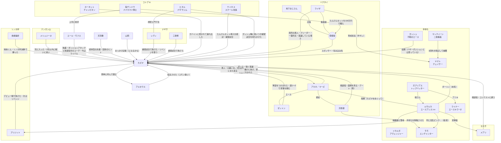

# 人間関係（067時点）

カズマを中心にした関係の全体図。矢印の向きは「誰が誰をどう思っているか」。

## 相関図

## カズマに向けられた気持ち
| 人物 | 気持ち | 変化 | 出典 |
| --- | --- | --- | --- |
| [アカネ](trainers/akane-mars.md) | 強く意識している（意識度98/100）。素直になれない | 拾った興味本位 → パンツ騒動で意識 → 「守って」を期待 → 旅立ち後は「帰ってこい」「添い寝してやる」 → 賭けに負け、スポンサー候補を教える → 家を出て行かれて「カズマのバカァ！」 → ソノオ杯を観戦し、初敗北に「ビンタしてでも引きずってってやる」 | 001, 008, 019, 036, 038, 061 |
| [ルサルカ](pokemon/rusalka.md) | 本気で惚れている（「ダーリン」、正妻気取り） | 最初は生命エネルギー目当て → 毎朝寝込みを襲う → メアリいわく、なつき具合は「アシスト（ヒロインルート）」寄り | 004, 005, 022, 025 |
| [ライザ](trainers/ryza.md) | 意識し始めている。仕事上は一蓮托生 | 商売の相談相手 → じてんしゃのサドルで悶える → 様子がおかしい（凜談） → 探検堂のブリーダーとして一緒に育成 → 住み込みのカズマを「クズ野郎」呼ばわりしつつ、納品に一緒に来てほしがる | 009, 016, 019, 025, 036, 037, 038, 042 |
| [メリュジーヌ](pokemon/melusine.md) | 「割とタイプ」。勝ったら恋人にしてあげる | 気配への興味 → 気に入る → 素通りされてイラッとした | 007, 020 |
| [メアリ](trainers/mary.md) | コンテスト仲間になれそうな相手として好意的。「応援してるわよ」 | 夕食に誘う → 連絡先を渡す → ヨスガに招いてコンテストに付き合い、『固有』やチーム名を教える | 025, 028, 040, 041 |
| [天羽奏](trainers/others.md) | 気さく。「デートしてやってもいい」。統率型の先輩として面倒を見る（「運男」） | 連絡先を渡す → 探検堂に遊びに来て『固有』のヒントをくれ、昼食を奢る | 028, 043 |
| [エール・モフス](trainers/ail.md) | 友達になりたい。執着が強い | ジム戦を見て興味 → 押しかけて助っ人に → 連絡先交換 → 夜中に鬼電して打ち上げ、『熟達指令』を教える → 観戦にもついて来たがる | 032, 033, 036, 050, 051 |
| [ゼットン](pokemon/zetton.md) | 家にいてほしい | 部屋を片付けてから一貫して味方 → 家を出るカズマについて行こうとし、週1〜2の家事を頼み込む | 001, 005, 019, 038 |
| [渋谷凜](trainers/shibuya-rin.md) | 面倒を見ている。見直しつつある。デートに誘われてかなり意識した | 「厨二病のバカ」 → 「思ってたよりスゴイ奴？」 → バッジ3つに「まだ驚いてる」 → 汚部屋の掃除を頼み、デート（笑）へ（割り勘） | 003, 025, 036, 043, 044 |
| 地下おじさん | 運命の人材 | 店に迎えたい → スポンサー登録して即採用 | 016, 036 |
| ホーネット（チャンピオン） | 好意的。珍しいガバイトの持ち主として興味 | ガバイトに惹かれて連れ出す → カズマに得があってほっとする | 038, 039 |
| エネル | ライバル心（「でんき」最強を示したい）とガッシュ種への好意 | 練習試合を持ちかける | 039 |
| 碇ゲンドウ、ケイネス | お得意様 | たんけんセットを購入・導入検討 | 039 |
| [モモ](pokemon/momo.md) | 移籍先の監督として好意的。あざとくからかう | カズマのチームに興味を持つ → 移籍 | 043, 044 |
| [レヴィ](trainers/levi.md) | 「強いね、おにーちゃん」。リベンジを誓う | 練習試合で負ける | 046 |
| [三雲修](trainers/osamu.md) | 統率型の恐ろしさを認める | 練習試合で負ける | 048, 049 |
| [ダージリン](trainers/darjeeling.md) | 同期のライバル。からかわれて土下座 | 3vs3で負ける → 開会式の日に店に来られる | 030, 051 |
| エネル | ガブリアスへの殺意（「本気で殺しに行く」） | ― | 049 |
| [ブリジット](trainers/bridget.md) | 明るく友好的。「おにーさん」 | 喫茶店で相席 → デビュー戦で負ける | 054, 057 |
| [食蜂操祈](trainers/shokuhou.md) | 余裕の上から目線（「地味くん」）。対戦を楽しみにしている | 同じソノオ杯で優勝候補として待ち受ける → 決勝で勝ち、プロ初の黒星をつける | 054, 061 |
| 山岡 | 面白いトレーナーとして興味 | おっかけになるかも | 053 |
| ハンサム | 口止めしたい相手 | きのみを渡して消える | 044 |
| ハクタイジムのポケモン | 何体かがカズマを気にしている（統率の片鱗） | ― | 022, 025 |

## カズマが持つ約束・借り
| 相手 | 内容 | 期限 | 出典 |
| --- | --- | --- | --- |
| アカネ | 一ヶ月の賭け（バッジ3つ＋スポンサー）。負けたらずっと家政夫 → **条件を両方達成（カズマの勝ち）** | 旅立ちから1ヶ月 | 008, 036 |
| アカネ | 旅費を出世払いで借りている | ― | 008 |
| アカネ | 3日以内にまた来る | 038から3日 | 038 |
| ゼットン | 週1〜2でアカネの家の世話（ゼットンの頼み。引き受けたかは不明） | ― | 038 |
| ハンサム | 国際警察のことを他言しない（口止め料にきのみをもらった） | ― | 044 |
| メリュジーヌ | テンガン山で戦う | 007から1年 | 007 |
| メアリ | またヨスガに来たら、街を案内してもらいコンテストの話を聞く | ― | 028 |
| ダージリン、食蜂操祈 | プロの舞台での再戦 | ― | 031 |
| エール | スポンサーが決まったら打ち上げ（エールの奢り） → 050で実施 | ― | 036, 050 |
| 探検堂 | スポンサー契約。プロで勝って店を潤す | ― | 036, 037 |
| ライザ | 「わざマシン：エナジーボール」を借りている（「貸しただけだからね？」） | ― | 042 |
| エネル、ケイネス | ナギサシティで練習試合 → レヴィと三雲修に勝利 | ― | 039, 046, 048 |
| エール | どちらかが抽選に落ちたら、もう片方の応援に行く（エールの提案） | 第一節 | 051 |
| エール | 地下大洞窟で練習試合（067で対戦中）。勝ったら『専用』の情報とアドバイスをもらう | ― | 062, 067 |
| ガッシュ、ルサルカ、マックイーン | 『専用』の3つの枠を与える | ― | 064 |

## そのほかの関係
- **アカネと凜**: 親友で同類。どちらも汚部屋。（出典: 002, 003, 006）
- **アカネとジュピター**: 同じ三将星のライバル。（出典: 000, 001）
- **メアリとマルフォイ**: マルフォイが一方的に好意を寄せ、いつも断られている。（出典: 026, 028）
- **直哉と玉藻の前**: 元主人と侍女。玉藻はツンデレ（直哉談）。（出典: 021, 022）
- **直哉とマンハッタンカフェ**: 直哉がスカウト中。カフェは前向きに検討。（出典: 022）
- **ダージリンとウラヤマ**: 姪と叔父。（出典: 028）
- **食蜂操祈とスピアー**: 「唯一無二」の相棒。（出典: 029）
- **エールとラハール・キュゥべえ・タツマキ**: トレーナーと手持ち。『エース』はラハール。タツマキはツッコミ役。（出典: 009, 032, 050）
- **エールと碇ゲンドウ（ナナカマド博士）**: 助手と上司。ゲンドウいわく、エールは「ボッチ」。（出典: 039）
- **ホーネットとエネル**: 顔を合わせると言い合う。エネルはホーネットを「女子力ゼロ勢」と呼ぶ。（出典: 039）
- **エネルと煉獄**: ライバル（エネル談）。（出典: 039）
- **メアリと凜**: カズマの近況を伝え合う仲。（出典: 040）
- **凜とティファニア**: トレーナーと手持ち。（出典: 043）
- **修とティアナ**: トレーナーと『エース』。スクールで意気投合した。（出典: 045）
- **ブリジットとウラヤマ**: 教会と孤児院を援助する「足長おじさん」。（出典: 054）
- **食蜂操祈とロータス、スピアー**: トレーナーと『二枚看板』、『エース』。ロータスはスピアーから『エース』の座を奪おうとして連敗中。（出典: 054）
- **ウラヤマと探検堂**: ソノオ杯で地下おじさんと隣の席になった縁で、たんけんセットを大量に買い、知人に紹介すると約束。（出典: 065）
- **ホーネットとアダム（アカギ）**: 今と先代のチャンピオン。ギンガ団はチャンピオンの座の奪還を狙っている。（出典: 044）
