# 人間関係（408時点）

カズマを中心にした関係の全体図。矢印の向きは「誰が誰をどう思っているか」。

## 相関図

```mermaid
graph TD
  K[カズマ]
  subgraph 手持ち
    G[ガッシュ<br>不動のエース]
    R[ルサルカ<br>エースアシストα]
    M[マックイーン<br>二枚看板]
    L[ライナー<br>エースキラーβ]
    F[ガブリアス<br>トップバッター]
    I[イカルガ<br>アヴェンジャー]
    Mo[モモ<br>エンチャンター]
    Y[ヤマト<br>チェイサー]
    Ro[ロトム<br>タイトエンド]
    Bz[ベルゼブモン<br>スカウター]
    Hi[リザードン<br>すっぴん・メガシンカ（元ヒトカゲ）]
  end
  subgraph ハクタイ
    A[アカネ／マーズ]
    Z[ゼットン]
    Rin[渋谷凛]
    Ry[ライザ]
    Dad[地下おじさん]
    Shop((探検堂))
    Os[オシュトル<br>前タワータイクーン]
  end
  subgraph テンガン山
    Me[メリュジーヌ]
    Ki[キーラ<br>氷狼女帝]
  end
  subgraph キッサキ
    Sa[キジマ・シア<br>キッサキジム]
  end
  subgraph ナギサ
    Ev[レヴィ]
    Osm[三雲修]
  end
  Ka[天羽奏]
  subgraph ソノオ杯
    Br[ブリジット]
    Sh[食蜂操祈]
  end
  Ya[山岡]
  subgraph ヨスガ
    Ma[メアリ]
  end
  subgraph コトブキ
    Ho[ホーネット<br>チャンピオン]
    Ge[碇ゲンドウ<br>ナナカマド博士]
    Ke[ケイネス<br>スクール校長]
    En[エネル<br>ナギサジム]
  end
  Ar[アルセウス]
  E[エール・モフス]

  Ar -->|"転生させた（コモン扱い）"| K
  K -->|"邪神と呼んで恨む"| Ar
  A -->|"拾った・強く意識（98/100）・賭けに負け、家を出て行かれた"| K
  K -->|"恩人・元雇い主。3日以内にまた来る"| A
  Z -->|"昔助けた・胃袋をつかまれた・週1〜2で家事を頼む・好感度はかなり高い・ヒトカゲ捕獲に付き合う（279）・ガッシュが巡り会ったのがお前でよかった（373）"| K
  Rin -->|"相談役・面倒を見る・デート（笑）・「友達」（160）・悪い虫から守護る（166）"| K
  Rin -.->|"泥棒猫の香り・ライザに見張らせる（166）"| Tk2[出雲天花]
  R -.->|"最近様子のおかしいしぶりんを警戒（166）"| Rin
  Ry -->|"商売の恩人・ブリーダー・一蓮托生・意識している様子"| K
  Shop -->|"スポンサー・住み込み先"| K
  Dad ---|"店長"| Shop
  Os ---|"スタッフ（202）"| Shop
  Os -->|"『ベテラン』として選手入り（372）・直哉戦で初陣（379）・ヨスガ杯で公式戦初登場（399）・決勝で3体抜き（403）"| K
  K -->|"路地裏で拾った（198）"| Os
  Ry ---|"看板娘"| Shop
  Me -->|"気に入った・1年以内に戦いに来い"| K
  Ho ---|"従姉妹・377で距離が縮まる"| Sh
  E -->|"執着・ダンジョンアタックと熟達指令のコーチ・練習試合と中規模大会で負けた・同期のライバル"| K
  Sa -->|"遭難者として助けた・たんけんセットに興味・お気に入り・5つ目のジムで負けた（224）"| K
  Da[ダージリン<br>茶房グロリアーナ]
  Bk[爆豪勝己<br>雄英ダイナマイツ]
  Da -->|"統率型のライバル・ハクタイ杯決勝で負けた・同じくB昇格（158）・第三節前の練習試合で負けた（385）・これまでの相手で最高峰"| K
  Ju[ジュピター<br>ギンガ団三将星筆頭]
  Ad[アダム<br>ギンガ団社長]
  Tk[一条武丸<br>人力ハードラック]
  Ju -->|"意気投合・連絡先交換・統率型の先輩として助言"| K
  Ju ---|"同僚（ウチのバカ）"| A
  Ad -->|"気に入って本部に呼んだ"| K
  Tk -->|"同期・スポンサーの最終面接で競った・練習試合（087）"| K
  R -->|"一目惚れ・デートでキスして告白（091）"| K
  K -->|"告白されて放心・2つ目の『絆』（愛の絆）"| R
  Sp[先輩<br>随牧スペリオール]
  Sp -->|"後輩・ノモセ杯の決勝で0-3で勝った・マサゴ杯でまた負けた"| K
  Nao[禪院直哉<br>呪相カースメーカー]
  Nao -->|"ライバル・挑戦状・トバリ杯初戦でまた負けた（104）・同じくB昇格（158）・第三節前の練習試合で負けた（381）・人間性だけは認めへん（386）"| K
  Yu[ゆら<br>直哉のSP候補]
  Yu -->|"実家から見張りに来た・SP候補"| Nao
  Sam[朝比奈さみだれ<br>四天王]
  Lz[ルイズ<br>宮殿トリステイン]
  Lz -->|"フロンティアの練習試合で0-4で負けた（170）"| K
  Zg[ジーク<br>双龍ファフニール]
  Zg -->|"責任転嫁されて練習試合に（172）、0-4で負けた（177）"| K
  Fyu[黛冬優子<br>ルーレットゴッデス]
  Fyu -->|"ルーレット好きで歓迎。施設にハマる適性を感じる（173）"| K
  Mnj[万丈目サンダー<br>発電所サンダーズ]
  Mnj -->|"操祈のダーリンの座を賭けて決闘を申し込む（182）"| K
  Tei[トウカイテイオー]
  Tei ---|"ユニバースに加入（168）"| E
  Tei -->|"ライバル宣言（171）"| M
  A -->|"Aランク大会の決勝で勝った（159）"| Sam
  Ik[黒鉄一輝<br>黒鉄キャバルリィ]
  Ik -->|"トバリ杯で負けた・強いな、キミは"| K
  Sat[サターン<br>ギンガ団三将星]
  Sat -.->|"マーズの噂で観戦・面白いトレーナー"| K
  Da ---|"観客席で隣・挑戦状を届けた"| Nao
  Bk -->|"ハクタイ杯初戦で負けた"| K
  Sa ---|"知り合い（凛ちゃん）"| Rin
  Ki -->|"母（西の麓にタマゴを放った）"| Y
  Ki ---|"育て役（ロリオカン）"| Me
  Ma -->|"相談役・コンテストに誘う・ヨスガ杯とエキシビションに誘う（370）"| K
  R -->|"泥棒猫"| Ma
  Rin -->|"手持ちを移籍させた"| Mo
  R -->|"同じ淫乱ピンク…（般若）"| Mo
  Ka -->|"統率型の先輩・固有のヒント・ハクタイ杯2日目に負けて「優勝して来いよな」（353）"| K
  Br -->|"デビュー戦で負けた・次はリベンジ・ウタのチャリティソングのお礼と激励（355）"| K
  Sh -->|"地味くん・ソノオ杯決勝で勝った"| K
  Ya -->|"おっかけ記者（になるかも）"| K
  R -->|"戦艦級と警戒"| Br
  En ---|"師匠と門下生"| Ev
  Ev -->|"練習試合で負けた・リベンジを誓う"| K
  Osm -->|"練習試合で負けた"| K
  M -->|"3回吹き飛ばして捕獲"| Y
  Ry -->|"育成担当（半ギレ）"| Y
  Ho -->|"ガバイトに惹かれて連れ出した・家の掃除をしてもらい好感度40、ただ操祈との距離は心配（377）"| K
  Ge ---|"上司と助手"| E
  Ke -->|"たんけんセット導入を検討・練習試合"| K
  En -->|"ガッシュ種に食いつき練習試合を持ちかけた・ナギサジム戦で「1-0」で負けて「この神が認めてやる！！！だから勝ち進め」（490）"| K
  Ge -->|"たんけんセットを100万円で購入"| Shop
  R -->|"ダーリン（本気）"| K
  G -->|"信頼（バギーポジションとは思っている）"| K
  A ---|"親友"| Rin
  A ---|"険悪（カズマをめぐって）"| R
  A ---|"エース"| Z
  F -->|"姐さん"| R
  F -->|"アニキ"| L
  Tk2 -->|"テレビでムサシとコジロウのコンビ（「コジロウくん」）・ライブに「何なら私と一緒に行く？」（248）"| K
  Hk[岸波白野<br>ミラクル団会長]
  Hk -->|"推し・舞台裏動画のご褒美に撫でられて小動物化、トバリ・デパートへ（249）・探検堂に就職するつもり（376）・生配信の司会（387）"| K
  Sk[左門<br>召喚サモナーズ]
  El[エレン・ベーカー<br>電波局ニューホライゾン]
  Sk -->|"ななつぼしを奢られる（234）・テレビの練習試合で負けた（243）"| K
  El -->|"教育番組に悪役として呼んだ・練習試合で負けた（247）"| K
  Ut[ウタ<br>シンオウの歌姫]
  Ut -->|"番組で暴れたカズマたちを止めた・お詫びにライブのペアチケット（248）"| K
  Ut ---|"マブダチ（178）"| Ma
  K -.->|"ウタのライブに誘う予定（248）"| Ma
  Ay[羽咲綾乃<br>百貨店スマッシュ]
  Ay -->|"白野を「デート」に連れ出されて敵認定・クロガネ杯の初戦で負けた（260）"| K
  Hk ---|"刎頸の友（あやのん）"| Ay
  Zn[星噛絶奈<br>多々良クラッシャーズ]
  Zn -->|"「ジャリボーイ」・クロガネ杯の5戦目で負けた（268）"| K
  Jt[ジータ<br>百代ファンタジーズ]
  Jt -->|"同じハクタイの「統率」型・クロガネ杯の決勝で勝った（269）・ガチャ談義でケンカ、ポンコツ凛に一緒に突っ込んで友情っぽいもの（272）・ハクタイ杯大規模大会の決勝で負けた（365）・「今日の借りは、必ず返す」（365.1）・未公開の『エンペラー』ネネカでマウント（484）"| K
  K -->|"課金兵・今大会で一番負けたくない相手（341, 350）・クロガネ杯の雪辱を果たした（365）・「またやろうぜ」（365.1）"| Jt
  Rin ---|"同期で友達・6つ目のバッジを取られた（272）"| Jt
  Pw[パワー<br>召喚サモナーズ]
  M ---|"顔を合わせれば口喧嘩（234）"| Pw
  Bz -->|"特訓で『共鳴』などを引き出した（249）"| Ro
  Ro ---|"アホほど相性がいい交代の相棒（249）"| Mo
  subgraph カントー
    Shi[白石蔵ノ介<br>トキワジム・グリーン]
    Tn[天子<br>白石の元門下生]
    Mf[桐須真冬<br>四天王・カンナ]
  end
  Shi -->|"手持ちを「B」中位級と見抜く・トキワジムに泊めた・天子との練習試合を提案（275）・ヒトカゲの育成相談に乗り、邪道な育成法も手帳に載せる・「キミのこと好きになれそうやで？」（281）"| K
  Shi ---|"元師匠と元門下生（『天賦の才』のニドキングを譲った）"| Tn
  Tn -->|"練習試合の約束（275）"| K
  Mf -->|"若いスバメ候補（74点）・ともしび温泉に招待（277, 278）"| K
  K -->|"フリーザーに抱きつきに行く・マーズやしぶりんと同じ匂い（58点）"| Mf
  Mf -.->|"生き別れの姉妹のようなシンパシー（279）"| A
  A -->|"カントー出張に誘う（273）・ともしび温泉まで追いかける（278, 279）"| K
  Ut -->|"Togetherを作る（271）・天賦のヒトカゲを「お前が、持ってろ！」（280）"| K
  K -->|"ウタへのお土産のつもりで捕まえた・11体目（279, 280）・そだてやに預けた（332）"| Hi
  Hi -->|"リザードンに進化してスズカと激励に来た（355）"| K
  Tk2 -->|"カントーに自腹でついて来る（274）・ヒトカゲのことで「おはなし」（280）"| K
  subgraph ハクタイ杯大規模大会
    Td[東堂葵<br>真砂ブギウギ]
    Ir[イレイナ<br>波止場ウィッチクラフト]
    Kt[鏑木・T・虎徹<br>夜帳ワイルドヒーローズ]
  end
  Td -->|"ブラザー・初日1戦目で負けた「負けたぜ、ブラザー」（344）・焼き肉で連絡先交換（368）"| K
  Ir -->|"「こいつら人間性最低ですよ」・初日2戦目で負けた（346, 347）・焼き肉で連絡先交換（368）"| K
  Kt -->|"「情熱も冷静さも併せ持ってる」（341）・最終日の初戦で負けた（361）"| K
  Gym[ハクタイジムの門下生]
  Rin ---|"師匠と門下生"| Gym
  Gym -->|"突然変異の珍獣・バトルの時だけはカッコイイかも（モテ度63）・直哉との練習試合をジムでと決めた（350）"| K
  Nao -->|"ナンパして返り討ち（350）"| Gym
  Ut -->|"カズマ由来の故郷の歌をチャリティソングに（355）・決勝の勝者コール（365）"| K
  M -->|"『絆』レベル5・「一緒に獲りに行きましょう、てっぺんを」（356）"| K
  K -->|"このチームの『アシスト』・俺の左腕（339）"| R
  R -.->|"たるんどる、と喝を入れて日帰りに送り出す（388）"| Tk2
  Tk2 -->|"キミのSPの座は誰にも渡さない・心の中では好き（391）"| K
  Ash[アシュロン<br>先代のテンガンのヌシ]
  Ash -->|"ヤマトの居場所に「ありがとうな」・王の素質を持つ傑物かも（373）"| K
  K -->|"メリュジーヌを『エンペラー』にすると宣言（373）"| Ash
  Ash ---|"先代と今代の『テンガンのヌシ』"| Me
  Kn[栗花落カナヲ<br>ハクタイジムの門下生]
  Rin ---|"師範と門下生"| Kn
  Kn -.->|"一目惚れされたと勘違い（365.2, 369）"| K
  Lk[リュカ<br>山小屋グランバニア]
  Lk -->|"友好度5・リベンジのビジョンが見えるまで出禁（371）"| K
  Cl[クロロ<br>むしの四天王]
  Cl -->|"同じ「統率」型として注目・少し同類の匂い（389）"| K
  Ju -.->|"カズマの話をちょくちょくする（389）"| Cl
  Ken[上杉謙信<br>オシュトルの元エースキラー]
  Ken ---|"元『エースキラー』（390）"| Os
  Ken ---|"『ベテラン』として加入（390）"| Sp
  Ken -->|"根っこは其方に似たトレーナーの元についた（390）"| K
  subgraph ヨスガ杯中規模大会
    Vh[ヴィルヘルム<br>鮮血カズィクルベイ]
    Uni[ユニ<br>探求バブミーズ]
    Cld[クラウド<br>神羅ソルジャーズ]
  end
  Mal[マルフォイ<br>ヨスガジムの門下生]
  Vh -->|"これは俺とテメェの決闘だ・初戦で負けた（393〜395）"| K
  Uni -->|"2戦目で負けた（397〜399）"| K
  Ce[セシリア<br>水麗ブルーティアーズ]
  Uni ---|"知り合い・データの受け渡し（410）"| Ce
  Ce -->|"オシュトルのサインと記念写真を条件に練習試合を受ける（410）・大規模戦の覇者の力、感じさせてもらいますわ（413）・練習試合で3体残しで負けた（414〜415）"| K
  Os -->|"ファン対応・サインとツーショット（416）"| Ce
  Tyk[島津豊久<br>血風ドリフターズ]
  Tyk -->|"レスリングの借りを返す・練習試合で2体残しで負けた・強かチームじゃ（417〜421）"| K
  Tyk ---|"ブリーダー番組で共演・後日練習試合の約束（417, 422）"| E
  Fyu ---|"同系統の運の『固有』・ガリガリくんを奢る・内緒で応援（423）"| K
  Cld -->|"全勝同士の決勝で負けた・エースを「しらはどり」で返り討ちにされ動揺・良い経験になった、礼を言う（401〜403）"| K
  K -->|"悔しいでしょうねぇ（煽り）（403）"| Cld
  Mal -->|"ヨスガスタジアムで出迎えるが名前を思い出してもらえない（392）"| K
  Ma -->|"すでに今大会でも最強・メガシンカに元タワータイクーンはやり過ぎ（393, 399）・エキシビションで「演りましょうか」（403）・負けて「こんなに強くなってたのね」（408）"| K
  K -->|"半年以上経ってここまで来た・戦ろうぜ（403）・エキシビションで勝った（408）"| Ma
  En -.->|"酔ってオシュトルの愚痴を聞かせた（407）"| Ma
```

## カズマに向けられた気持ち

気持ちの今の状態だけの表。どう移り変わってきたか（「変化」の列）は [relationships-notes.md](relationships-notes.md) に全部残している。
| 人物 | 気持ち | 出典 |
| --- | --- | --- |
| [アカネ](trainers/akane-mars.md) | 強く意識している（意識度98/100）。素直になれない | 001, 008, 019, 036, 038, 061, 145, 148, 159, 166, 187, 271, 273, 274, 278, 279, 304, 310, 337, 373, 479 |
| [ルサルカ](pokemon/rusalka.md) | 一目惚れで本気（初対面のストライク度1D100:94。生命エネルギーの美味さ80。「ダーリン」、正妻気取り）。カズマもデートでルサルカを強く意識した（意識度99）。「右腕」と「左腕」の片方を目指す | 004, 005, 022, 025, 090, 091, 098, 101, 166, 180, 181, 188, 189, 190, 366 |
| [ガッシュ](pokemon/gash.md) | 最初の手持ちで「右腕」。とんでもないトレーナーの手持ちになったと何度も思いつつ信頼している | 366 |
| [ライザ](trainers/ryza.md) | 意識し始めている。仕事上は一蓮托生。Bランク以降もBDを続けると決めた（今年いっぱいはただ働き）。ルサルカとの『愛の絆』に思うところがある | 009, 016, 019, 025, 036, 037, 038, 042, 109, 110, 148, 151, 188, 204 |
| [メリュジーヌ](pokemon/melusine.md) | 「割とタイプ」。勝ったら恋人にしてあげる | 007, 020, 336, 455 |
| クシャルダオラ（[その他のポケモン](pokemon/others.md)） | メリュジーヌのパシリの古龍（Lv140）。“ごすのお気に入り”とは仲良くしておいた方が得、と妙にフレンドリー。三下適正で妙な親和性 | 000, 006, 455 |
| [メアリ](trainers/mary.md) | コンテスト仲間になれそうな相手として好意的。「応援してるわよ」。326からは週4回のファッション情報で、カズマの身につけるものをじわじわ自分の好みに書き換えにかかっている（補足: ユーザーより） | 023, 025, 028, 040, 041, 248, 249, 326, 370, 393, 399, 403, 405, 406, 408, 409 |
| [天羽奏](trainers/others-b.md) | 気さく。「デートしてやってもいい」。統率型の先輩として面倒を見る（「運男」） | 028, 043, 352, 353 |
| [エール・モフス](trainers/ail.md) | 友達になりたい。執着が強い。今はライバル。No.2ルーキーの座を争う | 032, 033, 036, 050, 051, 068, 072, 114, 144, 162, 322, 341, 358, 364, 365.1, 412, 417, 422, 481 |
| [ゼットン](pokemon/zetton.md) | 家にいてほしい。好感度は「かなり高いぞ？」。昔カズマを助けたことがあり、ガッシュと組んだ時もその場にいた。知り合って半年ほどで、トレーナーに黙ってカズマについて来る仲 | 001, 005, 019, 038, 159, 279, 304, 373 |
| [渋谷凛](trainers/shibuya-rin.md) | 面倒を見ている。見直しつつある。デートに誘われてかなり意識した。160で「"友達"」と自分で整理した（今までより「イイヤツ」に感じる）。166では「私が守護らねばならぬ」と天花やルサルカに見張りをつけ始めた（本人は「普通の友達」のつもり） | 003, 025, 036, 043, 044, 160, 166, 180, 185, 186, 218, 272, 365.2, 378, 386, 482, 484 |
| [キジマ・シア](trainers/shia.md) | 「お気に入り」（ブラン談）。初期好感度は高い（1D50:37＋たんけんセット補正50）。たんけんセットの件でキッサキとして期待。「私個人としても」ダンジョンアタックの成功を期待している | 072, 086, 112, 224, 225, 252, 309 |
| 地下おじさん | 運命の人材 | 016, 036, 094 |
| ホーネット（チャンピオン。[その他のトレーナー](trainers/others.md)） | 個人的にはかなり好意的（377の従姉的好感度40。本人いわく、ガブリアスとお掃除の補正で個人的には50くらい乗る）。ただ、従妹の操祈とカズマの距離の近さは従姉として心配で、感謝と嫉妬に揺れている | 038, 039, 210, 377 |
| エネル（[その他のトレーナー](trainers/others.md)） | ライバル心（「でんき」最強を示したい）とガッシュ種への好意。ガブリアスへの殺意（「いずれ私と戦うときにそのガブリアスを出すなら本気で殺しに行く」） | 039, 049, 154, 409, 474, 475, 476, 489, 490 |
| 煉獄杏寿郎（「ほのお」の四天王。[その他のトレーナー](trainers/others.md)） | 認める相手（「見事なり、佐藤カズマ」）、リベンジを誓う | 303, 457, 474, 475 |
| 碇ゲンドウ、ケイネス | お得意様 | 039 |
| [モモ](pokemon/momo.md) | 移籍先の監督として好意的。あざとくからかう | 043, 044, 180 |
| [レヴィ](trainers/levi.md) | 「強いね、おにーちゃん」。リベンジを誓う | 046 |
| [三雲修](trainers/osamu.md) | 統率型の恐ろしさを認める | 048, 049 |
| [ダージリン](trainers/darjeeling.md) | 同期のライバル。統率型同士。開会式の日にからかわれたが、言い返して土下座させた | 030, 051, 074, 078, 096, 158, 165, 196, 322, 385, 386 |
| [禪院直哉](trainers/naoya.md) | ライバル。「どっちがモテるか」で張り合う仲。リベンジを狙う | 021, 022, 093, 096, 099, 104, 158, 189, 322, 350, 365.1, 378, 381, 386 |
| [先輩](trainers/senpai.md) | 「後輩」と呼ばれる。いい人だが噛ませ犬オーラ。カズマの中では半ば聖域で、先輩にだけは罵倒を一つも言ったことがない（補足: ユーザーより） | 010, 013, 092, 140, 148, 149, 183, 365.1, 390, 443, 463, 465, 466 |
| 黒鉄一輝（[その他のトレーナー](trainers/others-c.md)） | カズマたちを「C中位、それ以上かも」と評価。優勝候補として迎え撃つ | 094, 106, 107 |
| イングリッド（[その他のトレーナー](trainers/others.md)） | 第四ジムで負けた。「おぬしら思ってたよりもさらに強い」「わしと気が合う部分があるかも」 | 101, 117 |
| [スペランカー](trainers/spelunker.md) | 最初に戦ったジムリーダー。エネルに勝ったカズマに「なんだか嬉しくなっちゃった」。エキシビションに口説く（「受けてくれるのならボクはハッピーハッピーかもしれないけどね」） | 017, 492 |
| サターン（[その他のトレーナー](trainers/others.md)） | マーズ（アカネ）の話で興味を持ち、トバリ杯を観戦。「面白いトレーナーじゃないか」 | 105 |
| [出雲天花](trainers/tenka.md) | 「面白い男の子」「カワイイ」と興味。初対面で「お付き合いをする新従業員」と名乗った（本気度49） | 119, 120, 121, 123, 126, 127, 157, 179, 240, 248, 274, 280, 388, 391 |
| ドン・観音寺（[その他のトレーナー](trainers/others-c.md)） | 「C」屈指の統率型として胸を借りに来た。「良からぬ気配」がする。「カズマ少年」 | 121, 125, 126 |
| 錦木千束（[その他のトレーナー](trainers/others-c.md)） | 初戦の相手として警戒。「指示」型として『エース』ともう1体の情報を集めようとしている | 131, 132, 137, 446 |
| [ロトム](pokemon/rotom.md) | 最初はいきなり襲われて「人間って怖いロト」。すぐ打ち解けてイタズラも仕掛ける | 128, 129, 131, 149, 150, 151 |
| [ベルゼブモン](pokemon/beelzemon.md) | ハクタイの森「深度：3」の『ヌシ』としてダンジョンアタックで戦い、敗れて「お前のようなヤツの下ならより一層………な」と軍門に降った | 230, 232, 233 |
| [リザードン](pokemon/charizard.md) | 11体目。ゲームで最初に選んだのもヒトカゲのカズマの手持ち。カントー好きに振り回されつつ「帰りにアイス買ってくれたら許すよ（寛大）」 | 280, 332, 355, 374, 384, 389 |
| [岸波白野](civilians/hakuno.md) | 推しのチームの監督で、雇い主。カズマいわく舎弟の領域 | 217, 219, 220, 228, 235, 248, 249, 376, 387 |
| [ジュピター](trainers/jupiter.md) | 同じ統率型の先輩。相談相手 | 080, 082, 389 |
| 一条武丸 | 同期。強面で怖い | 081 |
| [ブリジット](trainers/bridget.md) | 明るく友好的。「おにーさん」 | 054, 057, 355 |
| [食蜂操祈](trainers/shokuhou.md) | 余裕の上から目線（「地味くん」）。対戦を楽しみにしている | 054, 061, 132, 141, 146, 147, 148, 182, 188, 192, 195, 322, 341, 365.1, 377, 411, 424, 425, 431, 435 |
| 山岡 | 面白いトレーナーとして興味 | 053, 156, 480 |
| ハンサム | 口止めしたい相手 | 044 |
| 黛冬優子（[その他のトレーナー](trainers/others.md)） | 「今年の「C」のトップ」と知っている。ルーレット好きで歓迎（第一印象1D75:47＋25）。カモにできる気がせず、バトルルーレットに“ハマる”適性を感じる。運任せのやり方を気に入る 。個人的にミラクルズが好きで内緒で応援している。自分の『固有』とカズマの『固有』を同系統の運の力と見る | 173, 176, 323, 423 |
| 万丈目サンダー（[その他のトレーナー](trainers/others-b.md)） | 操祈を巡る恋敵と誤解している。「この下郎が！！！」 | 182, 184, 191 |
| 式波・アスカ・ラングレー（[その他のトレーナー](trainers/others-b.md)） | カズマを“まぐれルーキー”と呼ぶ。先輩が大好き | 183, 184, 193, 194, 195 |
| ベルナデッタ＝フォン＝ヴァーリ（[その他のトレーナー](trainers/others-b.md)） | 元ひきこもりのカズマに“同じヒキニートのシンパシー”を感じている | 192, 196, 197, 201, 202, 478 |
| [オシュトル](trainers/oshutoru.md) | カズマを「単なる「統率」による力任せというわけでもない、リカバーも速い」と評価。今は《探検堂ミラクルズ》の『ベテラン』で、カズマを「我が聖上」と呼ぶ | 198, 199, 202, 204, 372, 379, 399, 403 |
| 小鳥遊ホシノ（[その他のトレーナー](trainers/others-b.md)） | 顔見知り（「前もしたね、自己紹介」） | 094, 202, 389 |
| ジーク（[その他のトレーナー](trainers/others.md)） | シンオウのルーキーを「こんなヤバイの………？」。ライナーに手を焼き「もういやだ、こんなスタジアム！！！！！！！」 | 172, 173, 177 |
| 左門（[その他のトレーナー](trainers/others-c.md)） | 第一節のコトブキで戦った相手。カズマの新しい悪魔（ベルゼブモン）の話に「お前を殺して奪い取る（迫真）」 | 234, 240, 243 |
| エレン・ベーカー（[その他のトレーナー](trainers/others-c.md)） | キッズ人気の高いミラクルズの『エース』を理由に、教育番組の悪役として呼んだ | 234, 244, 247 |
| ウタ（[その他の民間人](civilians/others.md)） | 番組でやり過ぎたカズマたちを止めに来た歌姫。故郷の歌を教わって歌い合う仲 | 248, 251, 271, 280, 355, 358, 365, 444, 477 |
| クーデリア・藍那・バーンスタイン（アカネのSP。[その他のトレーナー](trainers/others.md)） | アカネの家の掃除に来てくれていたことに感謝している | 479 |
| 朝比奈さみだれ（四天王。[その他のトレーナー](trainers/others.md)） | 脅威として注目し、迎え撃つ心づもり。煉獄の忠告で、実際に体験するのが一番と思っている | 094, 479, 492 |
| 羽咲綾乃（[その他のトレーナー](trainers/others-b.md)） | 白野の親友。白野がカズマと「デート」と言ったのに怒り、ミラクルズを悪と敵認定（「キミを始末してはくのんを返してもらうかね」） | 250, 257, 260 |
| 星噛絶奈（[その他のトレーナー](trainers/others-b.md)） | 《多々良クラッシャーズ》の監督（元ロケット団の『獣化』トレーナー）。ジータが一番警戒しているのがミラクルズと聞いて興味を持った（「私が味見してやるとしようかね」）。カズマを「ジャリボーイ」と呼ぶ | 257, 268, 269 |
| ジータ（[その他のトレーナー](trainers/others-b.md)） | 同じハクタイの「統率」型（資質はカズマとほぼ同じ、天花）。クロガネ杯で一番警戒していたのがミラクルズ（ルーキーに即負けはできない） | 257, 269, 272, 341, 362, 365, 365.1, 484 |
| 天子（[その他のトレーナー](trainers/others.md)） | 白石の元門下生で《常盤ヘブンアース》の監督（統率AA-）。ドM。カズマのS具合を見極めた（42点） | 275, 291〜295 |
| ワタル（海馬瀬人。[その他のトレーナー](trainers/others.md)） | カントー四天王筆頭（「統率：AAA」）。ウタのファンクラブ会員番号1番で、ウタと親しいカズマを「認めない」（ライバル心）が、一歩先を行く決闘者と認め、同じ「統率」としていずれ''本物''を決めると言う | 286, 287, 338, 358, 365.1 |
| 白石蔵ノ介（[その他のトレーナー](trainers/others.md)） | カントーのトキワジムのジムリーダー（''グリーン''、「育成：AAA」）。カズマの手持ちを「B」中位級、「俺好みな感じの手持ちのバラつき」と見る | 275, 281 |
| 桐須真冬（[その他のトレーナー](trainers/others.md)） | カントーの「こおり」の四天王（''カンナ''）。カズマを若いスバメの候補として見る（74点） | 277, 278, 279 |
| 東堂葵（[その他のトレーナー](trainers/others-b.md)） | 「ブラザー」。ヤマトに惚れこんでいる。''統率殺し''の「指示」型 | 332, 341〜344, 368, 439, 440 |
| イレイナ（[その他のトレーナー](trainers/others-b.md)） | 《波止場ウィッチクラフト》の監督（''波止場の宿''の一人娘）。挑発し合ったカズマとマックイーンに「こいつら人間性最低ですよ」 | 335, 346, 347, 368 |
| 鏑木・T・虎徹（[その他のトレーナー](trainers/others-b.md)） | 《夜帳ワイルドヒーローズ》の監督。カズマを「情熱も冷静さも併せ持ってるタイプ」と見て、「お前みたいなのはオッサンは好みだぜ？」 | 341, 358〜361 |
| ハクタイジムの門下生（[渋谷凛](trainers/shibuya-rin.md)の門下） | カズマは「突如現れた突然変異の珍獣」。ジムでのモテ度は1D100で63（「バトルの時だけはカッコイイかもしれないわね」「詳しくない子は憧れてたりするよ、私ら必死で止めてるけど」） | 336, 350, 365.2, 369, 442, 482, 484 |
| [メジロマックイーン](pokemon/mcqueen.md) | 「''貴方がトレーナーだったことに感謝してる''って意味では不動の3位」「''その自信と一緒に獲りに行きましょう、てっぺんを''」（『絆』レベル5） | 356, 365 |
| ハクタイジムのポケモン | 何体かがカズマを気にしている（統率の片鱗） | 022, 025 |
| 八雲紫（[ポケモンのその他](pokemon/others.md)） | ''カズマ・アンチ（仮）''。第一印象14。天花を「雪国の馬の骨のSP」にされたのが認められず、アローラでアンチ・スレを建てると宣言。天花が''シンオウチャンピオン''のSPとして帰ってきたら「掌グルンって返してあげる」 | 300, 301 |
| アシュロン（アダムの手持ち。[その他のトレーナー](trainers/others.md)） | 先代の『テンガンのヌシ』。メリュジーヌとキーラの件で事情を聞き、ヤマトの居場所に「ありがとうな」。「メリュジーヌ、お前が見つけた男は………王の素質を持つ傑物なのかもしれんな」 | 373 |
| 栗花落カナヲ（[その他のトレーナー](trainers/others.md)） | カズマのことはあまり知らない（知ってる度25、憧れ度51）が、電話番号を聞かれて一目惚れされたと勘違いしている | 365.2, 369, 442 |
| リュカ（[その他のトレーナー](trainers/others-b.md)） | フタバ杯で負けたトラウマ。友好度5（「キシャ――――っ！！！！！！」）。「いつか借りは返すよ、佐藤ゲマ！！！！」 | 371 |
| クロロ（「むし」の四天王。[その他のトレーナー](trainers/others.md)） | ジュピターからカズマの話をちょくちょく聞き、同じ「統率」型として注目（「''いずれキミもそのステージに来る''力はある」）。「少し同類の匂いを感じる」 | 389 |
| 上杉謙信（先輩のチームの『ベテラン』。[先輩](trainers/senpai.md)） | オシュトルの元『エースキラー』。「何やら、根っこは其方に似たトレーナーの元についたようだな？」 | 390, 465, 466 |
| マルフォイ（[ドラコ・マルフォイ](trainers/malfoy.md)） | 「あの時このヨスガで死闘を繰り広げたライバル」のつもり | 026, 027, 392, 454 |
| ヴィルヘルム・エーレンブルク（[その他のトレーナー](trainers/others-b.md)） | 《鮮血カズィクルベイ》の監督で『獣化』選手。「これは俺とテメェの決闘だ」（カズマ「''俺たちと、お前達の''だ！！！！！」） | 393, 394, 395, 454, 455 |
| ユニ（[その他のトレーナー](trainers/others-b.md)） | 《探求バブミーズ》の監督（自称''バブみ博士''）。マックイーンに「この野郎、バブみの欠片も感じないくせに」。色仕掛けで来たカズマに「この人間のクズがよ…………（憤怒）」 | 397, 398, 399, 410, 413 |
| セシリア（[その他のトレーナー](trainers/others-b.md)） | 《水麗ブルーティアーズ》の監督（ノモセジムの元門下生、「育成」型）。オシュトルのファンで、カズマたちの方が実力では完全に上と見つつ、経験を「育成」に生かしたい | 410, 413 |
| 島津豊久（[その他のトレーナー](trainers/others-b.md)） | 《血風ドリフターズ》の監督（「B」中位の「育成」型、薩摩隼人）。レスリングの負けで「佐藤カズマ、俺は認めん」、練習試合のあとは「強かチームじゃ」 | 417, 418, 421, 422 |
| ワイス、亀仙人（[その他のトレーナー](trainers/others-b.md)） | 《切鋒ブリザード》（キッサキの「B」上位、「指示」型）の監督とBD（「育成：AA」）。ワイスはミラクルズを一番おかしい「育成」のチームと即答 | 417, 431, 436, 443, 470 |
| サンラク（[その他のトレーナー](trainers/others-b.md)） | 《攻略シャングリラ》（第三節に「B」昇格）の監督で、バーゲストのチームの監督。“猿の世代”に「俺の世代最速攻略チャートを超えるのがルーキーに5人もいるなんて……！！」と対抗意識。「いずれ追いつき追い越すのは俺たちだ……！！」 | 444, 445 |
| 鉄平（[その他のトレーナー](trainers/others-b.md)） | 豊久のBD。「アンタ強かったなぁ……どうよ、一回ホウエン来てみねぇ？」 | 417, 418, 420 |
| テレビコトブキのプロデューサー（[その他の民間人](civilians/others.md)） | カズマを「同志」と見る敏腕P（「Pくん」）。「私とキミの仲だしね？（ﾆｯｺﾘ）」 | 255, 307, 309, 412, 444 |
| クラウド・ストライフ（[その他のトレーナー](trainers/others-b.md)） | 《神羅ソルジャーズ》の監督（「指示：A」の本能型）。カズマの『固有』を「確かに刺さると面倒な『固有』だが……味方に使った時の『PT』も脅威度の理由の一つ」、ミラクルズを「お前らみたいなのが波に乗ると、止められなくなるのは知っているさ」 | 401, 402, 403 |
| 月山習（[その他のトレーナー](trainers/others-b.md)） | 《暴食プレデターズ》（「B」上位の「統率」型、統率AA-、敵性種が主力）の監督。ミラクルズにずっと注目していて「美味しそう」。カズマの''スタンス''は自分とは違い、それでいて似た部分も感じる。試合中「喉元を食い破られないように、注意することだね………佐藤カズマ」、負けて「カズマくん、楽しいバトルの時間だったよ」 | 424, 429, 430 |
| ライネス（[その他のトレーナー](trainers/others-b.md)） | 《時計台ノウブルアーチ》（「B」上位の「万能」型）の監督。カズマと操祈を「B」を巻き込んで各所に火をつけている世代の筆頭二人と見る（ネットでは''猿の世代''）。「統率」の前にスタンスに''芯''があり、自分と似ている部分もあると感じた | 425, 437, 438, 439 |
| パピヨン（[その他のトレーナー](trainers/others-b.md)） | 《園生クインビーズ》のBDで、ソノオの店のオーナー。ハイテンションの入店を気に入って4割引き。最後は「かふんだんご」で操祈と一緒に黙らせて掃除させた | 425 |
| カタリナ・クラエス（[その他のトレーナー](trainers/others-b.md)） | 《湖畔グランドレイク》（「B」上位の「統率」型、統率AA、“モンハン統一軍”）の監督。強い「統率」型としてリスペクトしていて、「私個人が貴方を毛嫌いする理由は毛ほどもない」「なんか自然と仲良くなれるっていうか……同類扱い、みたいな？」。カズマ「びっくりするくらいに邪気がねぇ」「どんなトラップだよ、この野猿……」 | 446, 447, 449, 450, 452, 453 |
| マリア（[その他のトレーナー](trainers/others-b.md)） | カタリナのメイド兼SP。丁寧な申し込みとバトルビデオを持ってきた（カズマ「これが本当の金持ちのビジネスマナー………！！！？」） | 447, 449, 450, 453 |
| 遠坂凛（[その他のトレーナー](trainers/others-b.md)） | 《灯台カレイドスコープ》（ジョウトの「B」ランカー、「能力」型、指示B-／統率A（B）／能力A+）の監督。たんけんセットに目がくらんだ銭ゲバ（カズマいわく「あかいあくま」）。『エース』が「ガッシュ」種と知って“スズの塔”の噂を思い出したが、「『エース』の種族だけで舐めるほど私もマヌケじゃないわ」。試合中は「いきなりやってくれたな、この銭ゲバ」と罵り合い（「うるせぇ！！！！ぶっつぶしてやるわ、お前に勝って10割引きの権利をゲットじゃ！！！！！！！！」）、ガッシュがいるミラクルズの支柱は太そうだと見た | 491, 495, 496, 497, 498, 499 |

### 気持ちのダイスの数値（並べたもの）
恋愛・好意を数字で出したダイスは少なく、どれも貴重な記録（→ [story/dice.md](../story/dice.md)）。

| 人物 | 判定 | 値 | 話 |
| --- | --- | --- | --- |
| ルサルカ | ルサルカ的なカズマさんのストライク度（初対面） | **94**（生命エネルギーの美味さ80） | 004 |
| アカネ | アカネの（カズマへの）意識度 | 98（73＋パンツ騒動の補正25） | 001 |
| マーズ（アカネ） | 受け入れ度 | 55 | 001 |
| メリュジーヌ | カズマへのストライク度 | 72（1D75:47＋異世界人補正25）→ 76（134で1D28:4を加算） | 007, 134 |
| シア | カズマへの初期好感度 | 87（1D50:37＋たんけんセット補正50） | 086 |
| 天花 | お付き合い発言の本気度 | 49 | 119 |
| 凛 | デート意識度（高いほどガチ） | 73 | 043 |
| メアリ | デートへの意識度 | 27 | 121 |
| モモ | カズマさんのストライク度 | 18（恋愛対象ではない。トレーナーや友人としては高得点） | 180 |
| 冬優子（女神様） | 第一印象 | 72（47＋ルーレット好き補正25） | 173 |
| ライザ | 仲が良いとは（1ほど悪友、100ほど……） | 71（作者「それなりに男女の意識はある感じ」） | 008 |
| ライザ | じてんしゃ発言（サドルが摩耗したお古でいい）への意識度 | **92**（低いほど友達のじゃれ合い。電話を切って枕を殴り「まさか本気……？」） | 016 |
| ハンコック | 第一印象 | 89 | 298 |
| 美柑 | 第一印象 | 24（4＋海夢ちゃん補正20）→ しぶりん紹介後46 | 298 |
| 八雲紫 | 第一印象 | 14 | 301 |
| ハクタイジムの門下生 | ジムでのカズマのモテ（？）度 | 63（「バトルの時だけはカッコイイかもしれないわね」） | 350 |
| 直哉 | 初対面での友好度 | 61 | 020 |
| 天子 | カズマのS具合（天子の採点） | 42 | 275 |
| 真冬 | 採点（若いスバメ候補） | 74（1D80:54＋若いスバメ補正20） | 277 |
| 黒子 | カズマとの相性 | 46 | 296 |
| カナヲ | カズマのことを知ってる度／憧れてる度 | 25／51 | 365.2 |
| リュカ | カズマへの友好度 | 5（「キシャ――――っ！！！！！！」） | 371 |
| ホーネット | カズマへの従姉的好感度 | 40（1D70:10＋お掃除補正など30。本人いわく個人的には50くらい乗る） | 377 |

カズマの側: 初対面のアカネへの意識度41（001）、デートを経てのルサルカへの意識度99（44＋55、091）、内心意識度59（110）、真冬への評価58（1D75:33＋25、277）。（出典: 001, 004, 007, 008, 020, 086, 091, 110, 119, 121, 134, 173, 180, 275, 277, 296, 298, 301, 350, 365.2, 371, 377）
- ルサルカの94は、初対面の時点の値として突出している。「最初から自覚していて自分から取りに行った」形（[rusalka.md](pokemon/rusalka.md) の余談）を、数字で裏付けるもの。

## カズマが持つ約束・借り
| 相手 | 内容 | 期限 | 出典 |
| --- | --- | --- | --- |
| アカネ | 一ヶ月の賭け（バッジ3つ＋スポンサー）。負けたらずっと家政夫 → **条件を両方達成（カズマの勝ち）** | 旅立ちから1ヶ月 | 008, 036 |
| アカネ | 旅費を出世払いで借りている | ― | 008 |
| アカネ | カントー旅行に誘ってもらったお礼。帰ったらお土産を持ってお礼に行く（嘘ついたらタダじゃおかない） | シンオウに帰ったらすぐ | 295 |
| アカネ | 3日以内にまた来る | 038から3日 | 038 |
| ゼットン | 週1〜2でアカネの家の世話（ゼットンの頼み。引き受けたかは不明） | ― | 038 |
| ハンサム | 国際警察のことを他言しない（口止め料にきのみをもらった） | ― | 044 |
| メリュジーヌ | テンガン山で戦う。勝てばメリュジーヌは''カズマの翼''になる（336で約束。半年後、第四節のリーグ直前の''テンガン山決戦''の予定） | 007から1年 | 007, 336 |
| メアリ | またヨスガに来たら、街を案内してもらいコンテストの話を聞く | ― | 028 |
| ダージリン、食蜂操祈 | プロの舞台での再戦 → 食蜂にはソノオ杯決勝で負け（061）、ダージリンにはハクタイ杯決勝で勝ち（078） | ― | 031, 061, 078 |
| 一条武丸 | 《人力ハードラック》と練習試合 → 088でカズマの勝ち | ― | 081, 088 |
| ルサルカ | 練習試合のあとにデート → 091で実施（ペアのアクセサリー、キス、告白） | ― | 086, 091 |
| シア | いつかキッサキジムに挑戦する（「イケたらイク」）→ 第四ジムはトバリにしたので、5つ目以降で（シア「期待しましょう」）→ 5つ目のジムとして、大会を2つほど経てから挑むと電話（184） | 第二節 | 086, 112, 184 |
| 万丈目サンダー、アスカ | ナギサ杯で対戦（“決闘”と喧嘩）→ どちらにも2-0で勝ち、優勝（191, 194） | ナギサ杯 | 182, 183, 184, 191, 194 |
| 操祈 | 万丈目に勝ったご褒美（体操服ダブルピースの写真）→ 操祈は賭けに同意していない（195） | ― | 182, 195 |
| 《灯台サンセット》 | 地下大洞窟で練習試合（ロトムの初実戦） → 199〜201で実施。2-0でカズマの勝ち | 次の大会の前 | 196, 197, 201 |
| オシュトル | 引っ越しの手伝い（探検堂は住居の手配と補助） | ― | 202 |
| ルサルカ | 謝罪と賠償として「今日からしばらく」抱き枕にして寝る（189）→ 190では毎晩カズマの布団に | しばらく | 189, 190 |
| アカネ | 第四節の「A」で“勝った方が負けた方になんでもひとつ命令できる”勝負（アカネの提案。カズマは返事をしていない） | 第四節 | 187 |
| 禪院直哉 | 挑戦状（「逃げたら格下」）を受け、同じ大会にエントリーして対決する → トバリ杯の初戦でカズマの勝ち | トバリ杯 | 093, 096, 104 |
| エール | スポンサーが決まったら打ち上げ（エールの奢り） → 050で実施 | ― | 036, 050 |
| 探検堂 | スポンサー契約。プロで勝って店を潤す | ― | 036, 037 |
| ライザ | 「わざマシン：エナジーボール」を借りている（「貸しただけだからね？」） | ― | 042 |
| メアリ | ウタのライブ（ヨスガのコンテスト会場）にペアチケットで誘う（相手はダイスで決定。249時点ではまだ誘っていない） | トバリ・デパートに行った3日後 | 248, 249 |
| 白野 | 舞台裏動画の編集のご褒美に、カズマの奢りでトバリ・デパートへお出かけ | ― | 249 |
| 左門たち | 煽りでななつぼしを奢る → 234で実施 | ― | 234 |
| エネル、ケイネス | ナギサシティで練習試合 → レヴィと三雲修に勝利 | ― | 039, 046, 048 |
| 白石蔵ノ介、天子 | 天子（《常盤》）と練習試合。勝った方には白石からご褒美→ ご褒美はヒトカゲの育成法を書いた手帳（281） | カントーにいるうち（カントーのフリーイベントが終わったころ） | 275, 280, 281 |
| 凛 | 今度どこかで水着写真を撮って渡す（ガチャ談義で言質を取られた） | ― | 272 |
| ライザ（と天花） | カントーにいる間は単独行動を慎む | カントー滞在中 | 276 |
| ウタ | カントーのお土産にヒトカゲとポケモンの笛 → ヒトカゲは『天賦の才』で、ウタに譲られてカズマの11体目に（280） | ― | 271, 280 |
| ワタル（海馬） | ハクタイ杯大規模大会の3日目のチケットを確保して郵送する → 358でカイバーマンに変装して観戦 | 数日以内 | 338, 358 |
| メアリ | ヨスガ杯で優勝したらエキシビションでメアリと戦う（370で誘われた） → 403で全勝優勝し、対戦が決まった（「さぁ、戦ろうぜメアリ」「ええ、演りましょうかカズマ」） → **408のエキシビションで勝った（果たした）** | ヨスガ杯の閉幕前 | 370, 403, 408 |
| ワイス（と先輩） | ''マサゴ杯''でぶつかる（ワイスの宣戦布告「先の大会で優勝をかっさらわれた借りを返させて貰いますわ」。先輩も「楽しみにしてるぜ」）。エントリー抽選しだい → 先輩とは4戦目（463〜466）、ワイスとは決勝（468〜470）で戦い、どちらにも勝って優勝 | マサゴ杯 | 443, 466, 470 |
| 煉獄 | マサゴ杯の優勝チームの特権のエキシビションで戦う（471で《四天フレイムハート》の3体の事前公開） → 472〜474で戦って勝った（ライナーの1体残し） | マサゴ杯の優勝のあと | 470, 471, 474 |
| 煉獄 | “来たる第四節のクライマックス、ポケモンリーグで君を待つ”（オシュトル経由の伝言）。煉獄はリベンジを望む（「次は、リベンジをさせてもらわなくてはな？」） | 第四節のポケモンリーグ | 474, 475 |
| 操祈・虎徹・ベルナデッタ | フリーイベントの飲み会に誘う（「B」ランカーの同期や知り合いから安価で。ベルナデッタは地下に乗り込んで連れ出す） → 478で、地下“メルキド”のベルナデッタのところで飲み会をした | ジム挑戦まで | 476, 478 |
| 凛 | 地下で手に入れた「グラシデアのはな」と書かれた瓶を見せに行く（場合によっては譲る） → 482でタネを凛に育ててもらった。491で、花はハクタイジムで一元管理、カズマの分は返さなくてよいと言われた | ― | 481, 482, 491 |
| エネル（と手持ち一同） | 「勝ち進め、行けるとこまで行って見せろ」「自分が大したことないとでも思ってたら、その時は天罰下しに行くぞ」（エネル）、「カズマはもっと自分に自信を持つべきなのだ」（ガッシュ。手持ち一同同意）に「努力はしてくよ」。フォルテ「行けるものなら、行ってみせろ」 | ― | 490 |
| エネル | カズマのお礼を、とらが「癇癪が落ち着いたら伝えてやるよ」。とらは「明日「リベンジ」に行くから首洗って待ってろよ？」 | ― | 490 |
| 遠坂凛（《灯台カレイドスコープ》の監督。“アサギの灯台”のチーム、ジョウトの「B」ランカー。[その他のトレーナー](trainers/others-b.md)） | レヴィの仲介の練習試合（491） → 495で賭けを決めた: 遠坂が勝てばたんけんセットを9割引き、カズマが勝てば遠坂の「技マシン：キングシールド」をもらう代わりにたんけんセットを7割引きで売る → **499でカズマが勝った**（ガッシュの1体残し）。賭けのとおりなら、技マシンを受け取り、たんけんセットを7割引きで売る（受け渡しはまだ描かれていない） | 練習試合のあと | 491, 492, 493, 494, 495, 499 |
| 朝比奈さみだれ（《四天アースクエイク》） | 5つめの“中規模大会”のエキシビションで狙う（492の安価で決定。先に誘ってきたのもさみだれ、479） | 5つめの大会 | 479, 492 |
| ウタ | ライブ兼PV完成・続報発表の場（練習試合の翌日）に「お前も特別に招待してやろうか？あ～ん？」と招待された | 練習試合の翌日 | 493 |
| エネル | 練習試合の夜は神の戯れ（飲み会）に付き合え（煉獄も来るらしい）。「ぶっちゃけウタの話を断るより100倍怖い」 | 練習試合の夜 | 492, 493 |
| ヴィルヘルム（ベイ中尉）・羽咲綾乃 | 492のフリーイベントの安価で、ベイ中尉からの飲みの誘いと、トバリのゲーセンで怖い顔のあやのん、が選ばれた | 4つめの大会の前まで | 492 |
| アカネ（とゼットン） | ギンガハクタイビルのあと、アカネの部屋を片付けに行く（ゼットンのメッセージ連打） | 479の当日 | 479 |
| メアリ | ''Film Red''（仮）の件をヨスガへ謝りに行く（「メアリへはそこの赤いバカに責任おっかぶせて謝っとくからさ」。444のフリーイベントに選ばれた） | マサゴ杯の前 | 444 |
| マックイーン | ハクタイ杯で優勝したらスイーツバイキング（優勝しなくても高級スイーツ） → 365で優勝。実施はまだ描かれていない | 大会後 | 356, 365 |
| 禪院直哉（とダージリン） | 練習試合。門下生の教育の一環としてハクタイジムで。ダージリンは本人の了承なしで追加 | 第二節の終了後、第三節の前 | 350 |
| 東堂葵 | 東堂が勝ったらヤマトを紹介する（東堂が一方的に取りつけた） → 344で東堂が負けた | ハクタイ杯 | 332, 344 |
| エール | どちらかが抽選に落ちたら、もう片方の応援に行く（エールの提案） | 第一節 | 051 |
| エール | 地下大洞窟で練習試合 → **カズマの勝ち**。ただし情報を渡す前に帰られた（のちにタツマキの手紙でコツが届く） | ― | 062, 068, 069, 072 |
| エール | 今度は公式戦でリベンジ（エールの宣言） → 中規模大会でカズマが勝った | ― | 068, 144 |
| ガッシュ、ルサルカ、マックイーン | 『専用』の3つの枠を与える → ガッシュは付与済み（072）。マックイーンは第一節のうちに | ― | 064, 070, 072 |

## そのほかの関係

カズマを中心にしない関係（トレーナーと手持ち、親友同士など）は [relationships-others.md](relationships-others.md)。
