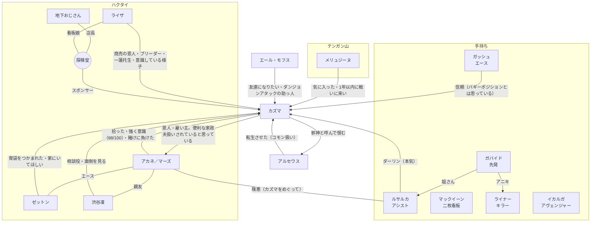

# 人間関係（037時点）

カズマを中心にした関係の全体図。矢印の向きは「誰が誰をどう思っているか」。

## 相関図

## カズマに向けられた気持ち
| 人物 | 気持ち | 変化 | 出典 |
| --- | --- | --- | --- |
| [アカネ](akane-mars.md) | 強く意識している（意識度98/100）。素直になれない | 拾った興味本位 → パンツ騒動で意識 → 「守って」を期待 → 旅立ち後は「帰ってこい」「添い寝してやる」 → 賭けに負け、スポンサー候補を教える | 001, 008, 019, 036 |
| [ルサルカ](rusalka.md) | 本気で惚れている（「ダーリン」、正妻気取り） | 最初は生命エネルギー目当て → 毎朝寝込みを襲う → メアリいわく、なつき具合は「アシスト（ヒロインルート）」寄り | 004, 005, 022, 025 |
| [ライザ](ryza.md) | 意識し始めている。仕事上は一蓮托生 | 商売の相談相手 → じてんしゃのサドルで悶える → 様子がおかしい（凜談） → 探検堂のブリーダーとして一緒に育成 | 009, 016, 019, 025, 036, 037 |
| [メリュジーヌ](melusine.md) | 「割とタイプ」。勝ったら恋人にしてあげる | 気配への興味 → 気に入る → 素通りされてイラッとした | 007, 020 |
| [メアリ](mary.md) | コンテスト仲間になれそうな相手として好意的 | 夕食に誘う。連絡先を渡す | 025, 028 |
| [天羽奏](others.md) | 気さく。「デートしてやってもいい」 | 連絡先を渡す | 028 |
| [エール・モフス](ail.md) | 友達になりたい | ジム戦を見て興味 → 押しかけて助っ人に → 連絡先交換、打ち上げを奢る約束 | 032, 033, 036 |
| [ゼットン](zetton.md) | 家にいてほしい | 部屋を片付けてから一貫して味方 | 001, 005, 019 |
| [渋谷凜](shibuya-rin.md) | 面倒を見ている。見直しつつある | 「厨二病のバカ」 → 「思ってたよりスゴイ奴？」 → バッジ3つに「まだ驚いてる」 | 003, 025, 036 |
| 地下おじさん | 運命の人材 | 店に迎えたい → スポンサー登録して即採用 | 016, 036 |
| ハクタイジムのポケモン | 何体かがカズマを気にしている（統率の片鱗） | ― | 022, 025 |

## カズマが持つ約束・借り
| 相手 | 内容 | 期限 | 出典 |
| --- | --- | --- | --- |
| アカネ | 一ヶ月の賭け（バッジ3つ＋スポンサー）。負けたらずっと家政夫 → **条件を両方達成（カズマの勝ち）** | 旅立ちから1ヶ月 | 008, 036 |
| アカネ | 旅費を出世払いで借りている | ― | 008 |
| メリュジーヌ | テンガン山で戦う | 007から1年 | 007 |
| メアリ | またヨスガに来たら、街を案内してもらいコンテストの話を聞く | ― | 028 |
| ダージリン、食蜂操祈 | プロの舞台での再戦 | ― | 031 |
| エール | スポンサーが決まったら打ち上げ（エールの奢り） | ― | 036 |
| 探検堂 | スポンサー契約。プロで勝って店を潤す | ― | 036, 037 |

## そのほかの関係
- **アカネと凜**: 親友で同類。どちらも汚部屋。（出典: 002, 003, 006）
- **アカネとジュピター**: 同じ三将星のライバル。（出典: 000, 001）
- **凜とティファニア**: 親しい仲。同居しているかもしれない（推測）。（出典: 003）
- **メアリとマルフォイ**: マルフォイが一方的に好意を寄せ、いつも断られている。（出典: 026, 028）
- **直哉と玉藻の前**: 元主人と侍女。玉藻はツンデレ（直哉談）。（出典: 021, 022）
- **直哉とマンハッタンカフェ**: 直哉がスカウト中。カフェは前向きに検討。（出典: 022）
- **ダージリンとウラヤマ**: 姪と叔父。（出典: 028）
- **食蜂操祈とスピアー**: 「唯一無二」の相棒。（出典: 029）
- **エールとラハール・キュゥべえ・タツマキ**: トレーナーと手持ち。（出典: 009, 032）
