# 人間関係（280時点）

カズマを中心にした関係の全体図。矢印の向きは「誰が誰をどう思っているか」。

## 相関図

```mermaid
graph TD
  K[カズマ]
  subgraph 手持ち
    G[ガッシュ<br>不動のエース]
    R[ルサルカ<br>エースアシストα]
    M[マックイーン<br>二枚看板]
    L[ライナー<br>エースキラーβ]
    F[ガブリアス<br>トップバッター]
    I[イカルガ<br>アヴェンジャー]
    Mo[モモ<br>エンチャンター]
    Y[ヤマト<br>チェイサー]
    Ro[ロトム<br>タイトエンド]
    Bz[ベルゼブモン<br>スカウター]
    Hi[ヒトカゲ<br>11体目・原始天賦]
  end
  subgraph ハクタイ
    A[アカネ／マーズ]
    Z[ゼットン]
    Rin[渋谷凜]
    Ry[ライザ]
    Dad[地下おじさん]
    Shop((探検堂))
    Os[オシュトル<br>前タワータイクーン]
  end
  subgraph テンガン山
    Me[メリュジーヌ]
    Ki[キーラ<br>氷狼女帝]
  end
  subgraph キッサキ
    Sa[キジマ・シア<br>キッサキジム]
  end
  subgraph ナギサ
    Ev[レヴィ]
    Osm[三雲修]
  end
  Ka[天羽奏]
  subgraph ソノオ杯
    Br[ブリジット]
    Sh[食蜂操祈]
  end
  Ya[山岡]
  subgraph ヨスガ
    Ma[メアリ]
  end
  subgraph コトブキ
    Ho[ホーネット<br>チャンピオン]
    Ge[碇ゲンドウ<br>ナナカマド博士]
    Ke[ケイネス<br>スクール校長]
    En[エネル<br>ナギサジム]
  end
  Ar[アルセウス]
  E[エール・モフス]

  Ar -->|"転生させた（コモン扱い）"| K
  K -->|"邪神と呼んで恨む"| Ar
  A -->|"拾った・強く意識（98/100）・賭けに負け、家を出て行かれた"| K
  K -->|"恩人・元雇い主。3日以内にまた来る"| A
  Z -->|"昔助けた・胃袋をつかまれた・週1〜2で家事を頼む・好感度はかなり高い・ヒトカゲ捕獲に付き合う（279）"| K
  Rin -->|"相談役・面倒を見る・デート（笑）・「友達」（160）・悪い虫から守護る（166）"| K
  Rin -.->|"泥棒猫の香り・ライザに見張らせる（166）"| Tk2[出雲天花]
  R -.->|"最近様子のおかしいしぶりんを警戒（166）"| Rin
  Ry -->|"商売の恩人・ブリーダー・一蓮托生・意識している様子"| K
  Shop -->|"スポンサー・住み込み先"| K
  Dad ---|"店長"| Shop
  Os ---|"スタッフ（202）・第三節から『ベテラン』の予定"| Shop
  K -->|"路地裏で拾った（198）"| Os
  Ry ---|"看板娘"| Shop
  Me -->|"気に入った・1年以内に戦いに来い"| K
  Ho ---|"従姉妹"| Sh
  E -->|"執着・ダンジョンアタックと熟達指令のコーチ・練習試合で負けて公式戦でリベンジ"| K
  Sa -->|"遭難者として助けた・たんけんセットに興味・お気に入り・キッサキジムを勧めた"| K
  Da[ダージリン<br>茶房グロリアーナ]
  Bk[爆豪勝己<br>雄英ダイナマイツ]
  Da -->|"統率型のライバル・ハクタイ杯決勝で負けた・同じくB昇格（158）"| K
  Ju[ジュピター<br>ギンガ団三将星筆頭]
  Ad[アダム<br>ギンガ団社長]
  Tk[一条武丸<br>人力ハードラック]
  Ju -->|"意気投合・連絡先交換・統率型の先輩として助言"| K
  Ju ---|"同僚（ウチのバカ）"| A
  Ad -->|"気に入って本部に呼んだ"| K
  Tk -->|"同期・スポンサーの最終面接で競った・練習試合（087）"| K
  R -->|"一目惚れ・デートでキスして告白（091）"| K
  K -->|"告白されて放心・2つ目の『絆』（愛の絆）"| R
  Sp[先輩<br>随牧スペリオール]
  Sp -->|"後輩・ノモセ杯の決勝で0-3で勝った"| K
  Nao[禪院直哉<br>呪相カースメーカー]
  Nao -->|"ライバル・挑戦状・トバリ杯初戦でまた負けた（104）・同じくB昇格（158）"| K
  Yu[ゆら<br>直哉のSP候補]
  Yu -->|"実家から見張りに来た・SP候補"| Nao
  Sam[朝比奈さみだれ<br>四天王]
  Lz[ルイズ<br>宮殿トリステイン]
  Lz -->|"フロンティアの練習試合で0-4で負けた（170）"| K
  Zg[ジーク<br>双龍ファフニール]
  Zg -->|"責任転嫁されて練習試合に（172）、0-4で負けた（177）"| K
  Fyu[黛冬優子<br>ルーレットゴッデス]
  Fyu -->|"ルーレット好きで歓迎。施設にハマる適性を感じる（173）"| K
  Mnj[万丈目サンダー<br>発電所サンダーズ]
  Mnj -->|"操祈のダーリンの座を賭けて決闘を申し込む（182）"| K
  Tei[トウカイテイオー]
  Tei ---|"ユニバースに加入（168）"| E
  Tei -->|"ライバル宣言（171）"| M
  A -->|"Aランク大会の決勝で勝った（159）"| Sam
  Ik[黒鉄一輝<br>黒鉄キャバルリィ]
  Ik -->|"トバリ杯で負けた・強いな、キミは"| K
  Sat[サターン<br>ギンガ団三将星]
  Sat -.->|"マーズの噂で観戦・面白いトレーナー"| K
  Da ---|"観客席で隣・挑戦状を届けた"| Nao
  Bk -->|"ハクタイ杯初戦で負けた"| K
  Sa ---|"知り合い（凛ちゃん）"| Rin
  Ki -->|"母（西の麓にタマゴを放った）"| Y
  Ki ---|"育て役（ロリオカン）"| Me
  Ma -->|"相談役・コンテストに誘う"| K
  R -->|"泥棒猫"| Ma
  Rin -->|"手持ちを移籍させた"| Mo
  R -->|"同じ淫乱ピンク…（般若）"| Mo
  Ka -->|"統率型の先輩・固有のヒント"| K
  Br -->|"デビュー戦で負けた・次はリベンジ"| K
  Sh -->|"地味くん・ソノオ杯決勝で勝った"| K
  Ya -->|"おっかけ記者（になるかも）"| K
  R -->|"戦艦級と警戒"| Br
  En ---|"師匠と門下生"| Ev
  Ev -->|"練習試合で負けた・リベンジを誓う"| K
  Osm -->|"練習試合で負けた"| K
  M -->|"3回吹き飛ばして捕獲"| Y
  Ry -->|"育成担当（半ギレ）"| Y
  Ho -->|"ガバイトに惹かれて連れ出した"| K
  Ge ---|"上司と助手"| E
  Ke -->|"たんけんセット導入を検討・練習試合"| K
  En -->|"ガッシュ種に食いつき練習試合を持ちかけた"| K
  Ge -->|"たんけんセットを100万円で購入"| Shop
  R -->|"ダーリン（本気）"| K
  G -->|"信頼（バギーポジションとは思っている）"| K
  A ---|"親友"| Rin
  A ---|"険悪（カズマをめぐって）"| R
  A ---|"エース"| Z
  F -->|"姐さん"| R
  F -->|"アニキ"| L
  Tk2 -->|"テレビでムサシとコジロウのコンビ（「コジロウくん」）・ライブに「何なら私と一緒に行く？」（248）"| K
  Hk[岸波白野<br>ミラクル団会長]
  Hk -->|"推し・舞台裏動画のご褒美に撫でられて小動物化、トバリ・デパートへ（249）"| K
  Sk[左門<br>召喚サモナーズ]
  El[エレン・ベーカー<br>電波局ニューホライゾン]
  Sk -->|"ななつぼしを奢られる（234）・テレビの練習試合で負けた（243）"| K
  El -->|"教育番組に悪役として呼んだ・練習試合で負けた（247）"| K
  Ut[ウタ<br>シンオウの歌姫]
  Ut -->|"番組で暴れたカズマたちを止めた・お詫びにライブのペアチケット（248）"| K
  Ut ---|"マブダチ（178）"| Ma
  K -.->|"ウタのライブに誘う予定（248）"| Ma
  Ay[羽咲綾乃<br>百貨店スマッシュ]
  Ay -->|"白野を「デート」に連れ出されて敵認定・クロガネ杯の初戦で負けた（260）"| K
  Hk ---|"刎頸の友（あやのん）"| Ay
  Zn[星噛絶奈<br>多々良クラッシャーズ]
  Zn -->|"「ジャリボーイ」・クロガネ杯の5戦目で負けた（268）"| K
  Jt[ジータ<br>百代ファンタジーズ]
  Jt -->|"同じハクタイの「統率」型・クロガネ杯の決勝で勝った（269）・ガチャ談義でケンカ、ポンコツ凛に一緒に突っ込んで友情っぽいもの（272）"| K
  Rin ---|"同期で友達・6つ目のバッジを取られた（272）"| Jt
  Pw[パワー<br>召喚サモナーズ]
  M ---|"顔を合わせれば口喧嘩（234）"| Pw
  Bz -->|"特訓で『共鳴』などを引き出した（249）"| Ro
  Ro ---|"アホほど相性がいい交代の相棒（249）"| Mo
  subgraph カントー
    Shi[白石蔵ノ介<br>トキワジム・グリーン]
    Tn[天子<br>白石の元門下生]
    Mf[桐須真冬<br>四天王・カンナ]
  end
  Shi -->|"手持ちを「B」中位級と見抜く・トキワジムに泊めた・天子との練習試合を提案（275）・ヒトカゲの育成相談に乗り、邪道な育成法も手帳に載せる・「キミのこと好きになれそうやで？」（281）"| K
  Shi ---|"元師匠と元門下生（『天賦の才』のニドキングを譲った）"| Tn
  Tn -->|"練習試合の約束（275）"| K
  Mf -->|"若いスバメ候補（74点）・ともしび温泉に招待（277, 278）"| K
  K -->|"フリーザーに抱きつきに行く・マーズやしぶりんと同じ匂い（58点）"| Mf
  Mf -.->|"生き別れの姉妹のようなシンパシー（279）"| A
  A -->|"カントー出張に誘う（273）・ともしび温泉まで追いかける（278, 279）"| K
  Ut -->|"Togetherを作る（271）・天賦のヒトカゲを「お前が、持ってろ！」（280）"| K
  K -->|"ウタへのお土産のつもりで捕まえた・11体目（279, 280）"| Hi
  Tk2 -->|"カントーに自腹でついて来る（274）・ヒトカゲのことで「おはなし」（280）"| K
```

## カズマに向けられた気持ち
| 人物 | 気持ち | 変化 | 出典 |
| --- | --- | --- | --- |
| [アカネ](trainers/akane-mars.md) | 強く意識している（意識度98/100）。素直になれない | 拾った興味本位 → パンツ騒動で意識 → 「守って」を期待 → 旅立ち後は「帰ってこい」「添い寝してやる」 → 賭けに負け、スポンサー候補を教える → 家を出て行かれて「カズマのバカァ！」 → ソノオ杯を観戦し、初敗北に「ビンタしてでも引きずってってやる」 → 中規模大会の決勝前に「上で待ってる、勝って来なよ」「カズマが勝つって信じてる。だから勝って、それから――」（続きは言わなかった） → 優勝を見届け、「無粋じゃん」と直接は言わずに心の中で「おめでとっ、カズマ♪」 → Aランク大会で優勝して「Aで待っている」。「帰ってきて」と駄々をこねる（159） → 凛の暴走に「ヤンデレかよ」。カズマを自分のチームのSPにしたい（166） → 「帰ってきてほしいよ、やっぱり」。頬にキスして“目印”をつけ、「“私はアンタを連れ戻す”」と宣戦布告。第四節の「A」で“勝った方が負けた方になんでもひとつ命令できる”勝負を提案（187） → シルフへの出張にカズマを誘い（「迷惑、かな…？」）、手持ち10体ごとカントーへ連れて行く。天花とライザもついて来て当初のプランは崩れた（271〜274） → 「今日も泊まり」の連絡と四天王との写真に「タイム」3回でキレ、ともしび温泉まで追いかけて「変な気の使い方をしてんじゃねぇよ」（278, 279） | 001, 008, 019, 036, 038, 061, 145, 148, 159, 166, 187, 271, 273, 274, 278, 279 |
| [ルサルカ](pokemon/rusalka.md) | 一目惚れで本気（初対面のストライク度1D100:94。生命エネルギーの美味さ80。「ダーリン」、正妻気取り）。カズマもデートでルサルカを強く意識した（意識度99）。「右腕」と「左腕」の片方を目指す | 最初は生命エネルギー目当て → 毎朝寝込みを襲う → メアリいわく「アシスト（ヒロインルート）」寄り → デートでペアのアクセサリーを付け合い、キスして告白 → カズマの2つ目の『絆』（『愛の絆』）を得て一気に強くなる → 昼寝中のカズマに"マーキング"。『愛の絆』が嬉しかった、『アシスト』は誰にも渡さない（166） → カズマもルサルカを意識していると認めた（180）。ガッシュと並ぶ「左腕」（181） → マーズに対抗して天花と《ビッグ・ボンバーズ》。制服遊園地デートで2回目のキスと改めての告白（「“アンタの一番”は私じゃなくても、“私の一番”はアンタだけ」）。カズマの弱音を受け止めた。「しばらく抱き枕」でカズマの布団に（188〜190） | 004, 005, 022, 025, 090, 091, 098, 101, 166, 180, 181, 188, 189, 190 |
| [ライザ](trainers/ryza.md) | 意識し始めている。仕事上は一蓮托生。Bランク以降もBDを続けると決めた（今年いっぱいはただ働き）。ルサルカとの『愛の絆』に思うところがある | 商売の相談相手 → じてんしゃのサドルで悶える → 様子がおかしい（凜談） → 探検堂のブリーダーとして一緒に育成 → 住み込みのカズマを「クズ野郎」呼ばわりしつつ、納品に一緒に来てほしがる → サイクリングロードで二人乗り。「チュートリアルキャラでゲームクリアまで」と言われて続投を決める → 優勝で「育成」の不安を口にし、「育成：A+」に成長 → 操祈に「“こんなヤツを気にするのは私だけだろ”って思ってたら、気づいたらこうなってた」。操祈を恋愛方面の協力者に（188） → オシュトルの妻・博霊先代に鍛えられ、積極性を出すと決める（204） | 009, 016, 019, 025, 036, 037, 038, 042, 109, 110, 148, 151, 188, 204 |
| [メリュジーヌ](pokemon/melusine.md) | 「割とタイプ」。勝ったら恋人にしてあげる | 気配への興味 → 気に入る → 素通りされてイラッとした | 007, 020 |
| [メアリ](trainers/mary.md) | コンテスト仲間になれそうな相手として好意的。「応援してるわよ」 | 初対面の好感度87（023のダイス。カズマへの値（補足: ユーザーより）） → 夕食に誘う → 連絡先を渡す → ヨスガに招いてコンテストに付き合い、『固有』やチーム名を教える → カズマがもらったウタのライブ（ヨスガのコンテスト会場）のペアチケットで、誘う相手にダイスで決まる（249時点ではまだ誘われていない）（248, 249） → ジャージ姿を見て週4回ファッション情報を送ることに（326） | 023, 025, 028, 040, 041, 248, 249, 326 |
| [天羽奏](trainers/others-b.md) | 気さく。「デートしてやってもいい」。統率型の先輩として面倒を見る（「運男」） | 連絡先を渡す → 探検堂に遊びに来て『固有』のヒントをくれ、昼食を奢る | 028, 043 |
| [エール・モフス](trainers/ail.md) | 友達になりたい。執着が強い。今はライバル。No.2ルーキーの座を争う | ジム戦を見て興味 → 押しかけて助っ人に → 連絡先交換 → 夜中に鬼電して打ち上げ、『熟達指令』を教える → 練習試合で負けて「公式戦でリベンジ」、『必中追尾』のコツを手紙で送る → 先にバッジ4つと第二『固有』を得て、カズマに奢らせる（中規模大会が公式戦初対決になりそう） → 中規模大会の全勝対決でまた負ける（「また負けちったよぉ」） → フロンティアの案内役に誘われ、ワンコールで「案内は任せろ！！」（162） → ソノオ杯小規模大会のエール優勝祝いで、同期4人でカズマに奢らせる（322） | 032, 033, 036, 050, 051, 068, 072, 114, 144, 162, 322 |
| [ゼットン](pokemon/zetton.md) | 家にいてほしい。好感度は「かなり高いぞ？」。昔カズマを助けたことがあり、ガッシュと組んだ時もその場にいた。知り合って半年ほどで、トレーナーに黙ってカズマについて来る仲 | 部屋を片付けてから一貫して味方 → 家を出るカズマについて行こうとし、週1〜2の家事を頼み込む → 「ウチのSPにならないか」（159） → カズマの単独コミュの相手としてヒトカゲの捕獲に付き合う。「助けたことはあってもそれ以降は世話になってるのはむしろこっちだしな」。プロの上の人たちからの評価とファン層を教え、『天賦』のヒトカゲに最初に気づく（279） | 001, 005, 019, 038, 159, 279 |
| [渋谷凜](trainers/shibuya-rin.md) | 面倒を見ている。見直しつつある。デートに誘われてかなり意識した。160で「"友達"」と自分で整理した（今までより「イイヤツ」に感じる）。166では「私が守護らねばならぬ」と天花やルサルカに見張りをつけ始めた（本人は「普通の友達」のつもり） | 「厨二病のバカ」 → 「思ってたよりスゴイ奴？」 → バッジ3つに「まだ驚いてる」 → 汚部屋の掃除を頼み、デート（笑）へ（割り勘） → 寝不足で過剰反応、膝枕で熟睡して「友達」（160） → 天花を泥棒猫と警戒し、見張りをつける（166） → モモに「変な虫」の逐一報告を頼み、カズマのジャージの上をほしがる（180） → ジャージの追加発注。モモに「“友達”で収まる領域を超えてる」と言われ、「じゃあ“それ以上”ならええねんな？」と“友達”以上へ。同棲、8つめのジムでの運命のバトルなどを考え始める（カズマは物陰で全部聞いていた。カズマのタイプは「しぶりん」）（185, 186） → 久しぶりに会い、一～二歩近い距離で「交友を深めたい」と詰める。ライザに「そうだよ、その通りだけど？」と認めるが、正面からのお礼には照れる（218） → クロガネ杯準優勝のカズマが6つ目のジム戦で来るのではと上機嫌。ガチャ談義でジータに課金へ誘導され、カズマの「水着写真」を言質に取り、ミラクル団のファンクラブカードを「買った！」（272） | 003, 025, 036, 043, 044, 160, 166, 180, 185, 186, 218, 272 |
| [キジマ・シア](trainers/shia.md) | 「お気に入り」（ブラン談）。初期好感度は高い（1D50:37＋たんけんセット補正50）。たんけんセットの件でキッサキとして期待。「私個人としても」ダンジョンアタックの成功を期待している | 遭難者として助けて空路で送る → 探検堂に来てジム挑戦を楽しみにする → お茶に誘う（ルサルカが割り込む） → 5つ目のジム戦で負け、グレイシャバッジと「わざマシン：ふぶき」を渡す | 072, 086, 112, 224, 225 |
| 地下おじさん | 運命の人材 | 店に迎えたい → スポンサー登録して即採用 → 地下大洞窟の調査から帰還 | 016, 036, 094 |
| ホーネット（チャンピオン） | 好意的。珍しいガバイトの持ち主として興味 | ガバイトに惹かれて連れ出す → カズマに得があってほっとする | 038, 039 |
| エネル | ライバル心（「でんき」最強を示したい）とガッシュ種への好意 | 練習試合を持ちかける | 039 |
| 碇ゲンドウ、ケイネス | お得意様 | たんけんセットを購入・導入検討 | 039 |
| [モモ](pokemon/momo.md) | 移籍先の監督として好意的。あざとくからかう | カズマのチームに興味を持つ → 移籍 → 恋愛のストライク度は18だが、トレーナーや友人としては高得点。凛の頼みを伝える（180） | 043, 044, 180 |
| [レヴィ](trainers/levi.md) | 「強いね、おにーちゃん」。リベンジを誓う | 練習試合で負ける | 046 |
| [三雲修](trainers/osamu.md) | 統率型の恐ろしさを認める | 練習試合で負ける | 048, 049 |
| [ダージリン](trainers/darjeeling.md) | 同期のライバル。統率型同士。からかわれて土下座 | 3vs3で負ける → 開会式の日に店に来られる → ハクタイ杯の決勝でリベンジを狙うが、また負ける → 直哉の挑戦状を届け、『PT』作りを見てくれる → 煽りの電話の報復に殴って奢らせる。同じくB昇格内定（158） → 許嫁がいると判明し、カズマにマウント（165） → ナギサ杯優勝を自慢して返り討ち。「ウチの世代のトップバッターとして役目を果たしたのは認めてあげるわ、お前船降りろ」。SPは許嫁のジョナサン（196） → ソノオ杯小規模大会のエール優勝祝いで、同期4人でカズマに奢らせる（322） | 030, 051, 074, 078, 096, 158, 165, 196, 322 |
| [禪院直哉](trainers/naoya.md) | ライバル。「どっちがモテるか」で張り合う仲。リベンジを狙う | ジム巡りのころにバトルで負ける → 野営で仲良くなる → プロになり「逃げたら格下」の挑戦状を送る → 大会前に店で会う → トバリ杯の初戦で接戦の末にまた負ける → 煽りの電話の報復に奢らせる。同じくB昇格内定、『全開指令』禁止を笑われる（158） → コトブキの遊園地で会って煽り合い（189） → ソノオ杯小規模大会のエール優勝祝いで、同期4人でカズマに奢らせる（322） | 021, 022, 093, 096, 099, 104, 158, 189, 322 |
| [先輩](trainers/senpai.md) | 「後輩」と呼ばれる。いい人だが噛ませ犬オーラ。カズマの中では半ば聖域で、先輩にだけは罵倒を一つも言ったことがない（補足: ユーザーより） | 初めてのトレーナー戦で勝つ → ノモセ杯の決勝で0-3で負ける（C上位の壁） → 中規模大会でリベンジ。「必ず優勝してきやがれ」 → 中規模大会で負けて「次は負けねぇぜ？『B』ランクの舞台でまた戦おうや、"後輩"」。お疲れ様会の幹事 → アスカに「アイツが勝って、俺が負けた……それがすべて」「ありゃあ“傑物”の類いだろうよ」と認める（183） | 010, 013, 092, 140, 148, 149, 183 |
| 黒鉄一輝（[その他のトレーナー](trainers/others-c.md)） | カズマたちを「C中位、それ以上かも」と評価。優勝候補として迎え撃つ | 探検堂でホシノたちに囲まれて戸惑う → トバリ杯で直接対決して負ける（「…………強いな、キミは……」） | 094, 106, 107 |
| イングリッド（[その他のトレーナー](trainers/others.md)） | 第四ジムで負けた。「おぬしら思ってたよりもさらに強い」「わしと気が合う部分があるかも」 | トバリ杯を観戦 → 第四ジム戦（カズマの勝ち） | 101, 117 |
| サターン（[その他のトレーナー](trainers/others.md)） | マーズ（アカネ）の話で興味を持ち、トバリ杯を観戦。「面白いトレーナーじゃないか」 | ― | 105 |
| [出雲天花](trainers/tenka.md) | 「面白い男の子」「カワイイ」と興味。初対面で「お付き合いをする新従業員」と名乗った（本気度49） | 探検堂に面接に来て採用 → 新戦力の紹介を提案 → メアリとのデートを仕向ける → 練習試合に同行して統率型の戦い方を助言 → 元手持ちに連絡 → 第二節からのSPに就任。カズマに密着し、「テレポート」でレストランへ連れ去って「別に、冗談なんか言って無いんだケドナー……」 → 夜会話で『天賦の才』の危うさを教え、「A」へ一緒に連れて行ってと頼む（カズマ「一緒に着いてきてくださいよ？」、天花「そっちの方が私好みだ」） → 教育番組の撮影で、カズマ（コジロウ）・ルサルカ（ニャース）とムサシとコジロウwithニャースの悪役コンビ（ムサシ役）。以後「コジロウくん」とも呼ぶ（240〜248） → お詫びのライブのペアチケットに「一回くらいそういう体験をするのもアリかもよ？何なら私と一緒に行く？」（248） → カントー旅行に自腹でついて来る（274）。ヒトカゲに気づいて「な に か し っ て な い ？」と''おはなし''に呼ぶ（280） | 119, 120, 121, 123, 126, 127, 157, 179, 240, 248, 274, 280 |
| ドン・観音寺（[その他のトレーナー](trainers/others-c.md)） | 「C」屈指の統率型として胸を借りに来た。「良からぬ気配」がする。「カズマ少年」 | 練習試合の約束（121の翌週） → 練習試合でカズマの勝ち。「私もまだまだだな」 | 121, 125, 126 |
| 錦木千束（[その他のトレーナー](trainers/others-c.md)） | 初戦の相手として警戒。「指示」型として『エース』ともう1体の情報を集めようとしている | コトブキ杯中規模大会の初戦で当たる → 3-0でカズマの勝ち（「こりゃつっよいわ」） | 131, 132, 137 |
| [ロトム](pokemon/rotom.md) | 最初はいきなり襲われて「人間って怖いロト」。すぐ打ち解けてイタズラも仕掛ける | 洋館を奪われて「ひみつきち」の管理人に（捕獲はされていない） → 探検堂の事務もリモートで手伝う → ダイスで9体目の手持ちに選ばれ、「プロのポケモンはモテる」に釣られて正式に加入 | 128, 129, 131, 149, 150, 151 |
| [ベルゼブモン](pokemon/beelzemon.md) | ハクタイの森「深度：3」の『ヌシ』としてダンジョンアタックで戦い、敗れて「お前のようなヤツの下ならより一層………な」と軍門に降った | 230で対面 → 232で敗れる → 233で加入（『スカウター』の予定） | 230, 232, 233 |
| [岸波白野](civilians/hakuno.md) | 推しのチームの監督で、雇い主。カズマいわく舎弟の領域 | 非公式ファンクラブの会長として呼ばれ公式化、広報のアルバイトに（217） → ななつぼしで奢られる（219, 220） → 千束に「推しとオタ」を問われて整理がつかなくなる（220） → テレビの舞台裏（NG集）動画を徹夜で編集して投稿し、ご満悦のカズマに撫でられて小動物化（「うぇへへへへへへ……頑張った甲斐がありましゅ～」）。ご褒美にカズマの奢りでトバリ・デパートへ（249） | 217, 219, 220, 228, 235, 248, 249 |
| [ジュピター](trainers/jupiter.md) | 同じ統率型の先輩。相談相手 | 祝勝会の店で会って連絡先交換 → ギンガ団本部に呼ばれ、助言をもらう | 080, 082 |
| 一条武丸 | 同期。強面で怖い | スポンサーの最終面接で並ぶ（武丸が採用） → サイクリングロードで再会、練習試合の約束 | 081 |
| エネル | ガブリアスへの殺意（「本気で殺しに行く」） | ― | 049 |
| [ブリジット](trainers/bridget.md) | 明るく友好的。「おにーさん」 | 喫茶店で相席 → デビュー戦で負ける | 054, 057 |
| [食蜂操祈](trainers/shokuhou.md) | 余裕の上から目線（「地味くん」）。対戦を楽しみにしている | 初対面のストライク度43（028） → 同じソノオ杯で優勝候補として待ち受ける → 決勝で勝ち、プロ初の黒星をつける → 中規模大会で「警戒MAX」（エールに負けて1敗） → 最終戦で「これまで戦った誰よりも強い」と認めて全力で挑むが負ける（カズマの全勝優勝） → 「まだ一勝一敗」。カズマを「"私のライバル"」と呼び、より大きな舞台での再戦を約束 → 万丈目とカズマの“ダーリン”の座を賭けた決闘に巻き込まれる（「私の意志はどこにいったぁ」） → アヘ顔のカズマを見て、ライザの協力者に（「コイツがモテるなどという幻想をぶち殺してやる」。評価は73、「不思議とキライにはなれない」「それはそれとしてクズ」）。ナギサ杯の決勝ではミラクルズを応援（188, 192） → 優勝を見届け、賭けのご褒美を要求されて「私に対する公平力は……………？」（195） → ソノオ杯小規模大会のエール優勝祝いで、同期4人でカズマに奢らせる（322） | 054, 061, 132, 141, 146, 147, 148, 182, 188, 192, 195, 322 |
| 山岡 | 面白いトレーナーとして興味 | おっかけになるかも → 逆張りで推していて全勝優勝に大喜び。取材でマーズとの関係を勘ぐり、Aランク大会のチケットを「手付金」にくれた | 053, 156 |
| ハンサム | 口止めしたい相手 | きのみを渡して消える | 044 |
| 黛冬優子（[その他のトレーナー](trainers/others.md)） | 「今年の「C」のトップ」と知っている。ルーレット好きで歓迎（第一印象1D75:47＋25）。カモにできる気がせず、バトルルーレットに“ハマる”適性を感じる。運任せのやり方を気に入る | バトルルーレットで初対面 → 《双龍ファフニール》戦のルーレットを回す | 173, 176 |
| 万丈目サンダー（[その他のトレーナー](trainers/others-b.md)） | 操祈を巡る恋敵と誤解している。「この下郎が！！！」 | ソノオで遭遇し、“決闘”を申し込む（ナギサの大会で決着の約束） → ナギサ杯のオープニングマッチでカズマたちに0-2で負ける（「まさか、この俺がルーキーに…………っ」）（191） | 182, 184, 191 |
| 式波・アスカ・ラングレー（[その他のトレーナー](trainers/others-b.md)） | カズマを“まぐれルーキー”と呼ぶ。先輩が大好き | ヨスガで先輩を煽られてカズマがブチギレ、ナギサ杯で戦うと喧嘩を売る（アスカは勝ったら先輩と24時間デートを要求）（183） → ナギサ杯の決勝で0-2で負け、先輩に“鬼メール”（194, 195） | 183, 184, 193, 194, 195 |
| ベルナデッタ＝フォン＝ヴァーリ（[その他のトレーナー](trainers/others-b.md)） | 元ひきこもりのカズマに“同じヒキニートのシンパシー”を感じている | ナギサ杯でカズマたちに負ける → 自分から探検堂を訪ね、地下大洞窟での練習試合でも0-2で負ける（「大人しく部屋から出てこい！！！」）。たんけんセットを買った | 192, 196, 197, 201, 202 |
| [オシュトル](trainers/oshutoru.md) | カズマを「単なる「統率」による力任せというわけでもない、リカバーも速い」と評価 | 路地裏で拾われ、練習試合を見学。探検堂のスタッフになり、第三節から『ベテラン』の予定。引っ越しの手伝いを頼んだ。早くも意気投合し、二人で花札をしている（妻の博霊先代いわく、カズマはオシュトルに似ている） | 198, 199, 202, 204 |
| 小鳥遊ホシノ（[その他のトレーナー](trainers/others-b.md)） | 顔見知り（「前もしたね、自己紹介」） | 目の前でオシュトルを探検堂に取られた | 094, 202 |
| ジーク（[その他のトレーナー](trainers/others.md)） | シンオウのルーキーを「こんなヤバイの………？」。ライナーに手を焼き「もういやだ、こんなスタジアム！！！！！！！」 | 責任転嫁されて練習試合に → 0-4で負ける | 172, 173, 177 |
| 左門（[その他のトレーナー](trainers/others-c.md)） | 第一節のコトブキで戦った相手。カズマの新しい悪魔（ベルゼブモン）の話に「お前を殺して奪い取る（迫真）」 | ななつぼしで奢られる（234） → 教育番組の企画で''はぐれ悪魔超人コンビ''として登場し、カズマと言い争って仲間割れのバトル → 《召喚サモナーズ》戦で負ける（243） | 234, 240, 243 |
| エレン・ベーカー（[その他のトレーナー](trainers/others-c.md)） | キッズ人気の高いミラクルズの『エース』を理由に、教育番組の悪役として呼んだ | 番組企画の電話（234） → 「正義のヒロイン（真）」として《電波局ニューホライゾン》戦で負ける（244〜247） | 234, 244, 247 |
| ウタ（[その他の民間人](civilians/others.md)） | 番組でやり過ぎたカズマたちを止めに来た歌姫。故郷の歌を教わって歌い合う仲 | ''新時代''宣言にプリンの「うたう」で眠らせる → お詫びにライブのプラチナペアチケットを渡し、NG集的な動画をカズマ側に任せる（248） → 故郷の歌を教わって新曲''アカシア''に（251） → カラオケでミラクルズのイメージソング''Together''を一晩で作り、お土産にヒトカゲとポケモンの笛を頼む（271） → お土産のヒトカゲが『天賦の才』で、「欲しいなら欲しいって言えよ！！！」「お前が、持ってろ！」と譲る（280） | 248, 251, 271, 280 |
| 羽咲綾乃（[その他のトレーナー](trainers/others-b.md)） | 白野の親友。白野がカズマと「デート」と言ったのに怒り、ミラクルズを悪と敵認定（「キミを始末してはくのんを返してもらうかね」） | クロガネ杯の初戦でカズマの勝ち。カズマは「これまで戦った「指示」型のなかじゃ、テメーが一番強い」と認めた | 250, 257, 260 |
| 星噛絶奈（[その他のトレーナー](trainers/others-b.md)） | 《多々良クラッシャーズ》の監督（元ロケット団の『獣化』トレーナー）。ジータが一番警戒しているのがミラクルズと聞いて興味を持った（「私が味見してやるとしようかね」）。カズマを「ジャリボーイ」と呼ぶ | クロガネ杯の5戦目、全勝同士の対決でカズマの勝ち（「ほんと可愛くないジャリども」） → 決勝はボンドルドと観戦し、カズマの疲労と、同等以上の「統率」型との経験不足を指摘した | 257, 268, 269 |
| ジータ（[その他のトレーナー](trainers/others-b.md)） | 同じハクタイの「統率」型（資質はカズマとほぼ同じ、天花）。クロガネ杯で一番警戒していたのがミラクルズ（ルーキーに即負けはできない） | クロガネ杯の決勝でカズマに勝って優勝（「君たちがそうなように、私たちだって''上''を目指してるんだ」） → 優勝したのに準優勝のカズマの方がファンが増えて悔しがる。ガチャ談義で無料ガチャ派のカズマとケンカしたが、ポンコツ化した凛に声をそろえて突っ込み、友情っぽいものが芽生えた（272） | 257, 269, 272 |
| 天子（[その他のトレーナー](trainers/others.md)） | 白石の元門下生で《常盤ヘブンアース》の監督（統率AA-）。ドM。カズマのS具合を見極めた | トキワで練習試合（275で約束） → 294でカズマの勝ち | 275, 291〜294 |
| ワタル（海馬瀬人。[その他のトレーナー](trainers/others.md)） | カントー四天王筆頭（「統率：AAA」）。ウタのファンクラブ会員番号1番で、ウタと親しいカズマを「認めない」（ライバル心）が、一歩先を行く決闘者と認め、同じ「統率」としていずれ''本物''を決めると言う | シオン杯を観戦し、控え室でウタの新曲と電話で打ちのめした（286） → セキエイ高原に連れて行かれて茶を飲み、連絡先をもらった（287） | 286, 287 |
| 白石蔵ノ介（[その他のトレーナー](trainers/others.md)） | カントーのトキワジムのジムリーダー（''グリーン''、「育成：AAA」）。カズマの手持ちを「B」中位級、「俺好みな感じの手持ちのバラつき」と見る | トキワの森で会い、ロケット団のボス扱いされる → トキワジムに泊め、弟子の天子との練習試合を提案。勝った方へのご褒美は考えておく。カズマの手持ちを見て、久しぶりに''赤司''（レッド）と戦いたくなる（275） → ヒトカゲの「育成」の相談に乗り、練習試合のあとに''手帳を落とす''形で育成法（邪道な''『役割』なしの育成''も）を渡すことに。カズマの好感度が爆上がり（281） | 275, 281 |
| 天子（[その他のトレーナー](trainers/others.md)） | 白石の元門下生。カズマのS具合は42点 | 白石の提案で、カズマたちと練習試合をすることに（275） | 275 |
| 桐須真冬（[その他のトレーナー](trainers/others.md)） | カントーの「こおり」の四天王（''カンナ''）。カズマを若いスバメの候補として見る（74点） | ナナシマで雪に降られたカズマたちと出会い、フリーザーに抱きつきに来たカズマを凍らせる → 一行をラプラスに乗せてともしび温泉に招待（277〜279） | 277, 278, 279 |
| ハクタイジムのポケモン | 何体かがカズマを気にしている（統率の片鱗） | ― | 022, 025 |
| 八雲紫（[ポケモンのその他](pokemon/others.md)） | ''カズマ・アンチ（仮）''。第一印象14。天花を「雪国の馬の骨のSP」にされたのが認められず、アローラでアンチ・スレを建てると宣言。天花が''シンオウチャンピオン''のSPとして帰ってきたら「掌グルンって返してあげる」 | 300で古参3体の重い覚悟に引き、301で敵視 | 300, 301 |

### 気持ちのダイスの数値（並べたもの）
恋愛・好意を数字で出したダイスは少なく、どれも貴重な記録（→ [story/dice.md](../story/dice.md)）。

| 人物 | 判定 | 値 | 話 |
| --- | --- | --- | --- |
| ルサルカ | ルサルカ的なカズマさんのストライク度（初対面） | **94**（生命エネルギーの美味さ80） | 004 |
| アカネ | アカネの（カズマへの）意識度 | 98（73＋パンツ騒動の補正25） | 001 |
| マーズ（アカネ） | 受け入れ度 | 55 | 001 |
| メリュジーヌ | カズマへのストライク度 | 72（1D75:47＋異世界人補正25）→ 76（134で1D28:4を加算） | 007, 134 |
| シア | カズマへの初期好感度 | 87（1D50:37＋たんけんセット補正50） | 086 |
| 天花 | お付き合い発言の本気度 | 49 | 119 |
| メアリ | デートへの意識度 | 27 | 121 |
| モモ | カズマさんのストライク度 | 18（恋愛対象ではない。トレーナーや友人としては高得点） | 180 |
| 冬優子（女神様） | 第一印象 | 72（47＋ルーレット好き補正25） | 173 |
| ライザ | 仲が良いとは（1ほど悪友、100ほど……） | 71（作者「それなりに男女の意識はある感じ」） | 008 |
| ライザ | じてんしゃ発言（サドルが摩耗したお古でいい）への意識度 | **92**（低いほど友達のじゃれ合い。電話を切って枕を殴り「まさか本気……？」） | 016 |
| ハンコック | 第一印象 | 89 | 298 |
| 美柑 | 第一印象 | 24（4＋海夢ちゃん補正20）→ しぶりん紹介後46 | 298 |
| 八雲紫 | 第一印象 | 14 | 301 |

カズマの側: 初対面のアカネへの意識度41（001）、デートを経てのルサルカへの意識度99（44＋55、091）、内心意識度59（110）。（出典: 001, 004, 007, 008, 086, 091, 110, 119, 121, 134, 173, 180, 298, 301）
- ルサルカの94は、初対面の時点の値として突出している。「最初から自覚していて自分から取りに行った」形（[rusalka.md](pokemon/rusalka.md) の余談）を、数字で裏付けるもの。

## カズマが持つ約束・借り
| 相手 | 内容 | 期限 | 出典 |
| --- | --- | --- | --- |
| アカネ | 一ヶ月の賭け（バッジ3つ＋スポンサー）。負けたらずっと家政夫 → **条件を両方達成（カズマの勝ち）** | 旅立ちから1ヶ月 | 008, 036 |
| アカネ | 旅費を出世払いで借りている | ― | 008 |
| アカネ | カントー旅行に誘ってもらったお礼。帰ったらお土産を持ってお礼に行く（嘘ついたらタダじゃおかない） | シンオウに帰ったらすぐ | 295 |
| アカネ | 3日以内にまた来る | 038から3日 | 038 |
| ゼットン | 週1〜2でアカネの家の世話（ゼットンの頼み。引き受けたかは不明） | ― | 038 |
| ハンサム | 国際警察のことを他言しない（口止め料にきのみをもらった） | ― | 044 |
| メリュジーヌ | テンガン山で戦う | 007から1年 | 007 |
| メアリ | またヨスガに来たら、街を案内してもらいコンテストの話を聞く | ― | 028 |
| ダージリン、食蜂操祈 | プロの舞台での再戦 → 食蜂にはソノオ杯決勝で負け（061）、ダージリンにはハクタイ杯決勝で勝ち（078） | ― | 031, 061, 078 |
| 一条武丸 | 《人力ハードラック》と練習試合 → 088でカズマの勝ち | ― | 081, 088 |
| ルサルカ | 練習試合のあとにデート → 091で実施（ペアのアクセサリー、キス、告白） | ― | 086, 091 |
| シア | いつかキッサキジムに挑戦する（「イケたらイク」）→ 第四ジムはトバリにしたので、5つ目以降で（シア「期待しましょう」）→ 5つ目のジムとして、大会を2つほど経てから挑むと電話（184） | 第二節 | 086, 112, 184 |
| 万丈目サンダー、アスカ | ナギサ杯で対戦（“決闘”と喧嘩）→ どちらにも2-0で勝ち、優勝（191, 194） | ナギサ杯 | 182, 183, 184, 191, 194 |
| 操祈 | 万丈目に勝ったご褒美（体操服ダブルピースの写真）→ 操祈は賭けに同意していない（195） | ― | 182, 195 |
| 《灯台サンセット》 | 地下大洞窟で練習試合（ロトムの初実戦） → 199〜201で実施。2-0でカズマの勝ち | 次の大会の前 | 196, 197, 201 |
| オシュトル | 引っ越しの手伝い（探検堂は住居の手配と補助） | ― | 202 |
| ルサルカ | 謝罪と賠償として「今日からしばらく」抱き枕にして寝る（189）→ 190では毎晩カズマの布団に | しばらく | 189, 190 |
| アカネ | 第四節の「A」で“勝った方が負けた方になんでもひとつ命令できる”勝負（アカネの提案。カズマは返事をしていない） | 第四節 | 187 |
| 禪院直哉 | 挑戦状（「逃げたら格下」）を受け、同じ大会にエントリーして対決する → トバリ杯の初戦でカズマの勝ち | トバリ杯 | 093, 096, 104 |
| エール | スポンサーが決まったら打ち上げ（エールの奢り） → 050で実施 | ― | 036, 050 |
| 探検堂 | スポンサー契約。プロで勝って店を潤す | ― | 036, 037 |
| ライザ | 「わざマシン：エナジーボール」を借りている（「貸しただけだからね？」） | ― | 042 |
| メアリ | ウタのライブ（ヨスガのコンテスト会場）にペアチケットで誘う（相手はダイスで決定。249時点ではまだ誘っていない） | トバリ・デパートに行った3日後 | 248, 249 |
| 白野 | 舞台裏動画の編集のご褒美に、カズマの奢りでトバリ・デパートへお出かけ | ― | 249 |
| 左門たち | 煽りでななつぼしを奢る → 234で実施 | ― | 234 |
| エネル、ケイネス | ナギサシティで練習試合 → レヴィと三雲修に勝利 | ― | 039, 046, 048 |
| 白石蔵ノ介、天子 | 天子（《常盤》）と練習試合。勝った方には白石からご褒美→ ご褒美はヒトカゲの育成法を書いた手帳（281） | カントーにいるうち（カントーのフリーイベントが終わったころ） | 275, 280, 281 |
| 凛 | 今度どこかで水着写真を撮って渡す（ガチャ談義で言質を取られた） | ― | 272 |
| ライザ（と天花） | カントーにいる間は単独行動を慎む | カントー滞在中 | 276 |
| ウタ | カントーのお土産にヒトカゲとポケモンの笛 → ヒトカゲは『天賦の才』で、ウタに譲られてカズマの11体目に（280） | ― | 271, 280 |
| エール | どちらかが抽選に落ちたら、もう片方の応援に行く（エールの提案） | 第一節 | 051 |
| エール | 地下大洞窟で練習試合 → **カズマの勝ち**。ただし情報を渡す前に帰られた（のちにタツマキの手紙でコツが届く） | ― | 062, 068, 069, 072 |
| エール | 今度は公式戦でリベンジ（エールの宣言） → 中規模大会でカズマが勝った | ― | 068, 144 |
| ガッシュ、ルサルカ、マックイーン | 『専用』の3つの枠を与える → ガッシュは付与済み（072）。マックイーンは第一節のうちに | ― | 064, 070, 072 |

## そのほかの関係
- **アカネと凜**: 親友で同類。どちらも汚部屋。310ではカズマを''管理''しようと''タッグ結成''。（出典: 002, 003, 006, 310）
- **アスカと先輩**: アスカは先輩の後輩で、先輩が大好き（「でも好き！！！！！！」）。先輩はアスカが「B」の間は会いに来させなかった。（出典: 183）
- **アスカと紅蓮聖天八極式、プリンツ・オイゲン**: トレーナーと『エース』、手持ち。（出典: 183）
- **ライナーとバーゲスト**: フロンティアのボディビル大会とミスコンの優勝者同士で文通している（バーゲストは筋肉フェチ）。（出典: 185）
- **オシュトルと博霊先代**: 夫婦。先代はタワータイクーン時代のオシュトルのチームの元『二枚看板』（『愛の絆』）。解散式でオシュトルをタコ殴りにして攫い、結婚した。（出典: 198, 204）
- **ライザと博霊先代**: パワー系同士で打ち解け、先代がライザの恋愛の鬼教官に（「舎弟」）。（出典: 204）
- **アカネとジュピター**: 同じ三将星のライバル。（出典: 000, 001）
- **メアリとマルフォイ**: マルフォイが一方的に好意を寄せ、いつも断られている。（出典: 026, 028）
- **直哉と玉藻の前**: 元主人と侍女で、トレーナーと『エース』。『愛の絆』を結んでから、玉藻はツンデレどころかデレデレ。（出典: 021, 022, 099）
- **直哉とマンハッタンカフェ**: スカウトが実り、カフェは《呪相カースメーカー》の『キラー』。直哉のことは相変わらず呆れている。（出典: 022, 100, 101）
- **玉藻とジゼル**: 同じチームで言い合いばかり（「女装野郎」「タマモっち」）。（出典: 101）
- **イングリッドとカタクリ**: 「相棒」で、トレーナーと『エース』（『魂の絆』）。カタクリはイングリッドを「イン姉」と呼ぶ。（出典: 101, 117）
- **ガッシュとルサルカ**: 旅立ちからの2人で、カズマの2つの『絆』。カズマの「右腕」と「左腕」を目指す。ルサルカの『アシストα』からガッシュの『エース』撃破につなぐ連携が評価され、ガッシュの異名『友情』になった（「おぬしの『アシスト』あってこその『異名』獲得なのだ」）。（出典: 101, 145）
- **ダージリンとウラヤマ**: 姪と叔父。（出典: 028）
- **ダージリンと直哉**: ノモセ杯の観客席で偶然隣になり、言い合う。どちらもカズマへのリベンジ狙い。ダージリンは直哉の挑戦状を面白がって届けた。（出典: 093, 096）
- **黒鉄一輝とホムラ**: トレーナーと『エース』（『天賦の才』）。ホムラは一輝がなかなか『絆』を結んでくれないと不満。すぐヒートアップするホムラに一輝は手を焼く。（出典: 095）
- **ホムラとライナー**: 偶然会い、「お友達から」と言われた。（出典: 095）
- **黒鉄一輝とホムラ**（続き）: 結局『愛の絆』を結んでいた。（出典: 105）
- **食蜂操祈とホーネット**: 従妹と従姉。操祈は「お従姉ちゃん」と呼び、いずれ勝ちたい相手。一部の人にしか教えていない。ホーネットは中規模大会を見に来て操祈を激励したが、「痴女服のチャンピオン」とひどい扱いをされる。（出典: 108, 132, 145）
- **オシュトルとホーネット**: 旧知。210のカンナギ杯で再会し、ホーネットが「B」の中規模大会の情報を“独り言”で渡した。オシュトルの言葉に「まるで復帰する男の言いざま」。（出典: 210）
- **ガッシュとレジーナ**: カンナギ杯決勝の『エース』対決の相手。試合後、レジーナに「常識人の知り合いは貴重」とヨスガに誘われ、常識人の友達になった。（出典: 215）
- **カズマと柊うてな**: カンナギ杯決勝の相手。試合後に電話番号の交換を申し出られ、System いわく「カズマに変態の知り合いが増えた」。（出典: 215）
- **メアリとアリス**: トレーナーと『エース』。（出典: 122）
- **ドン・観音寺とサンズ、オクタヴィア**: トレーナーと『エース』、「左腕」。オクタヴィアは観音寺を「ダーリン」と呼ぶ。（出典: 121）
- **メアリとドン・観音寺**: 知り合い。（出典: 121）
- **オクタヴィアとティガレックス、ハンニバル**: 仲が悪く、ティガとハンニバルは『二枚看板』のオクタヴィアによく逆らう（どちらもオクタヴィアに相性が悪い）。（出典: 123）
- **食蜂操祈と錦木千束**: スクールの後輩と先輩。千束は操祈の従姉妹のことを知る数少ない一人。千束のレストランは、ソノオの「あまいミツ」を仕入れている。（出典: 132）
- **砕蜂とロビン（リコリス）**: ハクタイの森にいた頃からの顔見知り（ロビンは砕蜂を「ヌシ」様と呼ぶ）。（出典: 132）
- **砕蜂とエイラ**: 初対面から言い合いになった似た者同士。（出典: 132）
- **マックイーンと先輩**: 先輩の「テメェの"愛馬"はよ」がマックイーンの異名『愛馬』になった。（出典: 140）
- **エールと食蜂**: 中規模大会でエールが勝った。（出典: 141）
- **凜とジータ**: 同期で友達（アカネも同期）。一緒に中規模大会を観戦した（141）。ジータは中規模戦の前に凛のハクタイジムで6つ目のバッジを取った（シルバーソルで「焼いてやった」、272）。（出典: 141, 272）
- **白石蔵ノ介と天子**: トキワジムの元師匠と元門下生。白石は天子に『天賦の才』のニドキングを譲った。天子は白石を「《常盤》の先代」と呼び、BDになってくれとねだる。（出典: 275）
- **白石蔵ノ介と赤司（''レッド''）**: 白石は《常盤》でリーグ2位まで行ったが、チャンピオンの''レッド''には直接対決で届かなかった。カズマとピカチュウを見て、久しぶりに''赤司''と戦いたくなった。（出典: 275）
- **桐須真冬とフリーザー、童磨、ラプラス、シノン**: トレーナーと手持ち。童磨は『二枚看板』で、勝手にボールから出てくる。（出典: 277, 279）
- **桐須真冬とアカネ**: ともしび温泉で会った真冬が、アカネに「生き別れの姉妹と出会ったような」シンパシーを感じた。（出典: 279）
- **ガッシュとアドルフ**: ガッシュは『雷帝』アドルフのファン。昔フラれた話をゼットンにばらされかけたアドルフを慰めた。（出典: 274）
- **ウタとプリン**: トレーナーと手持ち。プリンは嫉妬深い。（出典: 248, 280）
- **クロコダインとハルウララ**: ウララ（先輩のBD）の育成でレベルが上がった。ウララは「ダンナ」と呼ぶ。（出典: 138）
- **アカネとサターン（カイト）**: 同じ三将星。最近の戦績は五分。カイトはアカネの「びんじょう」相づちにツッコむ。（出典: 133）
- **ワイリー（プルート）と三将星**: 3チームのBD。仕事を押しつけられてキレている。（出典: 133）
- **メリュジーヌとガッシュ**: メリュジーヌはガッシュの名前と、中に眠る「力の結晶」を覚えた。（出典: 134）
- **メリュジーヌと「フェンリル」の『天賦』**: 友達（キーラのことと見られる）。（出典: 134）
- **マックイーンとパワー**: パワーは《召喚サモナーズ》の『二枚看板』。顔を合わせれば口喧嘩する仲（マックイーン「お前「C」の''中規模戦''でバトル中にパッド外れたの忘れてねぇからな？」）。（出典: 234）
- **メアリとウタ**: マブダチ。（出典: 178）
- **天花、カズマ、ルサルカ**: 教育番組の撮影で''ムサシとコジロウwithニャース''の悪役トリオ（天花がムサシ、カズマがコジロウ、ルサルカがニャース）。（出典: 240, 244, 246, 248）
- **ロトムとベルゼブモン**: ロトムはベルゼブモンを「ベルくん」と呼ぶ。249ではいつの間にか一緒に特訓していて、ロトムは『天電球の共鳴』『ロトムのカタログ』などを得た（ベルゼブモン「潜在能力という意味では『天賦』だけのことはあった……その方向性を自覚させればこんなものだ」）。（出典: 245, 249）
- **モモとロトム**: 交代でつなぐ相棒。ロトム「ぶっちゃけモモちゃんアホほどボクと相性良いから」。（出典: 201, 249）
- **ベルゼブモンと凛、モモ**: 249のモモの「育成」は、凛とベルゼブモンの助言を受けたもの。（出典: 249）
- **ロトムとルサルカ**: 森の洋館の今の住人と前の住人。ルサルカはロトムを「中々やる」と認めた。（出典: 128, 129）
- **ミオのジムリーダーとロビンマスク**: 去年の対抗戦で勝ったが、打ち上げでロビンスペシャルでKOされた。（出典: 130）
- **天花とグレンラガン、エンタープライズ**: アローラ時代のトレーナーと手持ち。天花が財団を離れてからは2体ともフリー。エンタープライズは今も天花を「司令官」と呼ぶ。（出典: 127）
- **天花と八雲紫**: アローラ時代のトレーナーと元『エース』。紫は天花以外のチームを嫌い、301でもまたチームを組もうとすがったが、天花は今は探検堂の職員だと断り、「今年の''第四節''が終わったら''シンオウチャンピオン''のSPとして帰ってくる」と約束した（かつて一緒に諦めた''てっぺんの景色''を教えるため）。紫は''傍観者''として見守る。（出典: 179, 300, 301）
- **黒子とライザ**: ライザは、シンオウ支部に赴任する黒子を次の大会に拉致（招待）することに決めた。黒子は、天花に、まず強火ファン筆頭のはくのんと仲良くなるよう言われている。（出典: 301）
- **ライザと鳴上悠**: 鳴上がライザをBDとしてスカウトしようとしたが、天花が断った。（出典: 307）
- **シアとマグナガルルモン、ブラン**: トレーナーと『エース』（『天賦の才』）、同行者。（出典: 112）
- **サターンとアカネ（マーズ）**: アカネはカズマの話をちょくちょくサターンにしている。（出典: 105）
- **マックイーンとマンハッタンカフェ**: 同じウマ娘種。トバリ杯で「同種族対決」。（出典: 103, 104）
- **ホシノ、さみだれと地下おじさん**: 地下大洞窟の調査仲間。202でもホシノが地下おじさんのマッピングに同行した。（出典: 094, 202）
- **オシュトルと妻**: 妻は現役時代のオシュトルのチームの『二枚看板』（『愛の絆』持ち）。引退時の“死闘”の末に結婚。財布は妻が握っている。第二節の終わり頃にタマゴの予定。（出典: 198, 202）
- **オシュトルとホシノ**: 全盛期は同格クラス（ホシノ談）。ホシノの勧誘を断った。（出典: 202）
- **オシュトルとエネル**: 全盛期にバチバチやり合っていた（ホシノ談）。（出典: 202）
- **食蜂操祈とスピアー**: 「唯一無二」の相棒。（出典: 029）
- **エールとラハール・キュゥべえ・タツマキ**: トレーナーと手持ち。『エース』はラハール。タツマキはツッコミ役。（出典: 009, 032, 050）
- **エールと碇ゲンドウ（ナナカマド博士）**: 助手と上司。ゲンドウいわく、エールは「ボッチ」。（出典: 039）
- **ホーネットとエネル**: 顔を合わせると言い合う。エネルはホーネットを「女子力ゼロ勢」と呼ぶ。（出典: 039）
- **エネルと煉獄**: ライバル（エネル談）。（出典: 039）
- **オシュトルと煉獄（と巴御前）**: 旧友。オシュトルいわく知り合いの中でも特に信頼できるヤツ。煉獄にとって「じめん/みず」のオシュトルは天敵中の天敵。先代は煉獄とネトゲで知り合った。煉獄はオシュトルの探検堂入りを他言しないと約束した。（出典: 303）
- **オシュトルと黛冬優子**: 冬優子に元タワータイクーンだと見抜かれ、第三節からの参戦を内密にしてもらった。（出典: 323）
- **メアリと凜**: カズマの近況を伝え合う仲。（出典: 040）
- **凜とティファニア**: トレーナーと手持ち。ティファニアは「エルフ」種の『金冠サイズ』。（出典: 043, 071）
- **シアと凜**: 知り合い（シアは「凛ちゃん」と呼ぶ）。シアは凜の汚部屋も見ている。（出典: 072, 084）
- **ゴールドシップとマックイーン**: 野生時代の友人。ゴールドシップはマックイーンがいなくなってさみしくて、《人力ハードラック》に入った。（出典: 087）
- **キーラとメリュジーヌ**: テンガン山の顔なじみ。互いに「西の麓」への視線をからかい合う（071）。アシュロンが人界へ降りたあと、キーラがメリュジーヌの育て役（''ロリオカン''）をしている（309）。（出典: 071, 309）
- **キーラとヤマト**: キーラは昔「西の麓」へ自分のタマゴを放った（071）。309で、ヤマトがその娘だと分かった（「やはり生きていたのか、''我が娘''」）。キーラ「言い訳はせん、私が優先したのはこの''テンガン山''だっただけだ」。（出典: 052, 071, 309）
- **修とティアナ**: トレーナーと『エース』。スクールで意気投合した。（出典: 045）
- **ブリジットとウラヤマ**: 教会と孤児院を援助する「足長おじさん」。（出典: 054）
- **食蜂操祈とロータス、スピアー**: トレーナーと『二枚看板』、『エース』。ロータスはスピアーから『エース』の座を奪おうとして連敗中。（出典: 054）
- **ウラヤマと探検堂**: ソノオ杯で地下おじさんと隣の席になった縁で、たんけんセットを大量に買い、知人に紹介すると約束。（出典: 065）
- **ホーネットとアダム（アカギ）**: 今と先代のチャンピオン。ギンガ団はチャンピオンの座の奪還を狙っている。（出典: 044）
